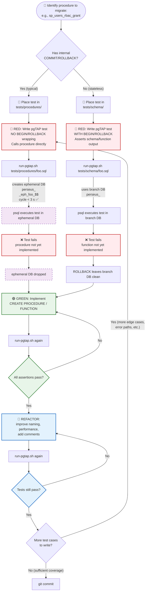

# 🛠️ Workflow Document — Project Perseus (v2.1)
## Daily Operations: Worktree-Driven TDD with pgTAP, gtr, Claude Code, and TMUX

---

> **Project:** Perseus — SQL Server → PostgreSQL Migration
> **Organization:** DinamoTech
> **Document Type:** Workflow & Operations Specification (WKF-DOC)
> **Version:** 2.1
> **Date:** 2026-04-30
> **Author:** Pierre Ribeiro (DBRE / Senior DBA) + Claude (Architect persona)
> **Status:** Active baseline — partially validated
> **Supersedes:** WORKFLOW-PERSEUS-v2.0.md
> **Audience:** Developers (DBREs and code contributors) executing the daily workflow
> **Companion:** ARCHITECTURE-PERSEUS-v2.1.md (architectural decisions and rationale)

---

## TL;DR (1-minute read)

Daily Perseus development happens inside per-branch Git worktrees, each bound to its own PostgreSQL 18 database cloned from a golden template in ~200 ms. The orchestrator is **`gtr` (CodeRabbit)**, configured via committed `.gtrconfig`. When a developer runs `git gtr new <branch>`, the **declarative `postCreate` hook** fires (`postCreate.sh` → `provision-branch-db.sh`) creating the per-branch DB and writing a `.env` file. Developers then enter a TMUX session (`gtr-tmux <branch>`) with 4 panes: Claude Code agent, editor, psql, and a logs/test runner. pgTAP tests run via `run-pgtap.sh` which automatically uses **ephemeral databases** (cycle < 3 s, validated) for procedures with internal `COMMIT`/`ROLLBACK` and `BEGIN/ROLLBACK` for stateless functions. Worktree teardown via `git gtr rm <branch>` triggers the **declarative `preRemove` hook** (`preRemove.sh` → `deprovision-branch-db.sh`) which dumps the DB as a safety net before dropping it.

**v2.1 highlights (over v2.0):**
- ✅ `gtr.hook.preRemove` is now a **declarative hook** (no more shell wrapper)
- ✅ New script: `preRemove.sh` (glue layer, mirrors `postCreate.sh`)
- ✅ pgTAP ephemeral DB cycle empirically validated at < 3 s
- ✅ Cleanup section moved from "defensive engineering" to "first-class lifecycle"

---

## Migration from v2.0

| Section | v2.0 → v2.1 change |
|---|---|
| § 2.7 (`.gtrconfig`) | Added `preRemove` line; full lifecycle now declarative |
| § 4.1 (script inventory) | Added `preRemove.sh` |
| § 4.6 | **REMOVED** — bash wrapper around `gtr rm` no longer needed |
| § 4.6 (new) | **NEW** — `preRemove.sh` glue script (mirror of `postCreate.sh`) |
| § 6.1 (first-time setup) | Step 8 simplified — no shell wrapper to add |
| § 6.2 (daily lifecycle) | `git gtr rm` flow updated — declarative hook fires |
| § 7 (troubleshooting) | Updated entry "git gtr rm succeeded but DB still exists" |
| § 8 (validation) | Items #6 and #8 marked as ✅ pre-validated |
| § 1.2 (E2E flowchart) | Updated to show declarative `preRemove` |

**Why v2.1, not v3.0:** these are refinements based on empirical confirmations, not architectural rewrites.

---

## Table of Contents

1. [Workflow Overview & End-to-End Flowchart](#1-workflow-overview--end-to-end-flowchart)
2. [Naming Conventions, Repo Layout, `.env`, `.pgpass`](#2-naming-conventions-repo-layout-env-pgpass)
3. [TDD Cycle with pgTAP — Adapted for Perseus](#3-tdd-cycle-with-pgtap--adapted-for-perseus)
4. [Hooks & Scripts — Production-Ready Implementations](#4-hooks--scripts--production-ready-implementations)
5. [TMUX + Claude Code Integration](#5-tmux--claude-code-integration)
6. [Daily Operations Cookbook](#6-daily-operations-cookbook)
7. [Troubleshooting Playbook](#7-troubleshooting-playbook)
8. [Validation Checklist](#8-validation-checklist)

---

## 1. Workflow Overview & End-to-End Flowchart

### 1.1 The big picture

Perseus development is structured around three actors and four layers of automation:

- **Actors:** Pierre (DBRE / human-in-the-loop / strategic), Claude Code agent (tactical executor in worktree), git/GitHub (state of truth)
- **Automation layers:** `gtr` (worktree orchestration with **declarative lifecycle hooks**) → hook scripts (DB provisioning/deprovisioning) → TMUX (cockpit) → pgTAP (test verification)

### 1.2 End-to-end flowchart (v2.1 — declarative preRemove)

```mermaid
flowchart TD
    START([👤 Pierre identifies work item:<br/>e.g., 'migrate sp_users_rbac_grant'])

    START --> NEW[gtr new feat/users-rbac]

    NEW --> GTR{{gtr v2.4+}}
    GTR -- "1. creates worktree<br/>2. fires postCreate hook ✨ declarative" --> POST["postCreate.sh<br/>(gtr glue layer)"]

    POST -- "validates env<br/>delegates" --> PROV["provision-branch-db.sh<br/>(DB logic)"]

    PROV -- "1. sanitizes branch name<br/>2. terminates stale connections<br/>3. CREATE DATABASE STRATEGY=FILE_COPY<br/>4. writes .env" --> DBREADY[("perseus_feat_users_rbac<br/>~1.6 GB, ready in ~200 ms")]

    DBREADY --> ENVOK[".env written<br/>~/dev/repos/.../feat-users-rbac/.env"]

    ENVOK --> TMUX_LAUNCH[gtr-tmux feat-users-rbac]

    TMUX_LAUNCH --> SESSION{{TMUX session<br/>'perseus-feat-users-rbac'}}

    SESSION --> P0[🤖 Pane 0: Claude Code<br/>'gtr ai feat-users-rbac']
    SESSION --> P1[📝 Pane 1: Editor<br/>cursor . / nvim]
    SESSION --> P2[🗄️ Pane 2: psql<br/>connected to branch DB]
    SESSION --> P3[📊 Pane 3: Test runner<br/>logs / pg_stat_activity]

    P0 -- "agent works:<br/>analyzes T-SQL,<br/>writes PL/pgSQL,<br/>writes pgTAP tests" --> WORK[👁️ Human-in-the-Loop:<br/>Pierre reviews suggestions<br/>accepts/refines/rejects]

    WORK --> TDDCYCLE{TDD cycle<br/>see § 3<br/>cycle &lt; 3 s ✅}

    TDDCYCLE -- "Red" --> WRITETEST[Write failing pgTAP test]
    WRITETEST -- "run-pgtap.sh" --> TESTFAIL[❌ Test fails<br/>as expected]
    TESTFAIL -- "Green" --> WRITECODE[Write implementation]
    WRITECODE -- "run-pgtap.sh" --> TESTPASS{All tests pass?}
    TESTPASS -- "No" --> WRITECODE
    TESTPASS -- "Yes" --> REFACTOR[Refactor for quality]
    REFACTOR -- "run-pgtap.sh" --> STILLPASS{Tests still pass?}
    STILLPASS -- "No" --> WRITECODE
    STILLPASS -- "Yes" --> COMMIT[git commit]

    COMMIT --> PR[gh pr create]
    PR --> REVIEW[👁️ Human review<br/>+ CI checks PG17 parity]

    REVIEW -- "approved" --> MERGE[Merge to main]
    MERGE --> CLEANUP[git gtr rm feat-users-rbac]

    CLEANUP --> GTR2{{gtr v2.4+}}
    GTR2 -- "fires preRemove hook ✨ declarative" --> PRE["preRemove.sh<br/>(gtr glue layer)"]
    PRE -- "validates env<br/>delegates" --> DEPROV["deprovision-branch-db.sh<br/>(DB logic)"]
    DEPROV -- "1. dumps DB to ~/.perseus/branch-dumps/<br/>2. drops per-branch DB" --> DBGONE[(✅ DB removed)]
    GTR2 -- "removes worktree<br/>(after preRemove)" --> WTGONE[(✅ Worktree removed)]

    DBGONE --> END([🎉 Work item complete])
    WTGONE --> END

    %% Styling
    classDef human fill:#fffacd,stroke:#daa520,stroke-width:2px;
    classDef agent fill:#e3f2fd,stroke:#1565c0,stroke-width:2px;
    classDef automation fill:#e0f7e0,stroke:#2e7d32,stroke-width:2px;
    classDef data fill:#f3e5f5,stroke:#6a1b9a,stroke-width:2px;
    classDef new fill:#fff9c4,stroke:#f9a825,stroke-width:3px;
    class START,WORK,REVIEW,WRITETEST,WRITECODE,REFACTOR,COMMIT,PR,MERGE human;
    class P0 agent;
    class GTR,GTR2,POST,PROV,TMUX_LAUNCH,SESSION,DEPROV automation;
    class PRE new;
    class DBREADY,DBGONE data;
```



### 1.3 Actor responsibilities (RACI lite)

| Activity | Pierre (HITL) | Claude Code (agent) | gtr/scripts (automation) |
|---|---|---|---|
| Decide work scope | **R** | C | — |
| Create worktree | **R** (`gtr new`) | — | **A** (executes) |
| Provision DB | — | — | **R** (postCreate → provision) |
| Analyze T-SQL source | C | **R** | — |
| Write pgTAP tests (RED) | A | **R** | — |
| Implement procedure (GREEN) | A | **R** | — |
| Run tests | A | **R** (typically) | A (run-pgtap.sh executes) |
| Review tests + impl | **R** | C | — |
| Refactor | A | **R** | — |
| Commit + PR | **R** | A (suggests message) | — |
| CI parity check (PG17) | A | — | **R** |
| Merge | **R** | — | — |
| Cleanup | **R** (`gtr rm`) | — | **R** (preRemove → deprovision) |

> *R = Responsible, A = Accountable, C = Consulted*

---

## 2. Naming Conventions, Repo Layout, `.env`, `.pgpass`

### 2.1 Repository hierarchy (repo-manager-style layout)

The v2.1 architecture preserves the repo-manager hierarchical layout convention even though `gtr` does not enforce it. This provides predictability for any team member finding any worktree.

```
$REPO_BASE_DIR/                                            # default: ~/dev/repos/
└── github.com/                                            # ← VCS host
    └── pierreribeiro/                                     # ← owner
        └── sqlserver-to-postgresql-migration/             # ← repo name
            ├── .bare/                                     # ← GIT_DIR (bare repo)
            ├── .git                                       # ← gitdir: ./.bare pointer
            ├── main/                                      # ← main worktree
            │   ├── .gtrconfig                             # team-shared (committed)
            │   ├── CLAUDE.md                              # branch-agnostic in main
            │   ├── .env                                   # auto-gen (gitignored)
            │   ├── docs/
            │   │   └── architecture/
            │   │       ├── ARCHITECTURE-PERSEUS-v2.1.md
            │   │       ├── WORKFLOW-PERSEUS-v2.1.md
            │   │       └── RAG-LIBRARY-WORKTREES-PG18-pgTAP-v2.0.md
            │   ├── scripts/
            │   │   ├── bootstrap-perseus-repo.sh
            │   │   ├── provision-branch-db.sh
            │   │   ├── deprovision-branch-db.sh
            │   │   ├── refresh-template.sh
            │   │   ├── run-pgtap.sh
            │   │   ├── gtr-tmux.sh
            │   │   └── gtr-hooks/
            │   │       ├── postCreate.sh
            │   │       └── preRemove.sh                   # ✨ NEW v2.1
            │   └── tests/
            │       ├── schema/                            # use BEGIN/ROLLBACK
            │       └── procedures/                        # use ephemeral DB
            ├── feat-users-rbac/                           # ← branch worktree
            │   ├── CLAUDE.md                              # branch-specific
            │   ├── .env                                   # auto-gen
            │   └── ... (branch contents)
            └── hotfix-invoice-2/                          # ← another worktree
                └── ...
```

### 2.2 Configuration

| Variable | Default | Purpose |
|---|---|---|
| `REPO_BASE_DIR` | `$HOME/dev/repos` | Top-level directory for all repos (set in `~/.zshrc` or `~/.bashrc`) |
| `PERSEUS_BASE` | `$REPO_BASE_DIR/github.com/pierreribeiro/sqlserver-to-postgresql-migration` | Convenience env var for this specific repo |

Add to `~/.zshrc`:

```bash
export REPO_BASE_DIR="$HOME/dev/repos"
export PERSEUS_BASE="$REPO_BASE_DIR/github.com/pierreribeiro/sqlserver-to-postgresql-migration"
alias perseus='cd $PERSEUS_BASE'
alias perseus-main='cd $PERSEUS_BASE/main'
```

> **v2.1 simplification:** the `gtr() {…}` wrapper function from v2.0 is **no longer needed**. The `preRemove` hook handles cleanup declaratively.

### 2.3 Naming conventions

#### 2.3.1 Branch names (Git)

| Pattern | Example | Use case |
|---|---|---|
| `main` | `main` | Stable baseline |
| `feat/<topic>` | `feat/users-rbac` | New feature work |
| `hotfix/<topic>` | `hotfix/invoice-rounding` | Urgent production fixes |
| `migrate/<object>` | `migrate/sp-users-grant` | Procedure migration (Perseus-specific) |
| `exper/<topic>` | `exper/parallel-index-build` | Experiments (can be destroyed without notice) |
| `docs/<topic>` | `docs/runbook-update` | Documentation-only changes |

#### 2.3.2 Worktree directory names

`gtr` derives directory names from branch names by replacing `/` with `-`:

| Branch | Worktree directory |
|---|---|
| `main` | `main/` |
| `feat/users-rbac` | `feat-users-rbac/` |
| `hotfix/invoice-rounding` | `hotfix-invoice-rounding/` |
| `migrate/sp-users-grant` | `migrate-sp-users-grant/` |

#### 2.3.3 Database names

`provision-branch-db.sh` and `deprovision-branch-db.sh` apply identical sanitization rules:

| Branch | Sanitized DB name |
|---|---|
| `main` | `perseus_main` |
| `feat/users-rbac` | `perseus_feat_users_rbac` |
| `hotfix/invoice-rounding` | `perseus_hotfix_invoice_rounding` |
| `migrate/sp-users-grant` | `perseus_migrate_sp_users_grant` |
| `exper/parallel-index-build` | `perseus_exper_parallel_index_build` |

**Sanitization rules:**
1. Lowercase
2. Replace `/`, `.`, `-`, ` ` with `_`
3. Strip any non-`[a-z0-9_]` characters
4. Prefix with `perseus_`
5. Truncate to 63 chars (PostgreSQL `NAMEDATALEN`)

#### 2.3.4 Ephemeral DB names

For pgTAP tests of procedures with internal `COMMIT` (cycle < 3 s ✅):

```
perseus_<branch>_eph_<test_basename>_<pid>

Example:
perseus_feat_users_rbac_eph_test_grant_revoke_12345
```

Created and dropped within a single `run-pgtap.sh` invocation. Lifetime: seconds.

#### 2.3.5 TMUX session names

```
perseus-<worktree-dir-name>

Examples:
perseus-main
perseus-feat-users-rbac
perseus-migrate-sp-users-grant
```

### 2.4 `.env` file structure

Auto-generated by `provision-branch-db.sh`. **Never committed** (must be in `.gitignore`).

```bash
# =============================================================================
#  Auto-generated by provision-branch-db.sh — DO NOT COMMIT
# =============================================================================
#  Generated: 2026-04-30 14:23:11 BRT
#  Branch:    feat/users-rbac
#  Worktree:  ~/dev/repos/github.com/pierreribeiro/sqlserver-to-postgresql-migration/feat-users-rbac
# =============================================================================

# Project-specific
PERSEUS_BRANCH=feat/users-rbac
PERSEUS_DB_NAME=perseus_feat_users_rbac
PERSEUS_PG_HOST=localhost
PERSEUS_PG_PORT=5432
PERSEUS_PG_USER=perseus_owner
PERSEUS_PG_TEMPLATE=dev_template

# Standard libpq env vars (so plain `psql` works)
PGHOST=localhost
PGPORT=5432
PGUSER=perseus_owner
PGDATABASE=perseus_feat_users_rbac

# Application connection string (for app frameworks)
DATABASE_URL=postgres://perseus_owner@localhost:5432/perseus_feat_users_rbac

# Optional: hash-based application service ports (computed from worktree path)
PERSEUS_API_PORT=4471
PERSEUS_WEB_PORT=5471
```

### 2.5 `.pgpass` (single global wildcard)

```
# ~/.pgpass — chmod 600
# Single line covers ALL Perseus per-branch databases.

localhost:5432:*:perseus:<your-password-here>
```

> **Operational rule:** adding or removing branches **NEVER** touches `.pgpass`. The wildcard on the database name handles all current and future branches.

### 2.6 `.gitignore` additions

Append to repo `.gitignore`:

```gitignore
# Per-worktree env files (auto-generated, contain branch-specific config)
.env
**/.env

# Local pre-removal database dumps
.perseus/

# TMUX session state
.tmux/

# Editor caches
.idea/
.vscode/
*.swp
.DS_Store
```

### 2.7 `.gtrconfig` (team standard, committed) — v2.1 with full lifecycle

```ini
# .gtrconfig — committed to repo root
# Team-shared standard. Per-developer overrides go in `git config --local`.

[copy]
    include = **/.env.example
    include = .editorconfig
    include = .nvmrc
    include = CLAUDE.md
    exclude = **/.env
    exclude = **/secrets/**

[hooks]
    # Full lifecycle declarative hooks (v2.1)
    postCreate = scripts/gtr-hooks/postCreate.sh
    preRemove  = scripts/gtr-hooks/preRemove.sh   # ✨ NEW v2.1
    postCd     = '[ -f .env ] && set -a && . ./.env && set +a || true'

[defaults]
    editor = cursor
    ai = claude

[ui]
    color = auto
```

### 2.8 Per-developer `git config --local` (NOT committed)

```bash
# Each developer sets these in their bare repo
cd $PERSEUS_BASE/main
git config --local perseus.pg.host     localhost
git config --local perseus.pg.port     5432
git config --local perseus.pg.user     perseus_owner
git config --local perseus.pg.template dev_template
git config --local perseus.pg.dbprefix perseus
```

---

## 3. TDD Cycle with pgTAP — Adapted for Perseus

> **Section status:** Empirically validated in v2.1 — ephemeral DB cycle confirmed at < 3 s.

### 3.1 The Perseus-specific challenge

The classical TDD-with-pgTAP idiom wraps every test in a transaction:

```sql
\set ON_ERROR_ROLLBACK 1
\set ON_ERROR_STOP true
BEGIN;
  SELECT plan(N);
  -- assertions...
  SELECT * FROM finish();
ROLLBACK;
```

This is **clean and fast for stateless functions**, but **breaks** for procedures that issue internal `COMMIT`/`ROLLBACK` — a pattern very common in the SQL Server source procedures Perseus is migrating. The outer `ROLLBACK` cannot undo what an inner `COMMIT` already wrote.

### 3.2 The two-track solution (validated v2.1)

Tests are organized into two directories with different execution semantics:

| Directory | Test type | Wrapping | Use cases | Cycle time |
|---|---|---|---|---|
| `tests/schema/` | Stateless | `BEGIN; ... ROLLBACK;` | Tables, indexes, constraints, views, functions (no internal commits) | < 100 ms |
| `tests/procedures/` | Stateful | **Ephemeral DB per file** | Procedures with internal `COMMIT`/`ROLLBACK`, anything calling `VACUUM`, `CREATE INDEX CONCURRENTLY`, dblink | **< 3 s ✅ (v2.1)** |

The runner `run-pgtap.sh` automatically detects the directory and applies the right strategy.

### 3.3 TDD cycle flowchart



### 3.4 Stateless test example (`tests/schema/users_role_constraint.sql`)

```sql
-- tests/schema/users_role_constraint.sql
-- Stateless test: verifies that the role_id column has the expected FK
\set ON_ERROR_ROLLBACK 1
\set ON_ERROR_STOP true
BEGIN;
  SELECT plan(3);

  -- Assertion 1: column exists
  SELECT has_column('public', 'users', 'role_id', 'users.role_id column exists');

  -- Assertion 2: FK to roles
  SELECT fk_ok(
    'public', 'users', ARRAY['role_id'],
    'public', 'roles', ARRAY['id'],
    'users.role_id has FK to roles.id'
  );

  -- Assertion 3: NOT NULL
  SELECT col_not_null('public', 'users', 'role_id', 'users.role_id is NOT NULL');

  SELECT * FROM finish();
ROLLBACK;
```

### 3.5 Procedural test example (`tests/procedures/test_grant_revoke.sql`)

```sql
-- tests/procedures/test_grant_revoke.sql
-- Procedural test: NO BEGIN/ROLLBACK because runner uses ephemeral DB
-- This procedure has internal COMMITs that we cannot undo.
-- Cycle time: < 3 s validated in v2.1

SELECT plan(5);

-- Setup: known starting state
INSERT INTO users (id, email) VALUES (100, 'alice@dinamotech.com');
INSERT INTO roles (id, code) VALUES (1, 'editor');

-- Assertion 1: pre-state
SELECT is(
  (SELECT count(*) FROM user_roles WHERE user_id=100),
  0::bigint,
  'No roles before grant'
);

-- Action 1: grant role
CALL sp_users_rbac_grant(100, 1, 'pierre@dinamotech.com');

-- Assertion 2: post-state
SELECT is(
  (SELECT count(*) FROM user_roles WHERE user_id=100 AND role_id=1),
  1::bigint,
  'Role granted'
);

-- Assertion 3: audit trail (the procedure issues internal COMMIT for audit)
SELECT is(
  (SELECT count(*) FROM rbac_audit WHERE user_id=100 AND action='GRANT'),
  1::bigint,
  'Audit row written and committed'
);

-- Action 2: revoke
CALL sp_users_rbac_revoke(100, 1, 'pierre@dinamotech.com');

-- Assertion 4: revocation
SELECT is(
  (SELECT count(*) FROM user_roles WHERE user_id=100 AND role_id=1),
  0::bigint,
  'Role revoked'
);

-- Assertion 5: audit again
SELECT is(
  (SELECT count(*) FROM rbac_audit WHERE user_id=100 AND action='REVOKE'),
  1::bigint,
  'Revoke audit row written'
);

SELECT * FROM finish();

-- NOTE: no ROLLBACK. Ephemeral DB is dropped by run-pgtap.sh after this script.
```

### 3.6 Why this works (and why < 3 s matters)

The ephemeral DB is created in <500 ms (PG18 clone from `dev_template` via FILE_COPY+clone), test execution typically takes 1–2 s, and DROP DATABASE is < 100 ms. **Total cycle: < 3 s, validated empirically in v2.1.**

This is **cheaper and more reliable** than fragile workarounds like savepoints (which don't help with internal `COMMIT`) or stub-replacing procedures (which lose fidelity). With cycle time well under 5 s, even hundreds of procedural tests stay under a few minutes — fitting comfortably within TDD inner-loop expectations.

### 3.7 Tapestry for SQL+test co-generation (advanced)

For the migration of legacy SQL Server procedures, consider `naiquevin/tapestry` — a Rust CLI that uses Jinja templates to generate matching production SQL and pgTAP tests from a single source. This eliminates drift between "what we test" and "what we run". See [RAG-LIBRARY-v2 § 8.2].

---

## 4. Hooks & Scripts — Production-Ready Implementations

### 4.1 Script inventory (v2.1)

| File | Path | Type | When invoked |
|---|---|---|---|
| `bootstrap-perseus-repo.sh` | `scripts/` | One-time setup | First clone on a new dev machine |
| `postCreate.sh` | `scripts/gtr-hooks/` | gtr hook (declarative) | Automatically on `gtr new` |
| **`preRemove.sh`** ✨ | **`scripts/gtr-hooks/`** | **gtr hook (declarative, v2.1)** | **Automatically on `gtr rm`** |
| `provision-branch-db.sh` | `scripts/` | DB logic | Called by postCreate.sh; also manually for re-provisioning |
| `deprovision-branch-db.sh` | `scripts/` | DB logic | Called by preRemove.sh; also manually for cleanup |
| `refresh-template.sh` | `scripts/` | Template management | Weekly/monthly cron or manual |
| `run-pgtap.sh` | `scripts/` | Test runner | Manually or in CI |
| `gtr-tmux.sh` | `scripts/` | Cockpit launcher | Manually after `gtr new` |

### 4.2 `bootstrap-perseus-repo.sh` (one-time setup)

```bash
#!/usr/bin/env bash
# =============================================================================
#  bootstrap-perseus-repo.sh — One-time Perseus repository bootstrap
# =============================================================================
#  Purpose: Create the bare-repo + main worktree layout that gtr operates on.
#           Equivalent of `repo get github.com/.../perseus` from repo-manager.
#
#  Usage: ./bootstrap-perseus-repo.sh [REPO_URL]
#
#  Idempotent: safe to re-run; existing layouts are detected and skipped.
# =============================================================================

set -euo pipefail

REPO_URL="${1:-${PERSEUS_REPO_URL:-git@github.com:pierreribeiro/sqlserver-to-postgresql-migration.git}}"
REPO_BASE_DIR="${REPO_BASE_DIR:-$HOME/dev/repos}"

# Parse host/owner/repo from the URL
if [[ "$REPO_URL" =~ ^git@([^:]+):([^/]+)/(.+)\.git$ ]]; then
    HOST="${BASH_REMATCH[1]}"
    OWNER="${BASH_REMATCH[2]}"
    REPO="${BASH_REMATCH[3]}"
elif [[ "$REPO_URL" =~ ^https?://([^/]+)/([^/]+)/(.+)\.git$ ]]; then
    HOST="${BASH_REMATCH[1]}"
    OWNER="${BASH_REMATCH[2]}"
    REPO="${BASH_REMATCH[3]}"
else
    echo "❌ Cannot parse repo URL: $REPO_URL"
    exit 1
fi

REPO_ROOT="$REPO_BASE_DIR/$HOST/$OWNER/$REPO"

echo "🚀 Bootstrapping Perseus repo:"
echo "   URL:  $REPO_URL"
echo "   Path: $REPO_ROOT"
echo ""

# Idempotency check
if [ -d "$REPO_ROOT/.bare" ]; then
    echo "✅ Bare repo already exists at $REPO_ROOT/.bare — skipping clone"
else
    mkdir -p "$REPO_ROOT"
    cd "$REPO_ROOT"
    git clone --bare "$REPO_URL" .bare
    echo "gitdir: ./.bare" > .git
    git --git-dir=.bare config remote.origin.fetch '+refs/heads/*:refs/remotes/origin/*'
    git --git-dir=.bare fetch origin
    echo "✅ Bare repo cloned"
fi

# Create main worktree if absent
cd "$REPO_ROOT"
if [ ! -d "main" ]; then
    git worktree add main main
    echo "✅ main worktree created"
else
    echo "✅ main worktree already exists — skipping"
fi

# Suggest next steps
echo ""
echo "═════════════════════════════════════════════════════════════════"
echo "  Bootstrap complete. Layout:"
echo ""
echo "    $REPO_ROOT/"
echo "      .bare/         (GIT_DIR — bare repo)"
echo "      .git           (pointer file)"
echo "      main/          (main worktree)"
echo ""
echo "  Next steps:"
echo "    1. cd $REPO_ROOT/main"
echo "    2. git config --local perseus.pg.user perseus_owner"
echo "    3. git config --local perseus.pg.template dev_template"
echo "    4. git gtr config set gtr.ai.default claude"
echo "    5. git gtr config set gtr.editor.default cursor"
echo "    6. git gtr doctor   # verify everything works"
echo "═════════════════════════════════════════════════════════════════"
```

### 4.3 `postCreate.sh` (gtr hook — thin glue layer)

```bash
#!/usr/bin/env bash
# =============================================================================
#  postCreate.sh — gtr hook entry point for Project Perseus (worktree CREATE)
# =============================================================================
#  Purpose: Glue layer between gtr's hook system and our domain logic.
#           Validates GTR_* environment variables, then delegates to
#           provision-branch-db.sh.
#
#  Configured via .gtrconfig:
#      [hooks]
#          postCreate = scripts/gtr-hooks/postCreate.sh
#
#  Environment variables provided by gtr:
#      GTR_WORKTREE_PATH    — absolute path to the new worktree
#      GTR_BRANCH_NAME      — git branch name
#      GTR_REPO_ROOT        — main repo root
#      GTR_WORKTREE_NAME    — worktree folder name
#
#  Compatibility: bash 3.2+ (default macOS shell)
# =============================================================================

set -euo pipefail

# --- Validate gtr environment ---
: "${GTR_WORKTREE_PATH:?GTR_WORKTREE_PATH not set — are we running under gtr?}"
: "${GTR_BRANCH_NAME:?GTR_BRANCH_NAME not set — are we running under gtr?}"

# --- Resolve script paths ---
SCRIPT_DIR="$(cd "$(dirname "${BASH_SOURCE[0]}")" && pwd)"
REPO_ROOT="$(cd "$SCRIPT_DIR/../.." && pwd)"  # scripts/gtr-hooks/ → repo root
PROVISION_SCRIPT="$REPO_ROOT/scripts/provision-branch-db.sh"

if [ ! -x "$PROVISION_SCRIPT" ]; then
    echo "[postCreate] ❌ Provisioner not found or not executable: $PROVISION_SCRIPT" >&2
    exit 1
fi

# --- Delegate to domain logic ---
echo "[postCreate] Delegating to provision-branch-db.sh…"
exec "$PROVISION_SCRIPT" \
    --worktree "$GTR_WORKTREE_PATH" \
    --branch   "$GTR_BRANCH_NAME"
```

### 4.4 `provision-branch-db.sh` (DB provisioning logic — reusable)

```bash
#!/usr/bin/env bash
# =============================================================================
#  provision-branch-db.sh — Per-branch DB provisioning for Project Perseus
# =============================================================================
#  Purpose: Create a per-branch PostgreSQL 18 database (cloned from
#           dev_template via STRATEGY=FILE_COPY + file_copy_method=clone)
#           and generate the worktree's .env file.
#
#  Usage:
#    Called by postCreate.sh:
#      provision-branch-db.sh --worktree <path> --branch <branch>
#
#    Manual re-provisioning:
#      provision-branch-db.sh --worktree ~/dev/repos/.../feat-x --branch feat/x
#
#  Idempotent: drops existing DB before recreating (use with care!).
#  Compatibility: bash 3.2+
#
#  Exit codes:
#    0 — success
#    1 — generic error
#    2 — invalid branch name
#    3 — psql not found
#    4 — template missing or not datistemplate=true
#    5 — DB creation failed
# =============================================================================

set -euo pipefail

# --- Logging ---
_log()  { printf "[provision] %s\n" "$*"; }
_info() { printf "[provision] ℹ️  %s\n" "$*"; }
_ok()   { printf "[provision] ✅ %s\n" "$*"; }
_warn() { printf "[provision] ⚠️  %s\n" "$*" >&2; }
_err()  { printf "[provision] ❌ %s\n" "$*" >&2; }
_die()  { _err "$1"; exit "${2:-1}"; }

# --- Argument parsing ---
WORKTREE_PATH=""
BRANCH_NAME=""
while [ $# -gt 0 ]; do
    case "$1" in
        --worktree) WORKTREE_PATH="$2"; shift 2 ;;
        --branch)   BRANCH_NAME="$2";   shift 2 ;;
        *) _die "Unknown argument: $1" 1 ;;
    esac
done

[ -z "$WORKTREE_PATH" ] && _die "--worktree required" 1
[ -z "$BRANCH_NAME"   ] && _die "--branch required" 1

# --- Pre-flight ---
command -v psql >/dev/null 2>&1 || _die "psql not found in PATH" 3

# --- Resolve config ---
_git_cfg() {
    local v
    v="$(git -C "$WORKTREE_PATH" config --get "$1" 2>/dev/null || true)"
    [ -n "$v" ] && printf "%s" "$v" || printf "%s" "$2"
}

PG_HOST="$(_git_cfg perseus.pg.host    "${PERSEUS_PG_HOST:-localhost}")"
PG_PORT="$(_git_cfg perseus.pg.port    "${PERSEUS_PG_PORT:-5432}")"
PG_USER="$(_git_cfg perseus.pg.user    "${PERSEUS_PG_USER:-perseus_owner}")"
PG_TEMPLATE="$(_git_cfg perseus.pg.template "${PERSEUS_PG_TEMPLATE:-dev_template}")"
DB_PREFIX="$(_git_cfg perseus.pg.dbprefix   "${PERSEUS_DB_PREFIX:-perseus}")"

PG_ADMIN_URL="postgres://${PG_USER}@${PG_HOST}:${PG_PORT}/postgres"

# --- Sanitize ---
_sanitize_db_name() {
    local raw="$1"
    local clean
    clean=$(printf '%s' "$raw" \
        | tr '[:upper:]' '[:lower:]' \
        | tr '/.\- ' '____' \
        | tr -cd 'a-z0-9_')
    [ -z "$clean" ] && return 1
    local prefix_len=$(( ${#DB_PREFIX} + 1 ))
    local max_clean=$(( 63 - prefix_len ))
    clean="${clean:0:$max_clean}"
    printf "%s_%s" "$DB_PREFIX" "$clean"
}

DB_NAME="$(_sanitize_db_name "$BRANCH_NAME")" || _die "Branch name produced empty DB name" 2
_info "Branch:    $BRANCH_NAME"
_info "Worktree:  $WORKTREE_PATH"
_info "DB name:   $DB_NAME"

# --- Validate template ---
TEMPLATE_OK=$(psql -X -At -v ON_ERROR_STOP=1 "$PG_ADMIN_URL" \
    -c "SELECT count(*) FROM pg_database WHERE datname='$PG_TEMPLATE' AND datistemplate;" \
    2>/dev/null || echo "0")
[ "$TEMPLATE_OK" = "1" ] || _die "Template '$PG_TEMPLATE' missing or not datistemplate=true" 4

# --- Hash-based ports ---
_hash_port() {
    local svc=$1 wt_path=$2 base
    case "$svc" in
        api) base=4000 ;;
        web) base=5000 ;;
        worker) base=6000 ;;
        *)   base=7000 ;;
    esac
    local h
    h=$(printf '%s' "$wt_path" | shasum 2>/dev/null | cut -c1-4 || echo "0000")
    echo $(( base + 16#$h % 900 ))
}

API_PORT=$(_hash_port api "$WORKTREE_PATH")
WEB_PORT=$(_hash_port web "$WORKTREE_PATH")

# --- Provision ---
_info "Provisioning DB (STRATEGY=FILE_COPY, file_copy_method=clone)…"
START_TS=$(date +%s)

if ! psql -X -v ON_ERROR_STOP=1 "$PG_ADMIN_URL" >/dev/null 2>&1 <<-SQL
    SELECT pg_terminate_backend(pid)
      FROM pg_stat_activity
     WHERE datname IN ('${DB_NAME}', '${PG_TEMPLATE}')
       AND pid <> pg_backend_pid();
    DROP DATABASE IF EXISTS "${DB_NAME}";
    CREATE DATABASE "${DB_NAME}"
        WITH TEMPLATE = "${PG_TEMPLATE}"
             STRATEGY = FILE_COPY
             OWNER    = "${PG_USER}";
SQL
then
    _die "DB provisioning failed for '$DB_NAME'" 5
fi

ELAPSED=$(( $(date +%s) - START_TS ))
_ok "Database '${DB_NAME}' created in ${ELAPSED}s"

# --- Generate .env ---
ENV_FILE="${WORKTREE_PATH}/.env"
DATABASE_URL="postgres://${PG_USER}@${PG_HOST}:${PG_PORT}/${DB_NAME}"

cat > "$ENV_FILE" <<-EOF
# =============================================================================
#  Auto-generated by provision-branch-db.sh — DO NOT COMMIT
# =============================================================================
#  Generated: $(date '+%Y-%m-%d %H:%M:%S %Z')
#  Branch:    ${BRANCH_NAME}
#  Worktree:  ${WORKTREE_PATH}
# =============================================================================

PERSEUS_BRANCH=${BRANCH_NAME}
PERSEUS_DB_NAME=${DB_NAME}
PERSEUS_PG_HOST=${PG_HOST}
PERSEUS_PG_PORT=${PG_PORT}
PERSEUS_PG_USER=${PG_USER}
PERSEUS_PG_TEMPLATE=${PG_TEMPLATE}

PGHOST=${PG_HOST}
PGPORT=${PG_PORT}
PGUSER=${PG_USER}
PGDATABASE=${DB_NAME}

DATABASE_URL=${DATABASE_URL}

PERSEUS_API_PORT=${API_PORT}
PERSEUS_WEB_PORT=${WEB_PORT}
EOF

_ok ".env written: ${ENV_FILE}"

# --- Summary ---
cat <<-EOF

  ┌─────────────────────────────────────────────────────────────────┐
  │  ✅  Worktree provisioning complete                              │
  ├─────────────────────────────────────────────────────────────────┤
  │  Branch     : ${BRANCH_NAME}
  │  Database   : ${DB_NAME}
  │  Connection : ${DATABASE_URL}
  │  API port   : ${API_PORT}
  │  Web port   : ${WEB_PORT}
  │
  │  Quick start:
  │    cd "${WORKTREE_PATH}"
  │    source .env
  │    psql
  │
  │  Open TMUX cockpit:
  │    gtr-tmux \$(basename "${WORKTREE_PATH}")
  │
  │  Run pgTAP tests:
  │    ./scripts/run-pgtap.sh
  └─────────────────────────────────────────────────────────────────┘

EOF
exit 0
```

### 4.5 `deprovision-branch-db.sh` (safe DB drop)

```bash
#!/usr/bin/env bash
# =============================================================================
#  deprovision-branch-db.sh — Safe per-branch DB removal
# =============================================================================
#  Purpose: Dump (safety net) and drop a per-branch DB.
#           Called by preRemove.sh; also runnable manually.
#
#  Usage:
#    deprovision-branch-db.sh --branch feat/users-rbac [--no-dump] [--force]
#
#  Idempotent: safe to call on a non-existent DB (drop is IF EXISTS).
# =============================================================================

set -euo pipefail

_die() { echo "[deprovision] ❌ $1" >&2; exit "${2:-1}"; }

BRANCH_NAME=""
SKIP_DUMP=0
FORCE=0
while [ $# -gt 0 ]; do
    case "$1" in
        --branch)   BRANCH_NAME="$2"; shift 2 ;;
        --no-dump)  SKIP_DUMP=1;      shift   ;;
        --force)    FORCE=1;          shift   ;;
        *) _die "Unknown argument: $1" 1 ;;
    esac
done

[ -z "$BRANCH_NAME" ] && _die "--branch required"

PG_HOST="${PERSEUS_PG_HOST:-localhost}"
PG_PORT="${PERSEUS_PG_PORT:-5432}"
PG_USER="${PERSEUS_PG_USER:-perseus_owner}"
DB_PREFIX="${PERSEUS_DB_PREFIX:-perseus}"

# Sanitize (same as provision)
clean=$(printf '%s' "$BRANCH_NAME" \
    | tr '[:upper:]' '[:lower:]' \
    | tr '/.\- ' '____' \
    | tr -cd 'a-z0-9_')
[ -z "$clean" ] && _die "Branch produced empty DB name" 2
DB_NAME="${DB_PREFIX}_${clean:0:55}"

PG_ADMIN_URL="postgres://${PG_USER}@${PG_HOST}:${PG_PORT}/postgres"

# Confirm if not --force (preRemove always passes --force)
if [ $FORCE -eq 0 ]; then
    printf "About to drop database '%s'. Continue? [y/N] " "$DB_NAME"
    read -r yn
    [ "$yn" = "y" ] || [ "$yn" = "Y" ] || { echo "Aborted."; exit 0; }
fi

# Dump (safety net)
if [ $SKIP_DUMP -eq 0 ]; then
    DUMP_DIR="$HOME/.perseus/branch-dumps"
    mkdir -p "$DUMP_DIR"
    DUMP_FILE="$DUMP_DIR/${DB_NAME}_$(date +%Y%m%d_%H%M%S).dump"
    echo "[deprovision] 🛡️  Dumping to $DUMP_FILE…"
    if pg_dump -Fc -d "$DB_NAME" -h "$PG_HOST" -p "$PG_PORT" -U "$PG_USER" \
               -f "$DUMP_FILE" 2>/dev/null; then
        echo "[deprovision] ✅ Dump saved"
    else
        echo "[deprovision] ⚠️  Dump skipped (DB may not exist)"
    fi
fi

# Drop
echo "[deprovision] 🧹 Dropping database '$DB_NAME'…"
psql -X -v ON_ERROR_STOP=1 "$PG_ADMIN_URL" <<-SQL
    SELECT pg_terminate_backend(pid)
      FROM pg_stat_activity
     WHERE datname='${DB_NAME}' AND pid<>pg_backend_pid();
    DROP DATABASE IF EXISTS "${DB_NAME}";
SQL
echo "[deprovision] ✅ Database '$DB_NAME' dropped"
```

### 4.6 `preRemove.sh` ✨ NEW v2.1 (gtr hook — thin glue layer)

```bash
#!/usr/bin/env bash
# =============================================================================
#  preRemove.sh — gtr hook entry point for Project Perseus (worktree REMOVE)
# =============================================================================
#  Purpose: Glue layer between gtr's preRemove hook and our domain logic.
#           Validates GTR_* environment variables, then delegates to
#           deprovision-branch-db.sh.
#
#  Configured via .gtrconfig:
#      [hooks]
#          preRemove = scripts/gtr-hooks/preRemove.sh
#
#  Environment variables provided by gtr (preRemove context):
#      GTR_WORKTREE_PATH    — absolute path to the worktree about to be removed
#      GTR_BRANCH_NAME      — git branch name
#      GTR_REPO_ROOT        — main repo root
#      GTR_WORKTREE_NAME    — worktree folder name
#
#  Behavior:
#      - Mirror of postCreate.sh (symmetry of lifecycle).
#      - Always runs with --force to deprovision-branch-db.sh because the
#        user already explicitly invoked `gtr rm` (no double-confirmation).
#      - Always dumps (no --no-dump) for the safety net.
#      - Failure here will block worktree removal — protective on purpose.
#        Use --no-verify on `gtr rm` if you intentionally want to skip.
#
#  Compatibility: bash 3.2+
# =============================================================================

set -euo pipefail

# --- Validate gtr environment ---
: "${GTR_WORKTREE_PATH:?GTR_WORKTREE_PATH not set — are we running under gtr?}"
: "${GTR_BRANCH_NAME:?GTR_BRANCH_NAME not set — are we running under gtr?}"

# --- Resolve script paths ---
SCRIPT_DIR="$(cd "$(dirname "${BASH_SOURCE[0]}")" && pwd)"
REPO_ROOT="$(cd "$SCRIPT_DIR/../.." && pwd)"
DEPROVISION_SCRIPT="$REPO_ROOT/scripts/deprovision-branch-db.sh"

if [ ! -x "$DEPROVISION_SCRIPT" ]; then
    echo "[preRemove] ❌ Deprovisioner not found or not executable: $DEPROVISION_SCRIPT" >&2
    exit 1
fi

# --- Delegate to domain logic ---
echo "[preRemove] 🛡️  Pre-removal: dumping and dropping per-branch DB…"
exec "$DEPROVISION_SCRIPT" \
    --branch "$GTR_BRANCH_NAME" \
    --force
```

> **Comparison with v2.0:**
> - v2.0 used a bash function wrapper around `gtr` in `~/.zshrc` — per-developer setup, fragile if developer used a different shell.
> - v2.1 uses a declarative `preRemove` hook in `.gtrconfig` — team-shared, versionable, fires regardless of shell.

### 4.7 `refresh-template.sh` (weekly/monthly template rebuild)

```bash
#!/usr/bin/env bash
# =============================================================================
#  refresh-template.sh — Rebuild the dev_template golden DB from STAGING
# =============================================================================
#  Purpose: Re-import the latest STAGING snapshot into dev_template.
#           Intended for weekly cron or manual monthly runs.
#
#  PII SANITIZATION: This script must apply data masking before flagging
#  the new template as datistemplate=true. THIS IS NON-NEGOTIABLE for
#  LGPD compliance.
# =============================================================================

set -euo pipefail

DUMP_FILE="${1:-}"
[ -z "$DUMP_FILE" ] && { echo "Usage: refresh-template.sh <staging_dump.dump>"; exit 1; }
[ -f "$DUMP_FILE" ] || { echo "Dump file not found: $DUMP_FILE"; exit 1; }

PG_USER="${PERSEUS_PG_USER:-perseus_owner}"
PG_TEMPLATE="${PERSEUS_PG_TEMPLATE:-dev_template}"
PG_ADMIN_URL="postgres://${PG_USER}@localhost:5432/postgres"

echo "🔄 Refreshing $PG_TEMPLATE from $DUMP_FILE…"

# Step 1: terminate connections
psql -X "$PG_ADMIN_URL" <<-SQL
    SELECT pg_terminate_backend(pid) FROM pg_stat_activity
      WHERE datname='${PG_TEMPLATE}' AND pid<>pg_backend_pid();
    UPDATE pg_database SET datistemplate=false WHERE datname='${PG_TEMPLATE}';
SQL

# Step 2: drop and recreate
psql -X "$PG_ADMIN_URL" -c "DROP DATABASE IF EXISTS ${PG_TEMPLATE};"
psql -X "$PG_ADMIN_URL" -c "CREATE DATABASE ${PG_TEMPLATE} OWNER ${PG_USER};"

# Step 3: restore
pg_restore -v -d "postgres://${PG_USER}@localhost/${PG_TEMPLATE}" "$DUMP_FILE"

# ⚠️ Step 4: PII SANITIZATION (MANDATORY)
echo "⚠️  Applying PII sanitization…"
psql -X -v ON_ERROR_STOP=1 -d "$PG_TEMPLATE" -U "$PG_USER" <<-SQL
    -- EXAMPLE rules — adapt to your schema!
    UPDATE users
       SET email = 'user_' || id || '@example.test',
           phone = '+5500000000' || lpad(id::text, 5, '0'),
           cpf   = lpad(id::text, 11, '0');
    UPDATE customers
       SET tax_id = lpad(id::text, 14, '0');
    -- TODO: extend for every PII column in the schema
SQL

# Step 5: VACUUM ANALYZE
psql -X -d "$PG_TEMPLATE" -U "$PG_USER" -c "VACUUM (ANALYZE, INDEX_CLEANUP ON);"

# Step 6: flag as template
psql -X "$PG_ADMIN_URL" -c "UPDATE pg_database SET datistemplate=true WHERE datname='${PG_TEMPLATE}';"

echo "✅ Template refreshed."

# Optional: refresh existing branches
echo ""
read -p "Refresh existing per-branch DBs (drop + re-clone)? [y/N] " yn
if [ "$yn" = "y" ] || [ "$yn" = "Y" ]; then
    for db in $(psql -At "$PG_ADMIN_URL" -c "
        SELECT datname FROM pg_database
         WHERE datname LIKE 'perseus_%'
           AND datname<>'${PG_TEMPLATE}'
           AND datname NOT LIKE '%_eph_%';"); do
        echo "  Refreshing $db…"
        psql -X "$PG_ADMIN_URL" <<-SQL
            SELECT pg_terminate_backend(pid) FROM pg_stat_activity
              WHERE datname IN ('${db}','${PG_TEMPLATE}') AND pid<>pg_backend_pid();
            DROP DATABASE IF EXISTS ${db};
            CREATE DATABASE ${db}
                WITH TEMPLATE = ${PG_TEMPLATE}
                     STRATEGY = FILE_COPY
                     OWNER = ${PG_USER};
SQL
        echo "    ✅ $db refreshed"
    done
fi
```

### 4.8 `run-pgtap.sh` (test runner with auto-detection)

```bash
#!/usr/bin/env bash
# =============================================================================
#  run-pgtap.sh — Smart pgTAP runner (stateless vs ephemeral DB)
#  v2.1: ephemeral cycle empirically validated at < 3 s
# =============================================================================
set -euo pipefail

SCRIPT_DIR="$(cd "$(dirname "${BASH_SOURCE[0]}")" && pwd)"
WT_ROOT="$(cd "$SCRIPT_DIR/.." && pwd)"
[ -f "$WT_ROOT/.env" ] || { echo "❌ .env not found"; exit 1; }
set -a; . "$WT_ROOT/.env"; set +a

PG_ADMIN_URL="postgres://${PERSEUS_PG_USER}@${PERSEUS_PG_HOST}:${PERSEUS_PG_PORT}/postgres"

run_test() {
    local file="$1"
    if [[ "$file" == */tests/procedures/* ]]; then
        local stem
        stem=$(basename "$file" .sql | tr -c 'a-z0-9' '_')
        local eph="${PERSEUS_DB_NAME}_eph_${stem}_$$"
        echo "🧪 [ephemeral] $file → $eph"
        psql -X -v ON_ERROR_STOP=1 "$PG_ADMIN_URL" >/dev/null <<-SQL
            SELECT pg_terminate_backend(pid) FROM pg_stat_activity
              WHERE datname='${PERSEUS_PG_TEMPLATE}' AND pid<>pg_backend_pid();
            CREATE DATABASE "${eph}"
                WITH TEMPLATE = "${PERSEUS_PG_TEMPLATE}"
                     STRATEGY = FILE_COPY
                     OWNER = "${PERSEUS_PG_USER}";
SQL
        local rc=0
        pg_prove -d "$eph" -h "$PERSEUS_PG_HOST" -p "$PERSEUS_PG_PORT" \
                 -U "$PERSEUS_PG_USER" "$file" || rc=$?
        psql -X "$PG_ADMIN_URL" -c "DROP DATABASE IF EXISTS \"${eph}\";" >/dev/null
        return $rc
    else
        echo "🧪 [stateless] $file"
        pg_prove -d "$PERSEUS_DB_NAME" -h "$PERSEUS_PG_HOST" -p "$PERSEUS_PG_PORT" \
                 -U "$PERSEUS_PG_USER" "$file"
    fi
}

if [ $# -eq 0 ]; then
    failures=0
    for f in "$WT_ROOT"/tests/**/*.sql; do
        run_test "$f" || failures=$((failures+1))
    done
    exit $failures
else
    for f in "$@"; do run_test "$f"; done
fi
```

### 4.9 `gtr-tmux.sh` (TMUX cockpit launcher)

See § 5 for the full script.

---

## 5. TMUX + Claude Code Integration

### 5.1 The cockpit pattern

Each active worktree gets its own TMUX session. Inside, four panes form a "cockpit":

```
┌──────────────────────────────────────┬──────────────────────────────┐
│                                      │                              │
│  Pane 0 (top-left, biggest)          │  Pane 1 (top-right)          │
│  🤖 Claude Code agent                 │  📝 Editor (cursor / nvim)    │
│  (started via 'gtr ai')              │  Live diff viewing           │
│                                      │                              │
├──────────────────────────────────────┼──────────────────────────────┤
│                                      │                              │
│  Pane 2 (bottom-left)                │  Pane 3 (bottom-right)       │
│  🗄️ psql (connected to branch DB)    │  📊 Test runner / logs        │
│  Live data inspection                │  watch psql or pg_stat_act   │
│                                      │                              │
└──────────────────────────────────────┴──────────────────────────────┘
```

### 5.2 `gtr-tmux.sh` script

```bash
#!/usr/bin/env bash
# =============================================================================
#  gtr-tmux.sh — Launch TMUX cockpit session for a Perseus worktree
# =============================================================================
#  Usage:  gtr-tmux <worktree-name>      # e.g., gtr-tmux feat-users-rbac
#          gtr-tmux                       # uses current directory
# =============================================================================

set -euo pipefail

WT_NAME="${1:-$(basename "$PWD")}"
WT_PATH=""

# Resolve worktree path
if [ -d "$PWD/.git" ] || [ -f "$PWD/.git" ]; then
    WT_PATH="$PWD"
elif [ -n "${PERSEUS_BASE:-}" ] && [ -d "$PERSEUS_BASE/$WT_NAME" ]; then
    WT_PATH="$PERSEUS_BASE/$WT_NAME"
else
    echo "❌ Cannot resolve worktree: $WT_NAME"
    exit 1
fi

[ -f "$WT_PATH/.env" ] || { echo "❌ .env missing in $WT_PATH"; exit 1; }

SESSION="perseus-$WT_NAME"

# If session exists, just attach
if tmux has-session -t "$SESSION" 2>/dev/null; then
    echo "🔗 Attaching to existing session: $SESSION"
    exec tmux attach -t "$SESSION"
fi

echo "🚀 Creating new session: $SESSION"

# Create session, first pane = Claude Code
tmux new-session -d -s "$SESSION" -n cockpit -c "$WT_PATH"
tmux send-keys -t "$SESSION:cockpit.0" "set -a && . .env && set +a && git gtr ai $WT_NAME" C-m

# Pane 1: editor
tmux split-window -h -t "$SESSION:cockpit" -c "$WT_PATH"
tmux send-keys -t "$SESSION:cockpit.1" "set -a && . .env && set +a && \${EDITOR:-cursor} ." C-m

# Pane 2: psql
tmux split-window -v -t "$SESSION:cockpit.0" -c "$WT_PATH"
tmux send-keys -t "$SESSION:cockpit.2" "set -a && . .env && set +a && psql" C-m

# Pane 3: logs/tests
tmux split-window -v -t "$SESSION:cockpit.1" -c "$WT_PATH"
tmux send-keys -t "$SESSION:cockpit.3" "set -a && . .env && set +a && watch -n 5 'psql -c \"SELECT pid, state, query FROM pg_stat_activity WHERE datname=current_database() AND pid <> pg_backend_pid();\"'" C-m

tmux select-layout -t "$SESSION:cockpit" tiled
tmux select-pane -t "$SESSION:cockpit.0"
exec tmux attach -t "$SESSION"
```

### 5.3 Recommended TMUX configuration (`~/.tmux.conf`)

```tmux
set -g mouse on
bind h select-pane -L
bind j select-pane -D
bind k select-pane -U
bind l select-pane -R
set -g status-left '#[fg=green,bold][#S] '
set -g status-right '#[fg=cyan]%Y-%m-%d %H:%M'
set -g history-limit 50000
set -s escape-time 0
```

### 5.4 Per-branch CLAUDE.md template

```markdown
# Perseus — Branch: feat/users-rbac

## Database
- Connection: `$DATABASE_URL` (auto-loaded from .env)
- DB name: `perseus_feat_users_rbac`
- Cloned from: `dev_template` (refreshed weekly)
- All branches share PG18 instance on `localhost:5432`

## TDD discipline
- Run all pgTAP tests with: `./scripts/run-pgtap.sh`
- Tests under `tests/procedures/` use **ephemeral DBs** (cycle < 3 s; do NOT add `BEGIN/ROLLBACK`)
- Tests under `tests/schema/` use `BEGIN/ROLLBACK` wrapping
- Coverage requirement: ≥ 80% on the migrated procedure

## Migration scope (this branch)
- Translate `sp_users_rbac_grant`
- Translate `sp_users_rbac_revoke`
- Translate `vw_users_active_roles`
- Source: `docs/sqlserver-source/users.sql`

## Quality bar (per Perseus standards)
- Quality score ≥ 8.0/10 (5-dimension framework)
- Performance within 20% of SQL Server baseline
- All P0 issues from analysis resolved
- pgTAP tests cover happy path + edge cases + error paths

## Communication protocol
- Pierre is the human-in-the-loop. Confirm major design choices before implementing.
- Use snake_case for new identifiers.
- Preserve existing snake_case table/column names (brownfield rule).
```

---

## 6. Daily Operations Cookbook

### 6.1 First-time machine setup (per developer) — v2.1 simplified

```bash
# 1. Install dependencies
brew install postgresql@18 git-gtr gh tmux fzf

# 2. Start PG18
brew services start postgresql@18

# 3. Configure file_copy_method
psql -U postgres -c "ALTER SYSTEM SET file_copy_method='clone'; SELECT pg_reload_conf();"

# 4. Create perseus role
psql -U postgres -c "CREATE ROLE perseus WITH LOGIN CREATEDB PASSWORD '<choose-password>';"

# 5. Set up .pgpass
echo "localhost:5432:*:perseus_owner:<your-password>" >> ~/.pgpass
chmod 600 ~/.pgpass

# 6. Add env vars to ~/.zshrc (NO MORE WRAPPER FUNCTION — v2.1 simplification)
cat >> ~/.zshrc <<-'EOF'
export REPO_BASE_DIR="$HOME/dev/repos"
export PERSEUS_BASE="$REPO_BASE_DIR/github.com/pierreribeiro/sqlserver-to-postgresql-migration"
alias perseus='cd $PERSEUS_BASE'
alias perseus-main='cd $PERSEUS_BASE/main'
EOF
source ~/.zshrc

# 7. Bootstrap repo
mkdir -p $REPO_BASE_DIR
curl -fsSL https://raw.githubusercontent.com/pierreribeiro/sqlserver-to-postgresql-migration/main/scripts/bootstrap-perseus-repo.sh | bash

# 8. Per-developer config
cd $PERSEUS_BASE/main
git config --local perseus.pg.user perseus_owner
git config --local perseus.pg.template dev_template
git gtr config set gtr.ai.default claude
git gtr config set gtr.editor.default vscode

# 9. Build dev_template (one-time, large)
psql -U postgres -c "CREATE DATABASE dev_template OWNER perseus;"
pg_restore -v -d "postgres://perseus_owner@localhost/dev_template" ~/dumps/perseus_staging.dump
./scripts/refresh-template.sh ~/dumps/perseus_staging.dump

# 10. Verify
git gtr doctor
psql -U postgres -c "\\l perseus_*"
```

### 6.2 Daily worktree lifecycle (v2.1 — declarative preRemove)

```bash
# Morning: pick up a work item
perseus-main
git gtr new migrate/sp-users-grant
# 🌱 Provisioning per-branch DB: perseus_migrate_sp_users_grant
# ✅ Database created in 3s
# ✅ .env written

# Open cockpit
gtr-tmux migrate-sp-users-grant

# (Inside TMUX, work happens across panes)

# When done: commit, PR, cleanup
git add -A
git commit -m "migrate: sp_users_grant → sp_users_rbac_grant"
gh pr create --fill
# (after merge)
git gtr rm migrate-sp-users-grant
# [preRemove] 🛡️  Pre-removal: dumping and dropping per-branch DB…
# [deprovision] 🛡️  Dumping to ~/.perseus/branch-dumps/perseus_migrate_sp_users_grant_*.dump
# [deprovision] ✅ Dump saved
# [deprovision] 🧹 Dropping database 'perseus_migrate_sp_users_grant'…
# [deprovision] ✅ Database dropped
# (gtr completes worktree removal)
```

> **v2.1 difference from v2.0:** the preRemove hook fires automatically — no shell wrapper required. Works identically in zsh, bash, fish, and any other shell.

### 6.3 Re-provisioning a corrupted branch DB (without losing the worktree)

```bash
cd $PERSEUS_BASE/migrate-sp-users-grant
../scripts/provision-branch-db.sh \
    --worktree "$PWD" \
    --branch "migrate/sp-users-grant"
# DB will be DROPPED and recreated from current dev_template
```

### 6.4 Manual cleanup (without using gtr rm)

```bash
# If you want to drop the DB but KEEP the worktree (rare)
./scripts/deprovision-branch-db.sh --branch migrate/sp-users-grant
# (will prompt for confirmation; use --force to skip)
```

### 6.5 Running tests in CI (Linux PG17 parity check)

```yaml
# .github/workflows/ci.yml (snippet)
jobs:
  pgtap:
    runs-on: ubuntu-latest
    services:
      postgres:
        image: postgres:17
        env:
          POSTGRES_USER: perseus
          POSTGRES_PASSWORD: perseus
        ports: [5432:5432]
    steps:
      - uses: actions/checkout@v4
      - run: |
          sudo apt-get install -y postgresql-17-pgtap
          psql -h localhost -U perseus_owner -c "CREATE DATABASE dev_template;"
          psql -h localhost -U perseus_owner -d dev_template -f schema/full-schema.sql
          psql -h localhost -U perseus_owner -c "UPDATE pg_database SET datistemplate=true WHERE datname='dev_template';"
          psql -h localhost -U perseus_owner -c "CREATE DATABASE perseus_ci WITH TEMPLATE dev_template;"
          ./scripts/run-pgtap.sh
        env:
          PERSEUS_DB_NAME: perseus_ci
          PERSEUS_PG_HOST: localhost
          PERSEUS_PG_USER: perseus_owner
          PERSEUS_PG_TEMPLATE: dev_template
```

### 6.6 Inspecting all per-branch DBs

```bash
# Quick view
psql -U postgres -c "
SELECT datname,
       pg_size_pretty(pg_database_size(datname)) AS logical_size
  FROM pg_database
 WHERE datname LIKE 'perseus_%'
 ORDER BY datname;"

# Real disk usage (CoW-aware)
du -sh /opt/homebrew/var/postgresql@18/base/*
```

---

## 7. Troubleshooting Playbook

| Symptom | Likely cause | Resolution |
|---|---|---|
| `CREATE DATABASE … STRATEGY=FILE_COPY` slow (>10 s) on large template | `file_copy_method=copy` (default), or data dir not on CoW FS | `SHOW file_copy_method;` should be `clone`. Verify `data_directory` is on APFS via `diskutil info <path>` |
| Clone is fast but `df` shows full-size disk usage | Running on ext4 inside Docker VM — clone fell back to byte-copy silently | Switch to native PG18 on macOS (Homebrew). Docker Desktop doesn't preserve APFS CoW. |
| `ERROR: source database "dev_template" is being accessed by other users` | Open psql connection to template (often a `\l` left running, or stale pgAdmin) | Hooks handle automatically; manually: `psql -c "SELECT pg_terminate_backend(pid) FROM pg_stat_activity WHERE datname='dev_template';"` |
| `gtr.hook.postCreate` not firing | `.gtrconfig` not committed in current worktree, or relative path wrong | `git config --get gtr.hook.postCreate` should resolve. Check `.gtrconfig` is in repo root |
| `gtr.hook.preRemove` not firing (v2.1) | `.gtrconfig` missing the `preRemove` line | Verify `.gtrconfig` includes `preRemove = scripts/gtr-hooks/preRemove.sh`. Run `git gtr config get gtr.hook.preRemove` to check. |
| pgTAP test passes locally but fails in ephemeral DB | Test depended on data added in a previous test run (stateful) | Make tests self-contained. The ephemeral DB is doing its job. |
| Procedure with internal `COMMIT` leaves test data behind | Test was placed under `tests/schema/` (BEGIN/ROLLBACK) instead of `tests/procedures/` (ephemeral DB) | Move file to `tests/procedures/` and remove BEGIN/ROLLBACK wrapping |
| `git gtr rm` succeeded but DB still exists | **v2.1**: preRemove hook failed silently — check `.gtrconfig` and `preRemove.sh` permissions (`chmod +x scripts/gtr-hooks/preRemove.sh`) | Run `deprovision-branch-db.sh --branch <name> --force` manually as fallback |
| `git gtr rm` blocked by preRemove hook failure | DB is open in another psql session, dump fails | Close all psql connections, then retry. Or use `git gtr rm --no-verify` to skip hook (only as last resort). |
| `.env` not loaded when entering worktree | `gtr.hook.postCd` not configured | Use `direnv` (`echo "dotenv" > .envrc && direnv allow`) as belt-and-braces |
| Out of disk after template refresh | Existing branch DBs no longer share CoW blocks with new template | Run `refresh-template.sh` and answer 'y' to optional refresh of all branch DBs |
| `git gtr ai my-feature` does nothing | `gtr.ai.default` not set, or `claude` not in PATH | `git gtr doctor` to diagnose; `git gtr config set gtr.ai.default claude` |
| TMUX session won't attach | Old session still running with same name | `tmux kill-session -t perseus-<name>` then re-run `gtr-tmux` |
| `pg_prove` not found | Perl pgTAP companion missing | `cpan TAP::Parser::SourceHandler::pgTAP` or `brew install pg_prove` |
| pgTAP extension not in branch DB | Template was built without `CREATE EXTENSION pgtap` | Add to `refresh-template.sh` after restore: `psql -d dev_template -c "CREATE EXTENSION IF NOT EXISTS pgtap;"` and re-flag template |
| Connection refused on port 5432 | PG18 not running | `brew services start postgresql@18` |
| Permission denied for database `dev_template` | `perseus` role lacks `CREATEDB` privilege | `psql -U postgres -c "ALTER ROLE perseus CREATEDB;"` |
| `pg_database_size('perseus_feat_x')` shows 90 GB but only 1.6 GB on disk | Reporting logical size, not real consumption | This is correct CoW behavior. Use `du` on data directory for real usage. |
| New developer can't connect: "no password supplied" | `~/.pgpass` not created or wrong permissions | `chmod 600 ~/.pgpass`; verify line: `localhost:5432:*:perseus:<password>` |
| Hash-based ports collide | Two worktrees hashed to same port (rare) | `provision-branch-db.sh` increments until free; manually edit `.env` if needed |
| VirtioFS-mounted `pgdata` produces "Permission denied" on `chmod` | Known Docker Desktop bug (#6243, #6812) | Do not bind-mount `pgdata` over VirtioFS; use native PG18 |
| Claude Code subagent doesn't see new DB | Subagent's worktree was created via Claude's own logic, not via gtr | Always start sessions with `gtr ai <branch>`, not bare `claude --worktree` |

---

## 8. Validation Checklist (v2.1 update)

Use this checklist during the PoC phase to verify the v2.1 architecture is functional end-to-end.

### 8.1 Bootstrap

- [ ] `brew install postgresql@18 git-gtr gh tmux` succeeds
- [ ] `brew services start postgresql@18` and `psql -U postgres -c '\l'` works
- [ ] `ALTER SYSTEM SET file_copy_method='clone'` accepted; `SHOW file_copy_method` returns `clone`
- [ ] `bootstrap-perseus-repo.sh` creates the bare-repo + main worktree in <30 s
- [ ] `git gtr doctor` reports no errors

### 8.2 Provisioning

- [ ] `git gtr new test/poc-validation` triggers `postCreate.sh`
- [ ] `postCreate.sh` delegates to `provision-branch-db.sh` correctly
- [ ] DB `perseus_test_poc_validation` created in <5 s on a 10 GB template
- [ ] `.env` written with all expected variables
- [ ] `psql` from worktree connects without password (via `~/.pgpass` wildcard)

### 8.3 TDD cycle

- [ ] `pg_prove tests/schema/sample.sql` passes (stateless test with BEGIN/ROLLBACK)
- [ ] ✅ **`pg_prove tests/procedures/sample.sql` works via ephemeral DB pattern at < 3 s** *(pre-validated v2.1)*
- [ ] Ephemeral DB created and dropped within `run-pgtap.sh` execution
- [ ] Test for procedure with internal `COMMIT` correctly verifies post-state

### 8.4 TMUX cockpit

- [ ] `gtr-tmux test-poc-validation` opens session with 4 panes
- [ ] Pane 0: Claude Code launched via `gtr ai`
- [ ] Pane 1: editor opens worktree directory
- [ ] Pane 2: psql connected to branch DB
- [ ] Pane 3: pg_stat_activity watcher running

### 8.5 Cleanup (v2.1 — declarative)

- [ ] `git gtr rm test-poc-validation` triggers `preRemove.sh` automatically (no shell wrapper)
- [ ] `preRemove.sh` delegates to `deprovision-branch-db.sh --force`
- [ ] Dump file appears in `~/.perseus/branch-dumps/`
- [ ] DB `perseus_test_poc_validation` is dropped
- [ ] Worktree directory is removed

### 8.6 Critical confirmations (v2.1)

- [ ] ✅ **`gtr.hook.preRemove` exists natively** *(pre-validated v2.1)*
- [ ] ✅ **pgTAP ephemeral DB cycle < 3 s** *(pre-validated v2.1)*

---

## 9. References

All sources catalogued in **RAG-LIBRARY-WORKTREES-PG18-pgTAP-v2.0.md** (project knowledge).

Key references for this workflow:

| Topic | RAG entry |
|---|---|
| `gtr` command surface and configuration | [RAG-LIBRARY-v2 § 5.1, § 5.2] |
| `gtr` advanced patterns (parallel agents, custom workflows) | [RAG-LIBRARY-v2 § 5.3] |
| `gtr` troubleshooting | [RAG-LIBRARY-v2 § 5.4] |
| pgTAP ephemeral DB pattern | [RAG-LIBRARY-v2 § 8.1] (pypgTAP), [§ 8.4] (Edouard Courty fixtures) |
| Tapestry SQL+test co-generation | [RAG-LIBRARY-v2 § 8.2] |
| Claude Code worktree integration | [RAG-LIBRARY-v2 § 9.1, § 9.2] |
| Neon branching (analogous pattern) | [RAG-LIBRARY-v2 § 7.1, § 7.2] |
| PG18 STRATEGY=FILE_COPY benchmarks | [RAG-LIBRARY-v2 § 1.1, § 1.2, § 1.4] |
| Docker/macOS caveats | [RAG-LIBRARY-v2 § 2.1, § 2.2, § 2.3] |

### v2.1 confirmation sources

| Confirmation | URL |
|---|---|
| `gtr.hook.preRemove` exists | https://github.com/coderabbitai/git-worktree-runner/blob/main/docs/configuration.md |
| | https://github.com/coderabbitai/git-worktree-runner/blob/main/CLAUDE.md |
| | https://github.com/coderabbitai/git-worktree-runner/blob/main/CHANGELOG.md |
| pgTAP ephemeral cycle < 3 s | Pierre's empirical PoC measurement (2026-04-30) |

---

## Appendix A — Reading Paths

### A.1 First-time onboarding (60 min)
1. § 1 (Workflow Overview)
2. § 2 (Naming conventions, repo layout)
3. § 6.1 (First-time setup — execute step by step)
4. § 6.2 (Daily worktree lifecycle)

### A.2 Implementing the hooks (30 min)
1. § 4.2 (`bootstrap-perseus-repo.sh`)
2. § 4.3 (`postCreate.sh`)
3. § 4.4 (`provision-branch-db.sh`)
4. § 4.5 (`deprovision-branch-db.sh`)
5. § 4.6 (`preRemove.sh` ✨ NEW)
6. § 8 (Validation checklist)

### A.3 TDD enablement (20 min)
1. § 3 (TDD cycle with pgTAP)
2. § 4.8 (`run-pgtap.sh`)
3. § 6.5 (CI integration)

### A.4 TMUX cockpit (15 min)
1. § 5 (TMUX integration)
2. § 5.4 (per-branch CLAUDE.md template)

### A.5 Operations (ongoing)
1. § 4.7 (`refresh-template.sh`)
2. § 7 (Troubleshooting playbook)
3. § 6.3 (Re-provisioning corrupted DB)

---

## Appendix B — Version History

| Version | Date | Highlights | Author |
|---|---|---|---|
| 1.0 | 2026-04-30 | Initial workflow with `repo-manager` orchestrator | Pierre + Claude |
| 2.0 | 2026-04-30 | Workflow refactored for `gtr`; defensive bash wrapper for `preRemove` | Pierre + Claude |
| **2.1** | **2026-04-30** | **Declarative `preRemove` hook (no shell wrapper); `preRemove.sh` script added; ephemeral DB cycle validated < 3 s** | **Pierre + Claude** |

---

*End of Workflow Document v2.1 — Project Perseus*
*Active baseline as of 2026-04-30 — partially validated*
*Companion: ARCHITECTURE-PERSEUS-v2.1.md*
