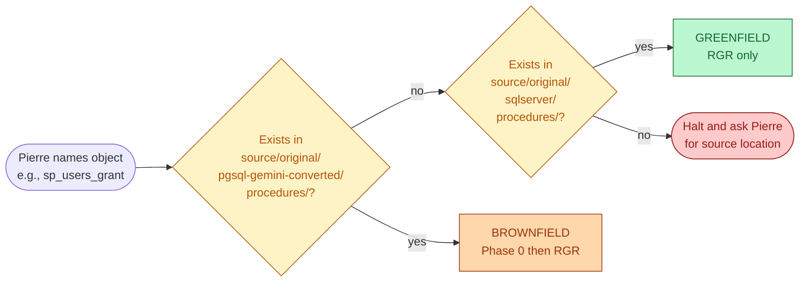
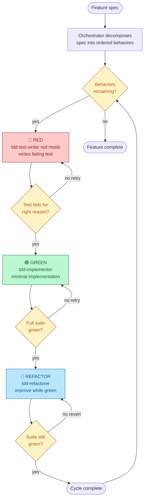
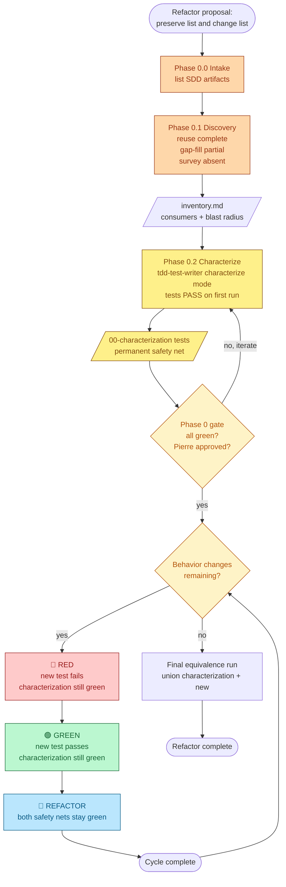

# 🛠️ Workflow Document — Project Perseus (v3.0)
## Daily Operations: Orchestrator + 3 Subagents TDD on Worktree-Driven PostgreSQL 18

---

> **Project:** Perseus — SQL Server → PostgreSQL Migration
> **Organization:** DinamoTech
> **Document Type:** Workflow & Operations Specification (WKF-DOC)
> **Version:** 3.0
> **Date:** 2026-05-11
> **Author:** Pierre Ribeiro (DBRE / Senior DBA) + Claude (Architect persona)
> **Status:** Active baseline
> **Supersedes:** WORKFLOW-PERSEUS-v2.2.md
> **Audience:** Pierre + future Claude Code sessions + DinamoTech DBREs adopting the gold standard
> **Companions:** ARCHITECTURE-PERSEUS-v2.1.md, deployment-perseus-infrastructure-v1.1.md, TDD_workflow.md, TDD_workflow_brownfield.md

---

## TL;DR (1-minute read)

Perseus daily work is a 7-step loop. Pierre starts Claude Code in the main directory; Claude reads the task, instruments the worktree (`gtr new` → declarative `postCreate` hook → per-branch DB cloned in ~200 ms), creates a TMUX cockpit with 2 panes, and runs the TDD cycle via **an orchestrator and 3 isolated subagents** (`tdd-test-writer` 🔴 RED, `tdd-implementer` 🟢 GREEN, `tdd-refactorer` 🔵 REFACTOR). The workflow is **brownfield by default** (Phase 0: Discovery + Characterization before any change) and falls back to **greenfield** only when the object does not yet exist in `source/original/pgsql-gemini-converted/`. Finished artifacts land in `source/building/pgsql/refactored/<object-type>/`. Pierre reviews, then Claude commits and opens the PR via `gh`. Worktree teardown is Pierre's call — `gtr rm` fires the declarative `preRemove` hook (dumps + drops the branch DB).

**v3.0 highlights (over v2.2):**
- ✅ Multi-actor TDD model: **orchestrator + 3 subagents + forced-eval hook** (replaces single-agent v2.x model)
- ✅ **Phase 0 (brownfield)**: Discovery + Characterization, gated, before any RGR
- ✅ **2-pane TMUX cockpit** (orchestrator + cc-agents log) — no more cosmetic panes; subagent visibility via `PostToolUse` hook
- ✅ Greenfield ↔ Brownfield branch logic based on source presence
- ✅ Directory structure encapsulating TDD: `source/building/pgsql/refactored/<type>/` + `tdd-cycles/<feature>/<NNN>-<slug>/`
- ✅ Components inventory explicit — apps, CLIs, skills, subagents, hooks, scripts all enumerated
- ✅ Setup delegated to `deployment-perseus-infrastructure-v1.1.md` (no duplication)
- ✅ RACI fixed: Claude = Responsible for create worktree, commit, PR
- ✅ All Mermaid diagrams validated

---

## Migration from v2.2

| Section / concept | v2.2 (deprecated) | v3.0 (this document) |
|---|---|---|
| TDD execution model | Single Claude Code agent | **Orchestrator + 3 isolated subagents + 2 skills + forced-eval hook** |
| TDD scope | RGR only | **Phase 0 (brownfield) → RGR**; greenfield fallback when source absent |
| TMUX panes | 4 (orchestrator, editor, psql, test runner) | **2** (orchestrator + cc-agents log) |
| Editor in pane | Yes (cursor / nvim) | **No** — VS Code runs externally, outside TMUX |
| Subagent visibility | Implicit | **Explicit** — `PostToolUse` hook with matcher=Agent writes to `cc-agents` pane |
| Artifact destination | Implicit | **`source/building/pgsql/refactored/<object-type>/`** |
| Audit trail | None | **`tdd-cycles/<feature>/<NNN>-<slug>/{plan,report}.md`** files persistent |
| First-time setup | Self-contained (§ 6.1) | **Reference to `deployment-perseus-infrastructure-v1.1.md`** |
| § 1.2 Mermaid | Broken (invalid) | **Fixed and validated** |
| § 3.3 Mermaid | Broken (invalid) | **Fixed and validated** |
| RACI Claude role | Accountable for create worktree, suggests PR | **Responsible** for create worktree, commit, PR |
| § 2.5 `.pgpass` | Auto-managed | **Manual** — Pierre adds/edits |
| Role naming | `perseus_admin` | `perseus_owner` (aligned with deployment v1.1) |

**Why v3.0, not v2.3:** the multi-actor TDD model + Phase 0 + radically simplified cockpit constitute a paradigm shift, not a patch.

**Why preserve v2.2:** historical reference for the single-agent model; useful when comparing the evolution of the gold-standard pattern.

---

## Table of Contents

1. [Workflow Overview & End-to-End Flowchart](#1-workflow-overview--end-to-end-flowchart)
2. [Components Inventory](#2-components-inventory)
3. [Directory Structure](#3-directory-structure)
4. [Conventions: Branches, DBs, `.env`, `.pgpass`, `.gtrconfig`](#4-conventions-branches-dbs-env-pgpass-gtrconfig)
5. [TDD Cycle — Greenfield + Brownfield](#5-tdd-cycle--greenfield--brownfield)
6. [TMUX Cockpit (2-Pane Hook-Based)](#6-tmux-cockpit-2-pane-hook-based)
7. [The Seven-Step Workflow](#7-the-seven-step-workflow)
8. [Hooks & Scripts — Production Code](#8-hooks--scripts--production-code)
9. [Daily Operations Cookbook](#9-daily-operations-cookbook)
10. [Troubleshooting Playbook](#10-troubleshooting-playbook)
11. [Acceptance Checklist](#11-acceptance-checklist)

---

## 1. Workflow Overview & End-to-End Flowchart

### 1.1 The big picture

Perseus runs on **three structural primitives**:

1. **Worktree isolation** — every work item gets a Git worktree + its own PostgreSQL 18 database cloned in ~200 ms via APFS CoW (see ARCHITECTURE-PERSEUS-v2.1.md §7).
2. **Multi-actor TDD** — the orchestrator (main Claude Code session) dispatches three isolated subagents in sequence (🔴 RED → 🟢 GREEN → 🔵 REFACTOR), each with clean context.
3. **Brownfield-first discipline** — before any change to an existing object, Phase 0 runs Discovery + Characterization (safety net of passing tests against the current implementation).

### 1.2 End-to-end flowchart

```mermaid
flowchart TD
    Start([Pierre starts Claude Code<br/>in repo main directory])
    AskTask[Pierre asks next task<br/>or specifies one]
    ReviewState[Claude reviews tracking docs<br/>git status and GitHub issues]
    ReadSpec[Claude reads task spec<br/>from SDD or openspec]

    DetectMode{Object exists in<br/>source/original/<br/>pgsql-gemini-converted?}
    Brownfield[Brownfield mode<br/>Phase 0 + RGR]
    CheckSrc{Object exists in<br/>source/original/<br/>sqlserver?}
    Greenfield[Greenfield mode<br/>RGR only]
    HaltNoSrc([Halt and ask Pierre<br/>for source])

    Instrument[Claude instruments worktree<br/>gtr new feat/object<br/>postCreate hook fires<br/>DB cloned env written]
    TMUX[Claude opens TMUX cockpit<br/>2 panes orchestrator and cc-agents]

    Phase0[Phase 0 Brownfield only<br/>Discovery and Characterization<br/>tdd-test-writer characterize mode]
    RGRLoop[Inner RGR cycle per behavior<br/>RED then GREEN then REFACTOR<br/>3 isolated subagents]
    Artifacts[Artifacts written to<br/>source/building/pgsql/refactored<br/>and tdd-cycles audit trail]

    Review{Pierre evaluates}
    AskRevise[Claude revises<br/>loops back to RGR]
    Commit[Claude commits<br/>and opens PR via gh CLI]
    Merge[Pierre merges PR]

    PierreCleanup{Pierre decides<br/>to clean up?}
    GtrRm[gtr rm fires preRemove<br/>dumps and drops branch DB]
    Done([Work item complete])

    Start --> AskTask --> ReviewState --> ReadSpec --> DetectMode
    DetectMode -- yes --> Brownfield
    DetectMode -- no --> CheckSrc
    CheckSrc -- yes --> Greenfield
    CheckSrc -- no --> HaltNoSrc
    Brownfield --> Instrument
    Greenfield --> Instrument
    Instrument --> TMUX
    TMUX --> Phase0
    Phase0 --> RGRLoop
    RGRLoop --> Artifacts
    Artifacts --> Review
    Review -- needs revision --> AskRevise
    AskRevise --> RGRLoop
    Review -- approved --> Commit
    Commit --> Merge
    Merge --> PierreCleanup
    PierreCleanup -- yes --> GtrRm
    PierreCleanup -- no, keep worktree --> Done
    GtrRm --> Done

    classDef human fill:#fde68a,stroke:#92400e,color:#92400e;
    classDef claude fill:#bfdbfe,stroke:#1e3a8a,color:#1e3a8a;
    classDef decision fill:#fef3c7,stroke:#b45309,color:#b45309;
    classDef automation fill:#bbf7d0,stroke:#166534,color:#166534;
    classDef phase fill:#fef08a,stroke:#854d0e,color:#854d0e;
    classDef halt fill:#fecaca,stroke:#991b1b,color:#991b1b;
    class Start,AskTask,Review,Merge,PierreCleanup human;
    class ReviewState,ReadSpec,Instrument,TMUX,Phase0,RGRLoop,Commit,AskRevise claude;
    class DetectMode,CheckSrc decision;
    class Brownfield,Greenfield,Artifacts,GtrRm automation;
    class HaltNoSrc halt;
```



### 1.3 Actor responsibilities (RACI)

| Activity | Pierre (HITL) | Claude Code orchestrator | Subagents | Hooks / scripts |
|---|---|---|---|---|
| Start Claude Code session | **R** | — | — | — |
| Decide work scope / pick task | **R** | C | — | — |
| Read project tracking, git, openspec | A | **R** | — | — |
| Detect greenfield vs brownfield | A | **R** | — | — |
| Create worktree (`gtr new`) | A | **R** | — | A (`postCreate`) |
| Provision branch DB | — | A | — | **R** (`postCreate` → `provision`) |
| Open TMUX cockpit | A | **R** | — | A (`gtr-tmux.sh`) |
| Phase 0 Discovery (brownfield) | C | **R** | — | — |
| Phase 0 Characterization | A | **R** (delegates) | **R** (`tdd-test-writer` characterize mode) | — |
| RED — write failing test | A | A (delegates) | **R** (`tdd-test-writer` red mode) | — |
| GREEN — implement to pass | A | A (delegates) | **R** (`tdd-implementer`) | — |
| REFACTOR — improve while green | A | A (delegates) | **R** (`tdd-refactorer`) | — |
| Run `pg_prove` | — | — | **R** (each subagent runs it) | A (`run-pgtap.sh`) |
| Subagent visibility in `cc-agents` pane | — | — | — | **R** (`PostToolUse` hook) |
| Place final artifact in `source/building/pgsql/refactored/<type>/` | A | A | **R** (`tdd-implementer` / `tdd-refactorer`) | — |
| Review final work | **R** | C | — | — |
| Commit message | A | **R** (drafts + executes) | — | — |
| Open PR via `gh` | A | **R** | — | — |
| Merge PR | **R** | — | — | — |
| Decide cleanup | **R** | — | — | — |
| Execute cleanup (`gtr rm`) | **R** | — | — | A (`preRemove`) |
| Drop branch DB | — | — | — | **R** (`preRemove` → `deprovision`) |

> R = Responsible · A = Accountable · C = Consulted
>
> Default rule: **worktree + DB cleanup is Pierre's manual decision**. Claude executes cleanup only on explicit request.

---

## 2. Components Inventory

Everything required to run the Perseus workflow. **First-time machine setup is handled by `deployment-perseus-infrastructure-v1.1.md`** — that document installs PG18, creates the cluster, sets up `perseus_owner`, and seeds `~/.pgpass`. This section enumerates the **runtime dependencies** the workflow consumes.

### 2.1 Applications & CLIs

| Tool | Min version | Purpose | Install |
|---|---|---|---|
| **macOS Tahoe** | 26.x | Host OS with APFS Copy-on-Write | (system) |
| **PostgreSQL 18** | 18.x | Database engine (native, no Docker) | `brew install postgresql@18` |
| **pgTAP** | 1.3+ | Database unit testing framework | `psql -c "CREATE EXTENSION pgtap"` (installed by deployment v1.1) |
| **pg_prove** | latest | pgTAP test runner (TAP output → human-readable) | `cpanm TAP::Parser::SourceHandler::pgTAP` |
| **Claude Code** | latest | AI orchestrator + subagent host | `npm install -g @anthropic-ai/claude-code` |
| **gtr** (git-worktree-runner) | v2.4+ | Worktree lifecycle orchestrator with declarative hooks | `brew install git-gtr` |
| **gh** (GitHub CLI) | 2.x | PR creation, issue management | `brew install gh` |
| **tmux** | 3.x | Terminal multiplexer for cockpit | `brew install tmux` |
| **jq** | 1.6+ | JSON parsing inside hooks | `brew install jq` |
| **openssl** | 3.x | Password generation | (system) |
| **VS Code** (or Cursor) | latest | Primary editor — runs **outside** TMUX | (download) |
| **pgAdmin** | 4.x+ | Visual DB inspection (Pierre's tool of choice) | (download) |

### 2.2 Claude Code Skills (knowledge bases)

| Skill | Purpose | Loaded by |
|---|---|---|
| **`tdd-integration`** | Orchestrator skill — owns Phase 0 + RGR cycle delegation | Main session (orchestrator) on every prompt via forced-eval hook |
| **`tdd-database-development`** | K1 — methodology, role mandates, AAA pattern, plan-and-report protocol | Loaded **first** by every subagent |
| **`pgtap-tdd-testing`** | K2 — engine-specific syntax, assertion catalog, isolation envelope, ephemeral DB pattern | Loaded **second** by every subagent |

### 2.3 Claude Code Subagents (already defined in `agents/`)

| Subagent file | Role | Modes |
|---|---|---|
| **`agents/tdd-test-writer.md`** | 🟡 CHARACTERIZE (brownfield Phase 0) / 🔴 RED (RGR) | `characterize` (writes tests that PASS against current code) · `red` (writes tests that FAIL because behavior is missing) |
| **`agents/tdd-implementer.md`** | 🟢 GREEN — minimal implementation to satisfy the failing test | Single mode |
| **`agents/tdd-refactorer.md`** | 🔵 REFACTOR — improve while keeping all safety nets green | Single mode |

> Each subagent is invoked via Claude Code's **Task tool**, runs **in-process with isolated context**, and reads only the files explicitly handed off to it (clean prompt + artifact paths). See § 5.4 for the isolation model.

### 2.4 Hooks (already defined in `.claude/hooks/`)

| Hook | Trigger | Purpose |
|---|---|---|
| **`tdd-skill-forced-eval.sh`** | `UserPromptSubmit` | Deterministically loads `tdd-integration` skill on every Pierre prompt — prevents skill drift |
| **`agent-visibility.sh`** | `PostToolUse` (matcher=`Agent`) | Writes each subagent task description + first 20 lines of result to the `cc-agents` TMUX pane |
| **`scripts/gtr-hooks/postCreate.sh`** | `gtr new` (worktree created) | Glue → calls `provision-branch-db.sh` |
| **`scripts/gtr-hooks/preRemove.sh`** | `gtr rm` (worktree about to be removed) | Glue → calls `deprovision-branch-db.sh --force` (pre-removal dump + drop) |

### 2.5 Global utility scripts (in `scripts/`)

| Script | Purpose |
|---|---|
| **`bootstrap-perseus-repo.sh`** | One-time: clone bare repo + create main worktree |
| **`provision-branch-db.sh`** | Create per-branch DB via `CREATE DATABASE … STRATEGY=FILE_COPY`, write `.env` |
| **`deprovision-branch-db.sh`** | Dump (safety net) + drop per-branch DB |
| **`refresh-template.sh`** | Rebuild `dev_template` from STAGING dump (weekly/monthly) |
| **`run-pgtap.sh`** | Test runner — auto-detects `tests/schema/` (BEGIN/ROLLBACK) vs `tests/procedures/` (ephemeral DB) |
| **`gtr-tmux.sh`** | Open 2-pane TMUX cockpit for a worktree |

### 2.6 Infrastructure documents (companions)

| Document | Role |
|---|---|
| `docs/architecture/ARCHITECTURE-PERSEUS-v2.1.md` | Why decisions — architectural rationale |
| `docs/architecture/deployment-perseus-infrastructure-v1.1.md` | **How to install** the PG18 cluster (consumed once per machine) |
| `docs/architecture/TDD_workflow.md` | Greenfield TDD reference |
| `docs/architecture/TDD_workflow_brownfield.md` | Brownfield TDD reference (Phase 0 source of truth) |
| `docs/architecture/WORKFLOW-PERSEUS-v3.0.md` | **This document** — how to use the components above daily |

---

## 3. Directory Structure

The repository encapsulates the entire TDD workflow: source artifacts, subagent definitions, skill knowledge, hooks, scripts, tests, and per-cycle audit trail.

```
sqlserver-to-postgresql-migration/                        # repo root
│
├── .bare/                                                # GIT_DIR (bare repo, gtr-managed)
├── .git                                                  # pointer file (gitdir: ./.bare)
├── .gtrconfig                                            # team-shared (committed)
│
├── .claude/                                              # Claude Code configuration
│   ├── settings.json                                     # registers both hooks
│   └── hooks/
│       ├── tdd-skill-forced-eval.sh                      # UserPromptSubmit hook
│       └── agent-visibility.sh                           # PostToolUse hook (matcher=Agent)
│
├── agents/                                               # subagent definitions
│   ├── tdd-test-writer.md                                # 🟡 CHARACTERIZE / 🔴 RED
│   ├── tdd-implementer.md                                # 🟢 GREEN
│   └── tdd-refactorer.md                                 # 🔵 REFACTOR
│
├── skills/                                               # knowledge bases
│   ├── tdd-integration/                                  # orchestrator skill
│   ├── tdd-database-development/                         # K1 — methodology
│   └── pgtap-tdd-testing/                                # K2 — engine syntax
│
├── scripts/                                              # global utility scripts
│   ├── bootstrap-perseus-repo.sh
│   ├── provision-branch-db.sh
│   ├── deprovision-branch-db.sh
│   ├── refresh-template.sh
│   ├── run-pgtap.sh
│   ├── gtr-tmux.sh
│   └── gtr-hooks/
│       ├── postCreate.sh
│       └── preRemove.sh
│
├── infra/database/                                       # PG18 cluster provisioning
│   ├── .env.example                                      # committed (placeholders)
│   ├── .env                                              # gitignored
│   ├── postgresql.conf.template
│   ├── init-db.sh                                        # init | start | stop | restart | status | shell | destroy | recreate
│   ├── lib/common.sh
│   └── init-scripts/
│       └── 01-init-database.sql
│
├── source/                                               # the migration source-of-truth
│   ├── original/
│   │   ├── sqlserver/                                    # raw T-SQL originals (Perseus L0)
│   │   │   ├── procedures/
│   │   │   ├── functions/
│   │   │   ├── views/
│   │   │   └── ...
│   │   └── pgsql-gemini-converted/                       # PG output from Gemini conversion
│   │       ├── procedures/                               # ← BROWNFIELD inputs
│   │       ├── functions/
│   │       └── ...
│   └── building/
│       └── pgsql/
│           └── refactored/                               # ← FINAL TDD ARTIFACTS land here
│               ├── procedures/
│               ├── functions/
│               ├── views/
│               ├── triggers/
│               ├── indexes/
│               └── tables/
│
├── tdd-cycles/                                           # persistent audit trail
│   └── <feature-or-refactor>/
│       └── <NNN>-<slug>/
│           ├── 00-discovery/                             # BROWNFIELD only
│           │   ├── resources.md                          # SDD artifact inventory
│           │   ├── inventory.md                          # consumers + blast radius
│           │   └── version-lock.md                       # object SHA + timestamp
│           ├── 00-characterization/                      # BROWNFIELD only — permanent safety net
│           │   ├── characterize.plan.md
│           │   ├── characterize.report.md
│           │   └── tests/                                # passing-on-first-run tests
│           ├── 01-<behavior-slug>/                       # one inner RGR cycle per behavior
│           │   ├── red.plan.md
│           │   ├── red.report.md
│           │   ├── green.plan.md
│           │   ├── green.report.md
│           │   ├── refactor.plan.md
│           │   └── refactor.report.md
│           └── 02-...
│
├── tests/                                                # pgTAP test files (executable)
│   ├── schema/                                           # BEGIN/ROLLBACK isolation
│   └── procedures/                                       # ephemeral DB isolation (< 3 s cycle)
│
├── docs/
│   └── architecture/
│       ├── ARCHITECTURE-PERSEUS-v2.1.md
│       ├── WORKFLOW-PERSEUS-v3.0.md                      # ← THIS DOCUMENT
│       ├── deployment-perseus-infrastructure-v1.1.md
│       ├── TDD_workflow.md
│       ├── TDD_workflow_brownfield.md
│       ├── TDD-pgTAP-Implementation-Guide.md
│       └── RAG-LIBRARY-WORKTREES-PG18-pgTAP-v2.0.md
│
├── main/                                                 # main worktree (gtr-managed)
│   ├── .env                                              # auto-generated, gitignored
│   ├── CLAUDE.md                                         # branch-agnostic agent guidance
│   └── ... (all source above mounted here per worktree)
│
└── feat-*/  hotfix-*/  migrate-*/  exper-*/              # branch worktrees (gtr-managed)
    ├── .env
    ├── CLAUDE.md                                         # branch-specific
    └── ...
```

### 3.1 Directory roles in one sentence each

| Path | One-sentence role |
|---|---|
| `.bare/` | Single source of git history; all worktrees attach here |
| `.claude/` | Hooks + Claude Code settings (committed) |
| `agents/` | Subagent role definitions Claude Code dispatches via Task tool |
| `skills/` | Knowledge bases each subagent loads before working |
| `scripts/` | Global shell utilities, dotenv-driven |
| `infra/database/` | PG18 cluster provisioning (consumed once by deployment v1.1) |
| `source/original/sqlserver/` | Frozen T-SQL — never modified |
| `source/original/pgsql-gemini-converted/` | First-pass PG conversion; brownfield input |
| `source/building/pgsql/refactored/` | **Final TDD-validated artifacts ready for DB deployment** |
| `tdd-cycles/` | Per-cycle plan + report markdown — audit trail of every RED/GREEN/REFACTOR run |
| `tests/` | Executable pgTAP files; auto-routed by `run-pgtap.sh` |
| `<branch>/` | Active worktree — full repo materialized per branch |

---

## 4. Conventions: Branches, DBs, `.env`, `.pgpass`, `.gtrconfig`

### 4.1 Branch naming

| Pattern | Example | Use case |
|---|---|---|
| `main` | `main` | Stable baseline |
| `feat/<topic>` | `feat/users-rbac` | New feature work |
| `hotfix/<topic>` | `hotfix/invoice-rounding` | Urgent fixes |
| `migrate/<object>` | `migrate/sp-users-grant` | Procedure migration (Perseus-specific) |
| `exper/<topic>` | `exper/parallel-index-build` | Experiments (disposable) |
| `docs/<topic>` | `docs/runbook-update` | Doc-only changes |

### 4.2 Worktree directory naming

`gtr` replaces `/` with `-`:

| Branch | Worktree directory |
|---|---|
| `feat/users-rbac` | `feat-users-rbac/` |
| `migrate/sp-users-grant` | `migrate-sp-users-grant/` |

### 4.3 Database naming

`provision-branch-db.sh` sanitizes and prefixes with `perseus_`:

| Branch | DB name |
|---|---|
| `main` | `perseus_main` |
| `feat/users-rbac` | `perseus_feat_users_rbac` |
| `migrate/sp-users-grant` | `perseus_migrate_sp_users_grant` |

Sanitization: lowercase, replace `/.-` with `_`, strip non-`[a-z0-9_]`, prefix `perseus_`, truncate to 63 chars.

### 4.4 Ephemeral DB naming (pgTAP procedure tests)

```
perseus_<branch>_eph_<test_basename>_<pid>

Example: perseus_migrate_sp_users_grant_eph_test_grant_revoke_12345
```

Lifetime: seconds. Cycle validated < 3 s (ARC v2.1 § 8).

### 4.5 TMUX session naming

```
perseus-<worktree-dir-name>

Example: perseus-feat-users-rbac
```

### 4.6 `.env` file (auto-generated per worktree, gitignored)

Created by `provision-branch-db.sh`. Contains everything subagents and scripts need.

```bash
# =============================================================================
#  Auto-generated by provision-branch-db.sh — DO NOT COMMIT
# =============================================================================

PERSEUS_BRANCH=feat/users-rbac
PERSEUS_DB_NAME=perseus_feat_users_rbac
PERSEUS_PG_HOST=localhost
PERSEUS_PG_PORT=5432
PERSEUS_PG_USER=perseus_owner
PERSEUS_PG_TEMPLATE=dev_template

# Standard libpq vars (so plain `psql` works)
PGHOST=localhost
PGPORT=5432
PGUSER=perseus_owner
PGDATABASE=perseus_feat_users_rbac

DATABASE_URL=postgres://perseus_owner@localhost:5432/perseus_feat_users_rbac

# Hash-based app service ports (computed from worktree path)
PERSEUS_API_PORT=4471
PERSEUS_WEB_PORT=5471
```

### 4.7 `~/.pgpass` (Pierre adds/edits manually)

Per ARC v2.1 § 2.5, a single global line covers all branch DBs:

```
# ~/.pgpass — chmod 600 — Pierre maintains this file by hand
localhost:5432:*:perseus_owner:<password>
```

> **Operational rule:**
> - Pierre **adds** this line once after running `init-db.sh init` for the first time (deployment v1.1 prints the generated password).
> - Pierre **edits** this line only if rotating the password (rare).
> - Adding/removing branch worktrees **never** touches `.pgpass` — the wildcard on database name covers all current and future branches.
> - Claude Code does not modify `~/.pgpass`.

### 4.8 `.gitignore` repo-level additions

```gitignore
# Per-worktree env files
.env
**/.env

# Pre-removal dumps
.perseus/

# TMUX state
.tmux/

# Editor caches
.idea/
.vscode/
*.swp
.DS_Store
```

### 4.9 `.gtrconfig` (team standard, committed)

```ini
# .gtrconfig — committed to repo root

[copy]
    include = **/.env.example
    include = .editorconfig
    include = .nvmrc
    include = CLAUDE.md
    exclude = **/.env
    exclude = **/secrets/**

[hooks]
    postCreate = scripts/gtr-hooks/postCreate.sh
    preRemove  = scripts/gtr-hooks/preRemove.sh
    postCd     = '[ -f .env ] && set -a && . ./.env && set +a || true'

[defaults]
    editor = code        # VS Code — runs outside TMUX
    ai = claude

[ui]
    color = auto
```

### 4.10 Per-developer `git config --local` (NOT committed)

```bash
cd $PERSEUS_BASE/main
git config --local perseus.pg.host     localhost
git config --local perseus.pg.port     5432
git config --local perseus.pg.user     perseus_owner
git config --local perseus.pg.template dev_template
git config --local perseus.pg.dbprefix perseus
```

---

## 5. TDD Cycle — Greenfield + Brownfield

### 5.1 Mode detection (greenfield vs brownfield)

When Pierre names an object to migrate, the orchestrator runs this decision in order:



**Default expectation: brownfield.** Most Perseus objects already exist in `pgsql-gemini-converted/` and are being refactored toward production quality. Greenfield is the exception (new feature added during migration).

### 5.2 Greenfield cycle (object does not yet exist)

Source of truth: `TDD_workflow.md`. Three-phase RGR per behavior:



Each cycle writes its plan + report under `tdd-cycles/<feature>/01-<behavior>/`. Final implementation lands in `source/building/pgsql/refactored/<type>/<object>.sql`.

### 5.3 Brownfield cycle (object already exists)

Source of truth: `TDD_workflow_brownfield.md`. Adds **Phase 0** before the RGR loop:



**Phase 0 is gated.** No RED cycle starts until:
1. `00-discovery/resources.md` classifies every SDD artifact (`complete | partial | absent`)
2. `00-discovery/inventory.md` lists consumers + blast radius
3. `00-characterization/tests/` all pass on first run
4. Pierre explicitly lists which captured behaviors are **preserve-as-is** vs. **intentionally-change**

**Brownfield inversion of the greenfield rule:** in greenfield, a passing first-run test is a bug. In brownfield, a **failing** first-run characterization test is a bug — the test mis-describes the current code.

### 5.4 The subagent isolation model

Three subagents work in sequence, **each with clean context**. Isolation is **context isolation**, not process isolation — they all run in-process under the same Claude Code session, but each Task tool invocation gets a fresh prompt with only the files it needs.

| Subagent | Reads (input) | Writes (output) | Does NOT read |
|---|---|---|---|
| **`tdd-test-writer` (RED mode)** | Behavior spec; relevant rows from `inventory.md` (brownfield); `pgtap-tdd-testing` skill | `red.plan.md` (intent before writing), `red.report.md` (what was written and why), test files in `tests/` | Implementation code (would bias the test) |
| **`tdd-test-writer` (characterize mode)** | Current object source (read-only); `inventory.md`; consumer dependencies | `characterize.plan.md`, `characterize.report.md`, tests in `00-characterization/tests/` | Anything from previous RGR cycles in same feature |
| **`tdd-implementer` (GREEN)** | The **test file(s)** the RED step wrote; business-logic context handoff from orchestrator (NOT from RED's chain-of-thought) | `green.plan.md`, `green.report.md`, the **implementation file** in `source/building/pgsql/refactored/<type>/` | `red.plan.md` (irrelevant), red's reasoning, the orchestrator's broader context |
| **`tdd-refactorer` (REFACTOR)** | `green.report.md` (what was implemented); full test suite | `refactor.plan.md`, `refactor.report.md`, refactored implementation | Cross-cycle context, alternative designs not implemented |

**Why this matters:** if `tdd-implementer` knew *how* `tdd-test-writer` reasoned, the implementer would be tempted to match the test author's mental model instead of writing the simplest code that makes the test pass. **Isolation forces the test artifact to be the only contract.** This is exactly the same property that makes inter-team code review work in human organizations.

### 5.5 pgTAP test isolation (two tracks, validated < 3 s cycle)

| Test directory | Wrapping | Use case | Cycle time |
|---|---|---|---|
| `tests/schema/` | `BEGIN; ... ROLLBACK;` | Stateless: tables, columns, FKs, views, functions without internal commits | < 100 ms |
| `tests/procedures/` | **Ephemeral DB per file** (created from `dev_template` via FILE_COPY+clone, dropped after) | Procedures with internal `COMMIT`/`ROLLBACK`, `VACUUM`, `CREATE INDEX CONCURRENTLY` | **< 3 s** (validated v2.1) |

`run-pgtap.sh` auto-detects directory and applies the right strategy. Each subagent runs the suite internally as part of its protocol — the result feeds back to the orchestrator via `*.report.md`.

---

## 6. TMUX Cockpit (2-Pane Hook-Based)

### 6.1 Why only 2 panes

Earlier Perseus revisions used 4-pane cockpits (orchestrator + editor + psql + test runner). v3.0 cuts to **2 panes** because:

| Eliminated pane | Reason |
|---|---|
| **Editor pane** | VS Code is the primary editor and runs **outside** TMUX — no value duplicating it inside |
| **psql pane** | Pierre uses pgAdmin for visual inspection. Claude does not type into TMUX panes (Bash tool runs in its own subprocess). Pane would sit empty. |
| **Test runner pane** | Subagents already run `pg_prove` internally as part of their protocol. Results land in `*.report.md` files and are mirrored to the `cc-agents` pane via the PostToolUse hook. Separate pane is redundant. |

The remaining 2 panes each have **active live value**:

### 6.2 Cockpit layout

```
┌──────────────────────────────────────────────┬───────────────────────────┐
│                                              │                           │
│  Pane 0 (left, ~60% width)                   │  Pane 1 (right, ~40%)     │
│  🤖 Claude Code Orchestrator                 │  📡 cc-agents log         │
│  ─────────────────────────────────────       │  ────────────────────     │
│                                              │                           │
│  Pierre interacts here.                      │  PostToolUse hook         │
│                                              │  matcher=Agent writes:    │
│  Orchestrator dispatches Task tool:          │                           │
│    🔴 RED   tdd-test-writer                  │  ━━━ HH:MM:SS Agent ━━━   │
│    🟢 GREEN tdd-implementer                  │  Task: <prompt 120 chars> │
│    🔵 BLUE  tdd-refactorer                   │  Result (first 20 lines): │
│                                              │  <subagent output excerpt>│
│  Each subagent runs in-process,              │                           │
│  isolated context, fresh prompt.             │  Read-only window into    │
│                                              │  subagent activity.       │
│                                              │                           │
└──────────────────────────────────────────────┴───────────────────────────┘
```

**Layout primitive:** single `tmux split-window -h`. No nested splits. No `tiled` layout. Predictable on any screen size.

### 6.3 The `cc-agents` pane mechanism

Subagents (Task tool invocations) run **in-process** under the main Claude Code session — they don't have their own stdout to tail. The workaround is a **`PostToolUse` hook** with `matcher=Agent`: whenever a Task tool completes, the hook runs `agent-visibility.sh`, which writes a structured entry to the `cc-agents` pane.

This gives Pierre **delayed visibility** (not live streaming): when a subagent starts, the prompt is logged immediately; when it finishes, the first 20 lines of the result appear. For long-running subagents, the entry shows `(running in background...)`.

**Trade-off accepted:** delayed completion-time visibility is preferred over reworking the entire TDD protocol to use Teammates (which would have live panes but break the `plan.md → report.md` contract).

### 6.4 Pierre's terminal layout (broader picture)

```
Outside TMUX (other windows / spaces):
  - VS Code  → editing source files, reviewing diffs
  - pgAdmin  → visual DB inspection, query execution

Inside TMUX session 'perseus-<branch>':
  - Pane 0: Claude Code orchestrator
  - Pane 1: cc-agents log
```

Pierre swaps between the TMUX terminal, VS Code, and pgAdmin as needed. No tool is forced inside TMUX.

---

## 7. The Seven-Step Workflow

The canonical loop for a single work item, end to end.

### Step 1 — Pierre starts Claude Code in the main directory

```bash
cd $PERSEUS_BASE/main
claude
```

The `UserPromptSubmit` hook (`tdd-skill-forced-eval.sh`) fires on every prompt, deterministically loading the `tdd-integration` skill.

### Step 2 — Pierre asks for the next task (or specifies one)

Two patterns:

**Pattern A — Pierre asks:**
> "What's next on the Perseus backlog?"

Claude reviews:
- `docs/architecture/` (tracking and project plan documents)
- `git log` and current branch state
- GitHub issues (`gh issue list`)
- The Jira board (if configured via `gh` extension)

Then proposes the next priority task with rationale.

**Pattern B — Pierre specifies:**
> "Migrate `sp_users_rbac_grant`."

Claude reads the corresponding row in the task cronogram or GitHub issue.

### Step 3 — Claude reads the task spec

Per the SDD / openspec process, the task is defined in a spec file (RFC, openspec doc, or GitHub issue body). Claude reads the spec including:
- **What** to build/change (behavior list)
- **Preserve list** vs **change list** (mandatory for brownfield — Pierre owns this)
- Acceptance criteria
- Performance/quality bar (Perseus standard: ≥ 8.0/10 five-dimension score)

### Step 4 — Claude instruments the worktree

```bash
git gtr new migrate/sp-users-grant
```

This triggers, in order:
1. `gtr` creates worktree at `$PERSEUS_BASE/migrate-sp-users-grant/`
2. `postCreate` hook fires → `postCreate.sh` → `provision-branch-db.sh`
3. `provision-branch-db.sh`:
   - sanitizes branch name to DB name (`perseus_migrate_sp_users_grant`)
   - terminates stale connections to `dev_template`
   - `CREATE DATABASE … TEMPLATE dev_template STRATEGY=FILE_COPY` (~200 ms)
   - writes `.env` in the new worktree
4. Claude opens cockpit: `./scripts/gtr-tmux.sh migrate-sp-users-grant`

The new worktree is ready in **under 5 seconds** end to end.

### Step 5 — Claude executes the TDD work in TMUX panes

Inside Pane 0, the orchestrator runs the appropriate cycle:

**Brownfield path** (default — object exists in `pgsql-gemini-converted/`):
1. Phase 0.0 — Resource intake: list SDD artifacts → `00-discovery/resources.md`
2. Phase 0.1 — Discovery: reuse complete, gap-fill partial, survey absent → `00-discovery/inventory.md`
3. Phase 0.2 — Characterization: dispatch `tdd-test-writer` in `characterize` mode → tests that pass on first run → `00-characterization/`
4. **Phase 0 gate:** Pierre approves preserve/change list
5. Inner RGR per behavior:
   - 🔴 RED — `tdd-test-writer` in `red` mode writes failing test
   - 🟢 GREEN — `tdd-implementer` writes minimal implementation in `source/building/pgsql/refactored/<type>/`
   - 🔵 REFACTOR — `tdd-refactorer` improves while keeping both safety nets green
6. Equivalence check at the end: union(characterization + all new behaviors) green

**Greenfield path** (object absent in both source paths but present in `sqlserver/`):
1. Claude reads the T-SQL original from `source/original/sqlserver/<type>/<object>.sql`
2. Orchestrator decomposes into ordered behaviors
3. RGR per behavior (no Phase 0)
4. Final artifact lands in `source/building/pgsql/refactored/<type>/`

Each subagent invocation appears in **Pane 1 (`cc-agents`)** via the `PostToolUse` hook: task description first, then result summary on completion.

### Step 6 — Pierre evaluates Claude's work

Pierre reviews:
- Final artifact in `source/building/pgsql/refactored/<type>/<object>.sql` (via VS Code)
- Test suite under `tests/` (via VS Code)
- Plan + report markdown in `tdd-cycles/<feature>/` (via VS Code)
- Database state, if needed (via pgAdmin)

**Approval paths:**
- ✅ **Approve** → proceed to Step 7
- ↻ **Request revisions** → Claude loops back into Step 5 with the feedback
- ❌ **Reject** → Pierre and Claude reassess approach; may discard work via `gtr rm` (Step 8 variant)

### Step 7 — Claude commits and opens the PR

```bash
# Claude drafts the message based on the cycle reports + git diff
git add -A
git commit -m "$(cat <<EOF
migrate: sp_users_rbac_grant → migrate_sp_users_grant

Phase 0:
  - Captured 7 characterization tests (rules of grant, audit emission,
    permission cascade, role hierarchy, error paths, idempotency, audit retention)
  - All consumers identified: 3 procedures, 1 view, 2 triggers
Behaviors changed:
  - [list of changed behaviors per cycle]
Tests: 7 characterization + 12 new RGR = 19 total, all green
Quality score: 8.7/10 (Perseus 5-dim framework)

Co-authored-by: Claude <claude@anthropic.com>
EOF
)"

gh pr create \
  --title "migrate/sp_users_rbac_grant" \
  --body-file tdd-cycles/migrate-sp-users-grant/SUMMARY.md \
  --base main
```

The PR includes a `SUMMARY.md` auto-generated from the cycle reports. Pierre is the **accountable** approver/merger on GitHub.

### Step 8 — Cleanup (Pierre's call)

**Default:** Pierre keeps the worktree open until he's ready to clean up.

When Pierre is done:

```bash
git gtr rm migrate-sp-users-grant
```

This triggers:
1. `preRemove` hook fires → `preRemove.sh` → `deprovision-branch-db.sh --force`
2. DB dumped to `~/.perseus/branch-dumps/perseus_migrate_sp_users_grant_<timestamp>.dump` (safety net)
3. DB dropped
4. Worktree directory removed

**Variant:** Pierre can ask Claude to run cleanup ("clean up the migrate-sp-users-grant worktree"). Claude executes the same command — but **only on explicit request**.

---

## 8. Hooks & Scripts — Production Code

This section presents the v3.0 **additions and modifications** only. Scripts unchanged since v2.2 (`postCreate.sh`, `provision-branch-db.sh`, `deprovision-branch-db.sh`, `preRemove.sh`, `refresh-template.sh`, `run-pgtap.sh`, `bootstrap-perseus-repo.sh`) are preserved as-is and referenced in WORKFLOW-PERSEUS-v2.2.md § 4 for full source.

### 8.1 `.claude/settings.json` (new — registers both hooks)

```json
{
  "hooks": {
    "UserPromptSubmit": [
      {
        "matcher": "*",
        "hooks": [
          {
            "type": "command",
            "command": "bash .claude/hooks/tdd-skill-forced-eval.sh"
          }
        ]
      }
    ],
    "PostToolUse": [
      {
        "matcher": "Agent",
        "hooks": [
          {
            "type": "command",
            "command": "bash .claude/hooks/agent-visibility.sh"
          }
        ]
      }
    ]
  }
}
```

### 8.2 `.claude/hooks/agent-visibility.sh` (new — subagent → cc-agents pane)

```bash
#!/usr/bin/env bash
# =============================================================================
#  agent-visibility.sh — PostToolUse hook for subagent visibility in TMUX
# =============================================================================
#  Purpose: when a Task tool (Agent) completes, write a structured log entry
#  to the `cc-agents` TMUX pane. Gives Pierre delayed visibility into
#  subagent activity without breaking subagent context isolation.
#
#  Triggered by: PostToolUse hook with matcher="Agent" in .claude/settings.json
#  Compatibility: bash 3.2+, jq, tmux
# =============================================================================

set -euo pipefail

INPUT=$(cat)
RESULT=$(echo "$INPUT" | jq -r '.tool_result // empty' | head -20)
PROMPT=$(echo "$INPUT" | jq -r '.tool_input.prompt // empty' | head -c 120)
BG=$(echo "$INPUT" | jq -r '.tool_input.run_in_background // false')

# We expect to be inside a TMUX session named perseus-<worktree>
SESSION="${TMUX_PANE:+$(tmux display-message -p '#S' 2>/dev/null || true)}"
[ -z "$SESSION" ] && exit 0   # not inside TMUX — silently no-op

PANE_TITLE="cc-agents"

# Locate the cc-agents pane in the current session
PANE_ID=$(tmux list-panes -t "$SESSION" -F '#{pane_title} #{pane_id}' 2>/dev/null \
            | awk -v t="$PANE_TITLE" '$1==t {print $2; exit}')

if [ -z "$PANE_ID" ]; then
  # Create the pane if missing (defensive — should already exist from gtr-tmux.sh)
  PANE_ID=$(tmux split-window -h -t "$SESSION" -d -P -F '#{pane_id}')
  tmux select-pane -t "$PANE_ID" -T "$PANE_TITLE"
fi

# Compose log entry
{
  echo "━━━ $(date +%H:%M:%S) Agent [bg=$BG] ━━━"
  echo "Task: $PROMPT"
  if [ -n "$RESULT" ]; then
    echo "Result (first 20 lines):"
    echo "$RESULT"
  else
    echo "(running in background...)"
  fi
  echo ""
} | while IFS= read -r line; do
  tmux send-keys -t "$PANE_ID" "echo $(printf '%q' "$line")" Enter 2>/dev/null || true
done
```

### 8.3 `scripts/gtr-tmux.sh` (rewritten — 2-pane layout)

```bash
#!/usr/bin/env bash
# =============================================================================
#  gtr-tmux.sh — Launch 2-pane TMUX cockpit for a Perseus worktree
# =============================================================================
#  Usage:
#    gtr-tmux <worktree-name>      # e.g., gtr-tmux feat-users-rbac
#    gtr-tmux                       # uses current directory
#
#  Cockpit:
#    Pane 0 (left, ~60%):  Claude Code orchestrator (Pierre interacts here)
#    Pane 1 (right, ~40%): cc-agents log (PostToolUse hook writes here)
#
#  IRON RULE: no hardcoded values — everything from .env or env vars.
#  Compatibility: bash 3.2+, tmux
# =============================================================================

set -euo pipefail

WT_NAME="${1:-$(basename "$PWD")}"

# Resolve worktree path
if [ -d "$PWD/.git" ] || [ -f "$PWD/.git" ]; then
    WT_PATH="$PWD"
elif [ -n "${PERSEUS_BASE:-}" ] && [ -d "$PERSEUS_BASE/$WT_NAME" ]; then
    WT_PATH="$PERSEUS_BASE/$WT_NAME"
else
    echo "❌ Cannot resolve worktree: $WT_NAME" >&2
    exit 1
fi

[ -f "$WT_PATH/.env" ] || { echo "❌ .env missing in $WT_PATH" >&2; exit 1; }

SESSION="perseus-$WT_NAME"

# Attach if already exists
if tmux has-session -t "$SESSION" 2>/dev/null; then
    echo "🔗 Attaching to existing session: $SESSION"
    exec tmux attach -t "$SESSION"
fi

echo "🚀 Creating cockpit session: $SESSION"

# Pane 0: Claude Code orchestrator
tmux new-session -d -s "$SESSION" -n cockpit -c "$WT_PATH" -x 200 -y 50
tmux select-pane -t "$SESSION:cockpit.0" -T "claude-orchestrator"
tmux send-keys -t "$SESSION:cockpit.0" \
    "set -a && . .env && set +a && clear && claude" C-m

# Pane 1: cc-agents log — split horizontally, ~40% width
tmux split-window -h -t "$SESSION:cockpit" -c "$WT_PATH" -p 40
tmux select-pane -t "$SESSION:cockpit.1" -T "cc-agents"
tmux send-keys -t "$SESSION:cockpit.1" \
    "clear && echo '═══ cc-agents log (subagent visibility) ═══' && echo 'Waiting for first Task tool invocation...' && echo ''" C-m

# Default focus on orchestrator
tmux select-pane -t "$SESSION:cockpit.0"

exec tmux attach -t "$SESSION"
```

### 8.4 `.claude/hooks/tdd-skill-forced-eval.sh` (existing — referenced as-is)

This hook is defined by the `TDD_workflow.md` and `TDD_workflow_brownfield.md` references. It runs on every `UserPromptSubmit` and deterministically injects instructions that force the `tdd-integration` skill to load. Source: see `TDD_workflow.md` § 9 (artifact map) and the matching companion guide.

### 8.5 Per-branch CLAUDE.md template

```markdown
# Perseus — Branch: <branch-name>

## Mode
[BROWNFIELD | GREENFIELD] — auto-detected at start of cycle

## Database
- Connection: `$DATABASE_URL` (auto-loaded from `.env`)
- DB name: `perseus_<branch>`
- Cloned from: `dev_template` (refreshed weekly)
- Owner role: `perseus_owner` (non-superuser)

## TDD discipline
- Greenfield → RGR loop only
- Brownfield → Phase 0 (Discovery + Characterization) → RGR loop
- Tests under `tests/procedures/` use ephemeral DBs (< 3 s cycle)
- Tests under `tests/schema/` use BEGIN/ROLLBACK
- Coverage: ≥ 80% on the migrated object
- Quality score: ≥ 8.0/10 (Perseus 5-dim framework)

## Migration scope (this branch)
- [list of objects from task spec]
- Source: `source/original/{pgsql-gemini-converted|sqlserver}/<type>/<object>.sql`
- Destination: `source/building/pgsql/refactored/<type>/<object>.sql`

## Subagent reminders
- `tdd-test-writer` (RED): reads test target only — never reads implementation
- `tdd-implementer` (GREEN): reads test artifact only — never reads RED's chain-of-thought
- `tdd-refactorer` (REFACTOR): reads green.report.md + full suite — never reads cross-cycle context
- Isolation = clean context per Task tool invocation (not separate processes)

## Communication protocol with Pierre
- Confirm preserve/change list explicitly before Phase 0 gate (brownfield only)
- Use snake_case for new identifiers
- Preserve existing snake_case table/column names (brownfield rule)
- Surface uncertainty rather than guessing — Pierre is the human-in-the-loop
```

---

## 9. Daily Operations Cookbook

### 9.1 First-time machine setup

**Delegated to `deployment-perseus-infrastructure-v1.1.md`.** That document handles:
- `brew install postgresql@18 git-gtr gh tmux jq fzf`
- Cluster init (`initdb`, `postgresql.conf`, `pg_hba.conf`)
- Role creation (`postgres` superuser + `perseus_owner` application owner)
- Database creation (`perseus_dev`) with all extensions including `pgtap`
- Generated password output + `~/.pgpass` instructions

After completing the deployment doc:

```bash
# Verify
./infra/database/init-db.sh status
psql -U perseus_owner -d perseus_dev -c "\dx"   # confirm extensions include pgtap

# Bootstrap workflow-specific layout
cd $REPO_BASE_DIR  # set in ~/.zshrc, default ~/dev/repos
./sqlserver-to-postgresql-migration/main/scripts/bootstrap-perseus-repo.sh

# Configure per-developer git locals
cd $PERSEUS_BASE/main
git config --local perseus.pg.user perseus_owner
git config --local perseus.pg.template dev_template
git gtr config set gtr.ai.default claude

# Verify
git gtr doctor
```

That's it. No shell wrapper functions to add. No `~/.zshrc` modifications beyond `REPO_BASE_DIR` / `PERSEUS_BASE` exports.

### 9.2 Daily work loop

```bash
# Morning
cd $PERSEUS_BASE/main
claude    # start orchestrator in main worktree

# Inside Claude Code:
#   "What's the next task on the Perseus backlog?"
#   → Claude reviews tracking, proposes task X
#   → Pierre confirms or specifies alternative
#   → Claude runs Steps 4-7 of the seven-step workflow

# When done with the work item:
git gtr rm <worktree-name>     # only when Pierre is ready
```

### 9.3 Resuming after lunch / reboot

```bash
# Cluster auto-stops on reboot (no brew services in v3.0)
./infra/database/init-db.sh start

# Reattach existing TMUX cockpit
gtr-tmux <worktree-name>       # detects existing session and attaches
```

### 9.4 Running multiple work items in parallel

Each work item is a separate worktree + DB + TMUX session. Pierre opens multiple TMUX sessions (one per branch) and switches with `tmux switch-client -t perseus-<other-branch>`.

Memory budget on a 32 GB MacBook: ~250 MB total at 5 parallel branches (ARC v2.1 § 2.2). Comfortable.

### 9.5 Inspecting database state mid-cycle

Pierre opens **pgAdmin** (outside TMUX), connects to `localhost:5432` using `perseus_owner` credentials from `~/.pgpass`, navigates to the branch DB, runs queries visually.

For one-off CLI checks Pierre runs `psql` in any free terminal:

```bash
cd $PERSEUS_BASE/<worktree-name>
set -a && . .env && set +a
psql   # uses .env vars
```

### 9.6 CI parity check (Linux PG17)

```yaml
# .github/workflows/ci.yml (snippet)
jobs:
  pgtap:
    runs-on: ubuntu-latest
    services:
      postgres:
        image: postgres:17
        env:
          POSTGRES_USER: perseus_owner
          POSTGRES_PASSWORD: perseus_owner
        ports: [5432:5432]
    steps:
      - uses: actions/checkout@v4
      - run: |
          sudo apt-get install -y postgresql-17-pgtap
          psql -h localhost -U perseus_owner -c "CREATE DATABASE dev_template;"
          psql -h localhost -U perseus_owner -d dev_template -f schema/full-schema.sql
          psql -h localhost -U perseus_owner -c "UPDATE pg_database SET datistemplate=true WHERE datname='dev_template';"
          psql -h localhost -U perseus_owner -c "CREATE DATABASE perseus_ci WITH TEMPLATE dev_template;"
          ./scripts/run-pgtap.sh
        env:
          PERSEUS_DB_NAME: perseus_ci
          PERSEUS_PG_HOST: localhost
          PERSEUS_PG_USER: perseus_owner
          PERSEUS_PG_TEMPLATE: dev_template
```

---

## 10. Troubleshooting Playbook

| Symptom | Likely cause | Resolution |
|---|---|---|
| `claude` command not found | Claude Code not installed | `npm install -g @anthropic-ai/claude-code` |
| Subagent runs but no entry in `cc-agents` pane | `agent-visibility.sh` not registered, jq not installed, or pane title mismatch | Verify `.claude/settings.json` registers `PostToolUse` matcher=Agent; `which jq`; check pane title with `tmux list-panes -F '#{pane_title}'` |
| Subagent appears to know context from a previous subagent | Context isolation broken — orchestrator may be passing too much in the Task prompt | Review the orchestrator's delegation: subagent should receive **artifact paths only**, not chain-of-thought from prior phases |
| `gtr new` hook (`postCreate`) doesn't fire | `.gtrconfig` not in repo root, or hook script not executable | `cat .gtrconfig` confirms `[hooks] postCreate = scripts/gtr-hooks/postCreate.sh`; `chmod +x scripts/gtr-hooks/*.sh` |
| `gtr rm` hook (`preRemove`) doesn't fire | Same — verify `.gtrconfig` includes `preRemove` line | Run `git gtr config get gtr.hook.preRemove` |
| Brownfield Phase 0 takes forever | Discovery surveying when SDD artifacts already exist | Confirm `00-discovery/resources.md` classifies SDD artifacts as `complete` where they are — reuse, don't regenerate |
| Characterization test fails on first run | Test mis-describes current code | Fix the **test** (not the code) until all green — this is the brownfield inversion of the greenfield rule |
| GREEN subagent adds features beyond what tests require | Implementer reading too much context | Tighten the orchestrator's prompt: hand off **only the test file path** and the business-logic context; explicitly forbid reading other cycle artifacts |
| REFACTOR breaks a characterization test | Refactor changed an observable behavior | **Revert the refactor.** Characterization is the safety net — improving code is never worth weakening it. If the behavior should change, that's a separate RED cycle. |
| `CREATE DATABASE … STRATEGY=FILE_COPY` slow (> 10 s) | `file_copy_method` not set to `clone`, or data dir not on APFS | `SHOW file_copy_method;` must return `clone`; verify `SHOW data_directory;` is on APFS via `diskutil info` |
| Branch DB exists after `gtr rm` | `preRemove.sh` failed silently | `chmod +x scripts/gtr-hooks/preRemove.sh`; manually run `./scripts/deprovision-branch-db.sh --branch <name> --force` |
| pgTAP test passes locally but fails in CI | Test depended on `dev_template` state CI doesn't reproduce | Make tests self-contained; if fixture data is needed, place it under `fixtures/` schema and load explicitly in test setup |
| Procedure test under `tests/schema/` left rows behind | Internal `COMMIT` bypassed the outer `BEGIN/ROLLBACK` | Move file to `tests/procedures/` (uses ephemeral DB) |
| Out of disk after template refresh | Existing branch DBs no longer share CoW blocks with new template | Run `refresh-template.sh` and answer 'y' to optional branch-DB re-clone |
| `~/.pgpass` line doesn't authenticate | Wrong role name (e.g., old `perseus_admin`) | Verify line: `localhost:5432:*:perseus_owner:<password>`; `chmod 600 ~/.pgpass` |
| TMUX session won't attach | Stale session with same name | `tmux kill-session -t perseus-<name>` then re-run `gtr-tmux` |

---

## 11. Acceptance Checklist

### 11.1 Components present

- [ ] All apps/CLIs from § 2.1 installed and correct version
- [ ] All skills from § 2.2 present under `skills/`
- [ ] All subagents from § 2.3 present under `agents/`
- [ ] All hooks from § 2.4 present and executable
- [ ] All scripts from § 2.5 present and executable
- [ ] `.claude/settings.json` registers both hooks
- [ ] Companion documents from § 2.6 readable in `docs/architecture/`

### 11.2 Cluster provisioned (per deployment v1.1)

- [ ] `./infra/database/init-db.sh status` shows cluster running
- [ ] `perseus_owner` role exists, owns `perseus_dev`
- [ ] `pgtap` extension available
- [ ] `~/.pgpass` has the `perseus_owner` line, mode `600`

### 11.3 Worktree lifecycle

- [ ] `gtr new test/poc-acceptance` creates worktree + DB in < 5 s
- [ ] `.env` written correctly in the new worktree
- [ ] `psql` connects from the new worktree without password prompt
- [ ] `gtr-tmux test-poc-acceptance` opens 2-pane cockpit
- [ ] Pane 0 has Claude Code running; Pane 1 has the `cc-agents` waiting banner
- [ ] `gtr rm test-poc-acceptance` dumps + drops DB and removes worktree

### 11.4 Subagent visibility

- [ ] Dispatching any Task tool from the orchestrator writes a `━━━ HH:MM:SS Agent ━━━` entry into Pane 1
- [ ] Background subagents log `(running in background...)` immediately
- [ ] Completion writes first 20 lines of `tool_result` to the same pane

### 11.5 TDD modes

- [ ] Object present only in `pgsql-gemini-converted/` → brownfield mode auto-selected
- [ ] Object present only in `sqlserver/` → greenfield mode auto-selected
- [ ] Object absent in both → orchestrator halts and asks Pierre
- [ ] Brownfield Phase 0 produces `00-discovery/{resources,inventory,version-lock}.md` and `00-characterization/tests/`
- [ ] Characterization tests pass on first run
- [ ] RGR cycle writes `{red,green,refactor}.{plan,report}.md` per behavior
- [ ] Final artifact lands in `source/building/pgsql/refactored/<type>/`

### 11.6 Subagent isolation

- [ ] `tdd-implementer` receives only the test file path and business-logic context (verifiable in `green.plan.md`)
- [ ] `tdd-refactorer` receives `green.report.md` + suite, not RED's reasoning (verifiable in `refactor.plan.md`)
- [ ] No subagent's `*.plan.md` references reasoning from a different subagent

### 11.7 PR workflow

- [ ] Claude drafts commit messages including cycle summary
- [ ] `gh pr create` includes `SUMMARY.md` from cycle reports
- [ ] Pierre is the merger on GitHub (Claude does not merge)

---

## Appendix A — Migration from v2.2 (detail)

| Section in v2.2 | v3.0 disposition |
|---|---|
| § 1.1 Big picture | Reframed around three primitives (worktree, multi-actor TDD, brownfield-first) |
| § 1.2 E2E flowchart | **Fixed Mermaid syntax**; flowchart now includes mode detection + 7-step loop |
| § 1.3 RACI | Claude moved from Accountable → **Responsible** for create worktree, commit, PR |
| § 2 Naming conventions | Compacted into § 4 |
| § 2.5 `.pgpass` | Reworded: "Pierre adds/edits manually" — no automation |
| § 2.7 `.gtrconfig` | Editor changed `cursor` → `code` (VS Code) |
| § 3 TDD cycle | **Split into greenfield + brownfield** with separate Mermaid flowcharts (both fixed) |
| § 4 Hooks & scripts | Compacted; only v3.0 additions inlined (§ 8.1, 8.2, 8.3) |
| § 5 TMUX cockpit | **Rewritten** — 4 panes → 2 panes; editor + psql + test-runner panes eliminated |
| § 5.4 CLAUDE.md template | Updated with subagent isolation reminders |
| § 6.1 First-time setup | **Delegated to deployment-perseus-infrastructure-v1.1.md** |
| § 7 Troubleshooting | Updated with subagent + brownfield-specific entries |
| § 8 Validation | Expanded into § 11 with 7 subsections |

---

## Appendix B — Subagent isolation: the deeper model

The three subagents share the same process (Claude Code in-process Task tool invocations), but the orchestrator treats each Task call as a **freshly-instantiated agent with a sealed context envelope**.

What this means in practice:

| Statement | True or false |
|---|---|
| Subagents have separate memory at the OS level | ❌ False — they share the Claude Code process |
| Subagents have separate context windows | ✅ True — each Task call gets a new prompt, no carryover |
| Subagents can read each other's chain-of-thought | ❌ False (by orchestrator discipline) — the orchestrator must not paste prior subagent reasoning into the next subagent's prompt |
| Subagents can read each other's **artifacts** | ✅ True — that's the entire point of the `plan.md` / `report.md` files |
| Subagents see the full conversation history | ❌ False — only what the orchestrator's Task prompt includes |
| Subagents see the same SKILL files | ✅ True (deterministic via forced-eval hook) |

**The discipline:** the orchestrator passes **paths**, not **prose**. It says "read `tests/procedures/test_grant_revoke.sql` and implement the procedure", not "the RED agent decided to test these eight assertions because of X, Y, Z, now build the procedure". The first preserves isolation; the second poisons it.

This is exactly why the `plan.md` / `report.md` file protocol exists: it's the **canonical handoff format** that survives context isolation. Every subagent reads files; no subagent inherits another's working memory.

---

## Appendix C — Version history

| Version | Date | Highlights |
|---|---|---|
| 2.0 | 2026-04-30 | gtr-centric architecture, defensive bash wrapper for preRemove |
| 2.1 | 2026-04-30 | Declarative preRemove hook; ephemeral DB < 3 s validated |
| 2.2 | 2026-05-06 | Minor naming alignment; perseus_admin → perseus_owner partial |
| **3.0** | **2026-05-11** | **Orchestrator + 3 subagents TDD; Phase 0 brownfield; 2-pane cockpit; greenfield/brownfield mode detection; reference-based first-time setup** |

---

*End of Workflow Document v3.0 — Project Perseus*
*Active baseline as of 2026-05-11*
*Companions: ARCHITECTURE-PERSEUS-v2.1.md, deployment-perseus-infrastructure-v1.1.md, TDD_workflow.md, TDD_workflow_brownfield.md*
*Supersedes: WORKFLOW-PERSEUS-v2.2.md*
