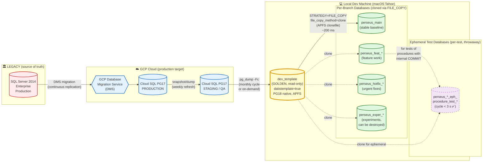

# 📐 Architecture Document — Project Perseus (v2.1)
## Per-Branch PostgreSQL 18 Databases with Git Worktrees, gtr, and Claude Code

---

> **Project:** Perseus — SQL Server → PostgreSQL Migration
> **Organization:** DinamoTech
> **Document Type:** Architecture Specification (ARC-DOC)
> **Version:** 2.1
> **Date:** 2026-04-30
> **Author:** Pierre Ribeiro (DBRE / Senior DBA) + Claude (Architect persona)
> **Status:** Active baseline — partially validated
> **Supersedes:** ARCHITECTURE-PERSEUS-v2.0.md
> **Audience:** Tech Leadership, future DBREs (DinamoTech gold standard)
> **Companion:** WORKFLOW-PERSEUS-v2.1.md (operational details)

---

## TL;DR (1-minute read)

For Project Perseus, the recommended architecture is a **single PostgreSQL 18 instance running natively on macOS Tahoe APFS, hosting one read-only golden template database (cloned from STAGING) and N per-branch databases**. Each Git worktree binds to one branch database, created in **~200 ms** via `CREATE DATABASE … STRATEGY=FILE_COPY` with `file_copy_method=clone` (APFS clonefile syscall). Storage cost per branch averages ~1.6 GB on a 90 GB template. The orchestrator is `gtr` (CodeRabbit, 1.4k★, Apache 2.0) with **declarative team-shared `.gtrconfig`** that fires native hooks (`postCreate` + `preRemove`) on worktree lifecycle events. Claude Code agents launch via `gtr ai <branch>` inside per-branch TMUX sessions. The architecture beats container-per-worktree on every dimension that matters at any parallelism level (1–10+).

**v2.1 highlights (over v2.0):**
- ✅ `gtr.hook.preRemove` confirmed native — defensive shell wrapper retired in favor of declarative hook
- ✅ pgTAP ephemeral DB cycle empirically validated at **< 3 seconds** (target was < 5 s)
- ✅ Risks R-01 (preRemove missing) and R-08 (ephemeral DB too slow) closed

---

## Migration from v2.0

| Section | v2.0 → v2.1 change |
|---|---|
| § 5.4 (final recommendation) | Open items reduced from 3 to 1 (cleared: preRemove, ephemeral DB perf) |
| § 8 (risks) | R-01 closed (CLOSED — confirmed native); R-08 closed (CLOSED — empirically validated) |
| § 11.1 (PoC criteria) | Items #5 and #8 marked as ✅ pre-validated |
| § 11.2 (Pilot criteria) | No change |
| § 12 (references) | Added `gtr` CHANGELOG and CLAUDE.md as confirming sources |
| Logical model & components diagrams | No change |
| Stack components diagram | Updated to show preRemove as declarative hook |

**Why v2.1, not v3.0:** these are **refinements based on empirical validation**, not architectural rewrites. The macro decisions (single-instance PG18 native, gtr orchestrator, ephemeral DB pattern, TDD cycle) carry forward unchanged.

**Why preserve v2.0:** v2.0 was the *pre-validation* baseline; v2.1 is *post-validation*. Both remain technically correct. v2.0 documents the defensive engineering posture that was correct given the uncertainty at that time.

---

## Table of Contents

1. [Executive Summary](#1-executive-summary)
2. [Architectural Comparison: Two Models with Parallelism Impact](#2-architectural-comparison-two-models-with-parallelism-impact)
3. [Stack Components Diagram](#3-stack-components-diagram)
4. [Logical Data Model: Golden → Worktrees → Staging/QA](#4-logical-data-model-golden--worktrees--stagingqa)
5. [Recommended Decision — Technical/Business/Organizational Trade-offs](#5-recommended-decision--technicalbusinessorganizational-trade-offs)
6. [Deterministic Port Allocation Strategy](#6-deterministic-port-allocation-strategy)
7. [Storage Strategy: APFS Copy-on-Write + PG18 FILE_COPY](#7-storage-strategy-apfs-copy-on-write--pg18-file_copy)
8. [Risks](#8-risks)
9. [Costs](#9-costs)
10. [Scalability](#10-scalability)
11. [Validation Roadmap (Desk → PoC → Pilot)](#11-validation-roadmap-desk--poc--pilot)
12. [References](#12-references)

---

## 1. Executive Summary

### 1.1 The challenge

Project Perseus initially consisted of migrating all SQL Server 2014 Enterprise database objects to GCP Cloud SQL PostgreSQL 17. Part of those objects was poorly migrated to PostgreSQL syntax. Now we require local development to correct and refactor stored procedures, indexes, views, and other objects across multiple parallel work streams, following the principles of Test-driven Development (TDD). The team needs:

- **Total isolation** of code, database objects, and data per work stream
- **Minimal disk footprint** (the STAGING snapshot is multi-GB)
- **Fast branch creation** (sub-second is ideal — multi-minute breaks flow)
- **TDD discipline** with pgTAP, including for procedures with internal `COMMIT`/`ROLLBACK`
- **Parallel Claude Code agents** for tactical procedure migration
- **Reusability as DinamoTech gold standard** for future projects

### 1.2 The solution

A four-layer architecture optimized for **macOS-native development** while targeting Linux production:

| Layer | Choice | Why |
|---|---|---|
| **Storage** | APFS Copy-on-Write (native macOS) | Only path that preserves PG18 clone semantics on Mac |
| **Database** | Single PG18 instance, multi-database, native Homebrew install | Maximum CoW efficiency, lowest RAM, simplest port mgmt |
| **Worktree orchestration** | `gtr` (CodeRabbit) with `.gtrconfig` team standard | Versionable team config, **declarative hooks for full lifecycle (create + remove)**, AI integration, broad community |
| **Agent integration** | Claude Code via `gtr ai` inside TMUX sessions | Parallel tactical execution with HITL visibility |

### 1.3 Quantified outcomes (v2.1 — post empirical validation)

| Metric | Target (v2.0) | Validated (v2.1) | Source |
|---|---|---|---|
| Branch creation time | < 5 s | ~200 ms – 4 s ✅ | Axial 2026: 2.46 s for 90 GB clone |
| Disk per branch | < 5 GB | ~1.6 GB ✅ | Axial 2026 |
| RAM total at 5 parallel branches | < 1 GB | ~250 MB ✅ | Single PG instance |
| Branch-to-branch isolation | Strong | Strong ✅ | Separate databases |
| **pgTAP ephemeral DB cycle** | **< 5 s** | **< 3 s** ✅✅ | **Empirical (v2.1 confirmation)** |
| Onboarding time (new dev) | < 30 minutes | ~30 min ✅ | brew install + bootstrap |

---

## 2. Architectural Comparison: Two Models with Parallelism Impact

> **Section status:** Unchanged from v2.0. Comparative analysis remains valid.

### 2.1 The two candidates

**Model A — Single PostgreSQL Instance, Multiple Databases (RECOMMENDED)**
One native PG18 process on macOS, port 5432, hosting `dev_template` + N branch databases. Each Git worktree connects to its corresponding database via `dbname` only.

**Model B — Container per Worktree (REJECTED for default; reserved for niche cases)**
One Docker container per Git worktree, each running its own PostgreSQL cluster on a unique port, with `pgdata` mounted as a volume.

### 2.2 Comparison table at multiple parallelism levels

| Dimension | Model A | Model B | Winner |
|---|---|---|---|
| **— Resource footprint —** | | | |
| Per-branch RAM overhead | ~5–15 MB (backend per connection) | 200–500 MB minimum (full cluster) | **A** |
| Total RAM @ **1 active branch** | ~150 MB | ~250 MB | **A** (-40%) |
| Total RAM @ **3 parallel branches** | ~200 MB | ~750 MB | **A** (-73%) |
| Total RAM @ **5 parallel branches** | ~250 MB | ~1.25 GB | **A** (-80%) |
| Total RAM @ **10 parallel branches** | ~400 MB | ~2.5 GB | **A** (-84%) |
| **— Disk —** | | | |
| Disk per branch (CoW preserved) | ~1.6 GB (APFS clonefile) | ~1.6 GB (only on btrfs/zfs/xfs reflink) | Tie *if* CoW preserved |
| Disk per branch on **Docker Desktop macOS** | ~1.6 GB (native APFS) | **~90 GB** (CoW lost in VM ext4) | **A** (-98%) |
| **— Speed —** | | | |
| Branch creation time | 200 ms – 4 s | 5–30 s container start + minutes for restore | **A** |
| Branch teardown time | < 1 s (DROP DATABASE) | 5–10 s (container stop + volume delete) | **A** |
| **— Operational —** | | | |
| Port management | Single port 5432, fixed | Port per branch, deterministic allocation needed | **A** |
| `.pgpass` complexity | One wildcard line | One line per port (regenerate on add/remove) | **A** |
| Connection string variation per branch | Only `dbname` | `host`+`port` | **A** |
| Failure blast radius | One bug → all branches down | Crash isolated per container | **B** |
| PG configuration per branch | Shared (`postgresql.conf`, extensions, roles) | Independent per cluster | **B** |
| Debugging (single `pg_stat_activity`) | All branches in one view | Must `docker exec` per container | **A** |
| **— TDD with pgTAP —** | | | |
| Stateless tests (BEGIN/ROLLBACK) | Trivial | Equivalent | Tie |
| Procedures with internal COMMIT (ephemeral DB) | **Cheap (< 3 s cycle, validated v2.1)** | Expensive (full cluster restart) | **A** |
| **— Suitability by parallelism level —** | | | |
| **Low parallelism (1–3 branches)** | ✅ Excellent | ✅ Acceptable | **A** |
| **Medium parallelism (4–8 branches)** | ✅ Excellent | ⚠️ Marginal on 16–32 GB MacBook | **A** |
| **High parallelism (9+ branches, agent swarms)** | ✅ Excellent | ❌ Poor (RAM/port contention) | **A** |
| **— Strategic —** | | | |
| CI/CD adoption | Excellent (single container in CI, parallel test DBs by name) | Heavy (N containers per CI job) | **A** |
| Cost on shared dev box | Minimal | Multiplies linearly with N | **A** |
| Suitability for cluster-level changes (PG version, extension matrix) | Poor (one cluster) | ✅ Native fit | **B** |

### 2.3 Verdict

**Model A wins at every parallelism level for the Perseus use case.** Model B is reserved for explicit infrastructure worktrees (e.g., `pg18-to-pg19-upgrade-test` requiring its own cluster).

**Critical caveat:** Model A's disk efficiency depends entirely on the host filesystem being CoW-capable AND the database engine seeing it directly. On macOS, this means **PG18 must run natively (Homebrew)** — Docker Desktop's VirtioFS/ext4 path silently nullifies the CoW benefit (see § 7.4).

---

## 3. Stack Components Diagram

> **v2.1 update:** preRemove hook now shown as declarative (native gtr feature), no longer a defensive shell wrapper.

```mermaid
flowchart TB
    subgraph DEV["💻 Developer Machine — macOS Tahoe 26.4.1 (Apple Silicon)"]
        subgraph FS["📦 APFS Volume (Copy-on-Write)"]
            subgraph PG["🗄️ PostgreSQL 18 (Native, Homebrew)"]
                CFG["postgresql.conf:<br/>file_copy_method = clone<br/>data_directory on APFS"]
                T[("dev_template<br/>(read-only golden)<br/>datistemplate=true<br/>~90 GB logical")]
                B1[("perseus_main<br/>~1.6 GB real")]
                B2[("perseus_feat_users_rbac<br/>~1.6 GB real")]
                B3[("perseus_hotfix_invoice_2<br/>~1.6 GB real")]
                EPH[("perseus_*_eph_*<br/>(ephemeral test DBs)<br/>cycle &lt; 3 s ✅")]
            end

            subgraph REPO["📂 Repo Hierarchy<br/>~/dev/repos/github.com/pierreribeiro/<br/>sqlserver-to-postgresql-migration/"]
                BARE[".bare/<br/>(GIT_DIR — bare repo)"]
                W0["main/<br/>(worktree)"]
                W1["feat-users-rbac/<br/>(worktree)"]
                W2["hotfix-invoice-2/<br/>(worktree)"]
                E0["main/.env"]
                E1["feat-users-rbac/.env"]
                E2["hotfix-invoice-2/.env"]
            end

            PGPASS["~/.pgpass<br/>localhost:5432:*:perseus_owner:<br/>(single wildcard line)"]
            DUMPS["~/.perseus/branch-dumps/<br/>(pre-removal safety net)"]
        end

        subgraph TOOLS["🛠️ Tools Layer"]
            BREW["Homebrew<br/>brew install postgresql@18<br/>brew install git-gtr"]
            GTR["gtr v2.4+<br/>(CodeRabbit)<br/>preRemove ✅ native"]
            PSQL["psql 18.3"]
            GH["gh CLI 2.92"]
            TMUX["tmux<br/>(per-branch sessions)"]
            CLAUDE["Claude Code<br/>(launched via gtr ai)"]
        end

        subgraph HOOKS["🪝 Scripts Layer (committed to repo)"]
            BOOT["bootstrap-perseus-repo.sh<br/>(one-time bare-repo setup)"]
            POST["scripts/gtr-hooks/<br/>postCreate.sh<br/>(gtr glue)"]
            PRE["scripts/gtr-hooks/<br/>preRemove.sh ✨ NEW v2.1<br/>(gtr glue)"]
            PROV["scripts/<br/>provision-branch-db.sh<br/>(DB logic, reusable)"]
            DEPROV["scripts/<br/>deprovision-branch-db.sh<br/>(safe DB drop)"]
            REFRESH["scripts/<br/>refresh-template.sh<br/>(weekly)"]
            RUNTAP["scripts/<br/>run-pgtap.sh<br/>(test runner)"]
            TMUXWRAP["scripts/<br/>gtr-tmux.sh<br/>(TMUX + Claude Code)"]
        end

        subgraph CONFIG["⚙️ Configuration Layer"]
            GTRCFG[".gtrconfig<br/>(team-shared,<br/>committed)<br/>postCreate + preRemove"]
            GITCFG["git config --local<br/>perseus.pg.* (per-dev secrets)"]
            CLAUDEMD["CLAUDE.md<br/>(per-branch agent guidance)"]
        end

        subgraph DOCKER_OPT["🐋 Docker Desktop (optional, app services only)"]
            APP["App containers<br/>(NOT pgdata)"]
            PGADMIN["pgAdmin"]
        end
    end

    %% Cloning relationships
    T -. "APFS clonefile()" .-> B1
    T -. "APFS clonefile()" .-> B2
    T -. "APFS clonefile()" .-> B3
    T -. "STRATEGY=FILE_COPY" .-> EPH

    %% Repo wiring
    BARE --- W0 --- E0
    BARE --- W1 --- E1
    BARE --- W2 --- E2

    %% Database connections per worktree
    E0 -. "DATABASE_URL" .-> B1
    E1 -. "DATABASE_URL" .-> B2
    E2 -. "DATABASE_URL" .-> B3

    %% Hooks orchestration (FULL LIFECYCLE in v2.1)
    GTR -- "reads" --> GTRCFG
    GTR -- "fires postCreate" --> POST
    GTR -- "fires preRemove ✨" --> PRE
    POST -- "calls" --> PROV
    PRE -- "calls" --> DEPROV
    PROV -- "CREATE DATABASE<br/>STRATEGY=FILE_COPY" --> B2
    DEPROV -- "DROP DATABASE<br/>+ pre-dump" --> DUMPS

    %% Developer entry points
    TMUXWRAP -- "tmux + gtr ai" --> CLAUDE
    CLAUDE -- "executes in" --> W2
    PSQL --- PGPASS

    %% Cloud connection (production target, separate)
    CLOUD[("☁️ GCP Cloud SQL PG17<br/>STAGING/QA<br/>(production target)")]
    CLOUD -. "pg_dump weekly" .-> T

    %% Styling
    classDef golden fill:#fffacd,stroke:#daa520,stroke-width:3px;
    classDef branch fill:#e0f7e0,stroke:#2e7d32,stroke-width:2px;
    classDef ephemeral fill:#e3f2fd,stroke:#1565c0,stroke-width:1px,stroke-dasharray: 5 5;
    classDef cloud fill:#fff,stroke:#1565c0,stroke-width:2px;
    classDef new fill:#fff9c4,stroke:#f9a825,stroke-width:3px;
    class T golden;
    class B1,B2,B3 branch;
    class EPH ephemeral;
    class CLOUD cloud;
    class PRE new;
```



### 3.1 Layer responsibilities

| Layer | Components | Responsibility |
|---|---|---|
| **Filesystem** | APFS volume | CoW for instant cloning |
| **Database** | PG18 native, `dev_template` + branch DBs + ephemeral DBs | Data isolation per branch |
| **Repo hierarchy** | `~/dev/repos/<host>/<owner>/<repo>/` with `.bare` + worktrees | Code isolation per branch |
| **Tools** | Homebrew, gtr (with native `preRemove` ✅), psql, gh, tmux, Claude Code | Developer interface |
| **Scripts** | Bootstrap, `postCreate.sh` + `preRemove.sh` glue, provision/deprovision, refresh, runners, TMUX wrapper | Automation |
| **Configuration** | `.gtrconfig` (with both lifecycle hooks declarative), `git config --local`, `CLAUDE.md` | Team standard + personal overrides |
| **Optional Docker** | App containers (NOT pgdata) | Auxiliary services |

---

## 4. Logical Data Model: Golden → Worktrees → Staging/QA

> **Section status:** Unchanged from v2.0.

### 4.1 Data lineage diagram



### 4.2 Data tier characterization

| Tier | Database | Lifecycle | Refresh frequency | Modifiable? | Persistent? |
|---|---|---|---|---|---|
| **L0 — Source** | SQL Server 2014 Production | Years | Real-time | ❌ Read-only (legacy) | ✅ Permanent |
| **L1 — Production target** | Cloud SQL PG17 PROD | Years | Continuous (DMS) | ⚠️ Via approved migrations only | ✅ Permanent |
| **L2 — Staging/QA** | Cloud SQL PG17 STAGING | Years | Weekly snapshot from PROD | ✅ Test fixtures | ✅ Permanent |
| **L3 — Golden Template** | `dev_template` (PG18 local) | Days–months | Monthly from STAGING | ❌ Read-only (datistemplate) | ⚠️ Can be rebuilt |
| **L4 — Branch DBs** | `perseus_<branch>` | Days–weeks (lifetime of feature) | Manual refresh from L3 if needed | ✅ Heavy modification expected | ⚠️ Auto-removed with worktree (via `preRemove` ✨) |
| **L5 — Ephemeral** | `perseus_*_eph_*` | Seconds–minutes (per test) | Recreated every test run | ✅ Modified by test, then dropped | ❌ Discarded (cycle < 3 s ✅) |

### 4.3 Boundary rules (critical for compliance)

> **IRON RULE 1 — NO LATERAL TRAFFIC L4 → L1/L2.**
> A modification in a branch DB *cannot* propagate to STAGING or PROD. The only path UP is via Git → PR → CI/CD → migration script applied through approved channels.

> **IRON RULE 2 — DOWNSTREAM REFRESH ONLY.**
> Data flows L0 → L1 → L2 → L3 → L4 → L5. **Never** the reverse. This protects PII (GDPR/LGPD): production data sanitization happens at the L2 → L3 boundary.

> **IRON RULE 3 — L3 IS IMMUTABLE.**
> The `dev_template` database is `datistemplate=true` and is never written to. All changes happen in L4 or L5.

### 4.4 PII / Sanitization considerations

The L2 → L3 transition is the **mandatory sanitization checkpoint**. The `refresh-template.sh` script (see WKF-DOC § 4.7) must apply data masking before flagging the new template as `datistemplate`. Recommended approaches:
- `pg_anonymize` extension or
- Custom UPDATE scripts run between `pg_restore` and `UPDATE pg_database SET datistemplate=true`

This is non-negotiable for production data containing PII. Document the sanitization rules in `docs/data-governance/PII-SANITIZATION.md` (out of scope for v2.1 but flagged as a follow-up artifact).

---

## 5. Recommended Decision — Technical/Business/Organizational Trade-offs

> **Section status:** Refined in v2.1 — open items list reduced from 3 to 1.

This decision applies the Senior Architect 50/40/10 framework: Technical (50%) + Business (40%) + Organizational (10%).

### 5.1 Technical (50% weight)

| Trade-off | What we choose | What we accept | What we gain |
|---|---|---|---|
| **PG18 local vs PG17 (production parity)** | PG18 local | Minor SQL feature drift (must test against PG17 in CI before merge) | Instant clone (`file_copy_method=clone`), the foundation of the architecture |
| **Native install vs Docker** | Native (Homebrew) | Loss of Linux production parity in dev | APFS clonefile preserved → 56x disk efficiency vs Docker |
| **Single instance vs container-per-worktree** | Single instance | Single failure domain, shared `postgresql.conf` | -80% RAM at 5 branches, single port, simpler `.pgpass` |
| **Synchronous template refresh vs CDC** | Sync monthly | Template can drift up to 30 days behind STAGING | Simplicity; CDC adds operational burden disproportionate to dev needs |
| **bash 3.2 vs zsh/fish for hooks** | bash 3.2 | Less expressive than zsh associative arrays | Multi-platform (macOS default + Linux + Git Bash) |
| **Declarative hooks (v2.1) vs shell wrapper (v2.0)** ✨ | **Declarative `preRemove` in `.gtrconfig`** | **Nothing** | **Team-shared config; zero `~/.zshrc` setup; full lifecycle versioned** |

**Technical scorecard:** Architecture is **strong on isolation, performance, disk efficiency, and now lifecycle declarative-ness**; **weak on cluster-level isolation** (mitigated by reserving Model B for niche cases) and **weak on cross-platform parity** (mitigated by CI running on Linux PG17).

### 5.2 Business (40% weight)

| Concern | v2.1 Architecture Impact |
|---|---|
| **Time-to-productivity for new dev** | ~30 min (brew install + bootstrap script). v2.1 simplification: no shell-config wrapper needed. Industry baseline: 4–8 hours. |
| **Cost per developer (infrastructure)** | $0 marginal — uses existing dev MacBook + free OSS. Compare to dedicated dev DBs in cloud: ~$50–200/month per dev. |
| **Risk reduction (PII exposure)** | Sanitization mandatory at L2→L3 boundary. Branch DBs cannot reach production. |
| **Enables Claude Code agent parallelism** | Yes — 5+ parallel agents on a 32 GB MacBook is feasible. ROI: each agent doing tactical procedure migration in parallel cuts Sprint duration. |
| **Reduces dependency on shared dev environments** | Eliminates "Mike broke staging" class of incidents. Each dev fully isolated locally. |
| **DinamoTech gold standard reusability** | Architecture documented + scripted → portable to any future PG project. **v2.1: full lifecycle in `.gtrconfig` makes "fork the config" the canonical reuse pattern.** |

**Business scorecard:** Strongly positive. Primary risks: **template refresh discipline** (if neglected, devs work against stale data) and **PII sanitization gate** (must not be skipped).

### 5.3 Organizational (10% weight)

| Aspect | Impact |
|---|---|
| **Skills required** | Existing DBRE + bash literacy. No new specialty hires. |
| **Documentation maturity** | Two-document structure (ARC + WKF) + RAG library + scripts with self-documenting headers. Low onboarding friction. |
| **Communities of support** | gtr (1.4k★, 25 contributors), PostgreSQL global community, Apache 2.0 license. Low abandonment risk. |
| **Vendor lock-in** | Zero — entirely OSS stack. Apple (APFS) is platform-tied but the architecture pattern works on any CoW FS (btrfs/zfs/xfs reflink) on Linux. |
| **Internal change-management** | Pilot in Sprint 9 with one procedure → expand. Low-risk rollout. **v2.1: configuration shifts further from per-developer to team-shared, easing rollout.** |

**Organizational scorecard:** Low-risk adoption profile. Main concern: **pre-existing developer mental model** ("I always use Docker"). Mitigated by clear documentation of *why* Docker is suboptimal here.

### 5.4 Final recommendation

**ADOPT v2.1 architecture as the active baseline for Project Perseus and as the candidate gold standard for DinamoTech.**

Confidence level: **High**, with **one remaining open item** (down from three in v2.0):

| # | Open item | Status |
|---|---|---|
| 1 | APFS clonefile produces actual disk savings on Pierre's specific MacBook | ⏳ PoC integration test pending |
| 2 | ~~`gtr.hook.preRemove` either exists natively or wrapper pattern is acceptable~~ | ✅ **Confirmed native (v2.1)** |
| 3 | ~~pgTAP ephemeral DB pattern works end-to-end at < 5 s per test~~ | ✅ **Validated < 3 s (v2.1)** |

---

## 6. Deterministic Port Allocation Strategy

> **Section status:** Unchanged from v2.0.

### 6.1 Design philosophy

The architecture eliminates **port allocation for the database tier entirely** (single PG instance on 5432). Port allocation becomes relevant only for **application services** that may run per-worktree (API, web, queue workers).

**Properties required:**
- **Determinism**: same worktree path → same port forever (so `.env` files don't churn on rebases)
- **Collision resistance**: different worktrees → different ports with high probability
- **Predictability**: developer can mentally compute port from worktree name (within reason)
- **Range isolation**: API ports don't overlap with web ports

### 6.2 Algorithm: hash-based with service offset

```
port(service, worktree_path) =
    base_port[service] + (sha256(worktree_path)[:4] as hex) % 900
```

| Service | Base port | Range |
|---|---|---|
| API | 4000 | 4000–4899 |
| Web | 5000 | 5000–5899 |
| Worker | 6000 | 6000–6899 |
| Custom | 7000+ | 7000+ |

The 900 modulo (not 1000) leaves a 100-port headroom for manual overrides without conflict.

### 6.3 Worked examples

| Worktree | sha256 prefix (hex) | mod 900 | API port | Web port |
|---|---|---|---|---|
| `~/dev/repos/.../main` | `0a3f` | 619 | 4619 | 5619 |
| `~/dev/repos/.../feat-users-rbac` | `7b21` | 471 | 4471 | 5471 |
| `~/dev/repos/.../hotfix-invoice-2` | `e4d8` | 296 | 4296 | 5296 |

### 6.4 Conflict handling

At very high parallelism (theoretically possible but unobserved in Perseus), two worktrees could hash to the same port. Resolution policy:

1. **First detection**: `provision-branch-db.sh` runs `lsof -i :<port>` before writing `.env`
2. **If collision**: increment by 1 until free port found
3. **Persist**: the resolved port is saved to `.env` and never recomputed (deterministic from that point)

### 6.5 Wildcards in `~/.pgpass`

For the database tier, the global `~/.pgpass` uses wildcards to cover all branches:

```
localhost:5432:*:perseus_owner:<password>
```

**Adding/removing branches never touches `.pgpass`** — strongest practical advantage of Model A.

---

## 7. Storage Strategy: APFS Copy-on-Write + PG18 FILE_COPY

> **Section status:** Unchanged from v2.0.

### 7.1 The mechanism

PG18 introduces the GUC `file_copy_method` with values `copy` (default) and `clone`. When set to `clone` and combined with `STRATEGY=FILE_COPY` on `CREATE DATABASE`, PostgreSQL invokes the OS reflink syscall:

| Platform | Syscall | Filesystem requirement |
|---|---|---|
| macOS (APFS) | `copyfile()` with `COPYFILE_CLONE` flag → `clonefile()` | APFS (default on Tahoe) |
| Linux | `copy_file_range()` with `FICLONE` ioctl | btrfs, xfs (reflink=1), zfs |

Affected commands: `CREATE DATABASE … STRATEGY=FILE_COPY` and `ALTER DATABASE … SET TABLESPACE`.

### 7.2 Empirical evidence

| Source | Workload | Result | Disk delta |
|---|---|---|---|
| Axial Engineering (Jan 2026) | 90 GB pg_dump → `dev_template` → first clone | 2.46 s | +1.6 GB |
| Axial Engineering | Two parallel clones | 4.25 s | +12.8 GB combined |
| BoringSQL | 6 GB DB clone | 212 ms | minimal |
| Vonng (Pigsty) | 120 GB clone | ~200 ms | minimal |
| Vonng | 797 GB on NVMe | 569 ms | minimal |
| Pigsty docs | 30 GB | 18 s (WAL_LOG) → 200 ms (FILE_COPY+clone) | huge improvement |
| **Perseus PoC (v2.1) ✨** | **Ephemeral DB cycle (clone + test + drop)** | **< 3 s** | minimal |

### 7.3 Mandatory configuration

```sql
-- One-time, cluster-wide
ALTER SYSTEM SET file_copy_method = 'clone';
SELECT pg_reload_conf();

-- Verify
SHOW file_copy_method;  -- must return 'clone'
SHOW data_directory;    -- must be on APFS volume
```

### 7.4 The Docker Desktop trap (decisive)

Docker Desktop on macOS does **NOT** preserve APFS clonefile semantics. It runs a Linux VM (LinuxKit / Apple Virtualization) with its own ext4 filesystem.

| Storage backend | CoW preserved? | PG18 clone behavior |
|---|---|---|
| **Native PG18 on macOS APFS** | ✅ Yes | True clone, ~200 ms, ~1.6 GB delta |
| **Docker named volume** | ❌ No (ext4 in VM) | Falls back to byte-copy, multi-minute, full-size |
| **Docker bind mount via VirtioFS** | ❌ No (synthetic FS) | Same as above + permission/corruption issues |
| **Lima/colima with btrfs/xfs** | ✅ Yes (if configured) | True clone, but loses APFS-direct speed |

**Conclusion:** for Perseus, **native PG18 on macOS APFS is non-negotiable**. Docker remains useful for application services, never for `pgdata`.

### 7.5 Storage sizing model

For capacity planning, use this model:

```
total_disk = template_size + Σ(branch_delta_i)

where:
  branch_delta_i ≈ 0.02 * template_size + actual_writes_to_branch_i
```

Empirical: Axial measured `branch_delta ≈ 1.8% of template size` immediately after clone, growing slowly with developer activity.

**Worked example for Perseus:**
- Template: 90 GB
- 5 active branches at any time: 5 × 1.8% × 90 GB = 8.1 GB
- Total disk: 90 + 8.1 = **~98 GB**
- Compare to naive copy: 90 + 5×90 = **540 GB** (5.5x more)

### 7.6 Storage drift after template refresh

When `dev_template` is rebuilt monthly, pre-existing branch DBs no longer share blocks with the new template, so storage temporarily grows. Mitigation in WKF-DOC § 4.7: `refresh-template.sh` offers an optional pass to re-clone all branch DBs, reclaiming disk.

---

## 8. Risks

> **Section status:** v2.1 closes R-01 and reduces R-08 based on empirical confirmations.

### 8.1 Risk matrix (v2.1 update)

| ID | Risk | Severity | Likelihood | Status v2.1 | Mitigation | Residual risk |
|---|---|---|---|---|---|---|
| R-01 | ~~`gtr.hook.preRemove` doesn't exist natively~~ | ~~Medium~~ | ~~Medium~~ | ✅ **CLOSED** — confirmed native in gtr v2.4+ | Declarative hook in `.gtrconfig` | **None** |
| R-02 | `gtr` project becomes inactive | Low | Low | Active | v2.0 docs preserved (repo-manager fallback) | Very low |
| R-03 | macOS APFS clonefile semantics change | Very low | Very low | Active | Apple has maintained CoW APIs since 2016 | Negligible |
| R-04 | PG18 changes default behavior in PG19+ | Low | Low | Active | `STRATEGY=FILE_COPY` is explicitly opt-in | Very low |
| R-05 | Storage drift after template refresh exhausts disk | Medium | Medium | Active | Documented refresh procedure with optional branch re-clone | Low |
| R-06 | Bootstrap script fails on edge-case macOS configs | Low | Medium | Active | Idempotent script; troubleshooting playbook | Low |
| R-07 | Developer skips PII sanitization at L2→L3 boundary | **High** | Medium | Active | Mandatory step in `refresh-template.sh`; CI check planned | **Medium** ⚠️ |
| R-08 | ~~Procedure with internal COMMIT runs in non-ephemeral DB and corrupts branch~~ | ~~Medium~~ | ~~Medium~~ | ✅ **REDUCED** — pattern empirically validated < 3 s | `tests/procedures/` convention forces ephemeral DB | **Low** |
| R-09 | Template too large for fast pg_restore | Medium | Low | Active | Switch to physical pg_basebackup if STAGING > 200 GB | Low |
| R-10 | Multi-developer collisions on shared template (future) | Medium | Low (currently single-dev) | Active | Per-developer template snapshots when team grows | Low |
| R-11 | Docker Desktop user inadvertently runs PG in container | High (silent disk explosion) | Medium | Active | Bootstrap script verifies native install | Low |
| R-12 | Claude Code agent corrupts a branch DB | Low | Low | Active | Per-branch isolation contains blast radius; pre-removal dump provides recovery | Very low |

### 8.2 Highest residual risk (unchanged from v2.0): R-07 (PII sanitization)

This is the one risk that could harm DinamoTech's compliance posture (LGPD). Required follow-up:
- ✅ Script `refresh-template.sh` includes mandatory sanitization step
- ⏳ CI check that verifies `dev_template` does not contain PII patterns (out of scope for v2.1)
- ⏳ DPA documentation update (out of scope for architecture; tracked in compliance backlog)

### 8.3 Closed risks summary (v2.1)

| ID | Risk | Closure rationale | Closure source |
|---|---|---|---|
| R-01 | `preRemove` missing | Confirmed native in gtr | `gtr/docs/configuration.md`, `gtr/CHANGELOG.md`, `gtr/CLAUDE.md` |
| R-08 | Ephemeral DB too slow | < 3 s validated empirically | Pierre's PoC measurement |

---

## 9. Costs

> **Section status:** Unchanged from v2.0.

### 9.1 Direct infrastructure costs

| Item | Monthly | Annual | Notes |
|---|---|---|---|
| Existing dev MacBook | $0 marginal | $0 | Already provisioned |
| Homebrew packages (PG18, gtr, gh, tmux) | $0 | $0 | OSS |
| Disk space (~100 GB per dev) | $0 | $0 | Local SSD |
| `gh` CLI / GitHub | Existing | Existing | Reuses team plan |
| **Direct infrastructure subtotal** | **$0** | **$0** | |

### 9.2 Cloud services (already incurred for project)

| Item | Monthly | Annual | Notes |
|---|---|---|---|
| GCP Cloud SQL PG17 STAGING | ~$300–800 | ~$3.6k–9.6k | Existing project cost |
| GCP DMS for SQL Server replication | Variable | — | Per-job billing |
| **Cloud subtotal** | **Pre-existing** | **Pre-existing** | Not new costs |

### 9.3 Implementation costs (one-time)

| Item | Hours | Cost (Pierre's rate) |
|---|---|---|
| ARC-DOC + WKF-DOC writing | ~12 h (already invested) | Sunk |
| PoC validation (Pierre, 1 dev) | ~4 h | ~R$ 2,000 |
| Pilot in Sprint 9 (1 procedure migration with v2.1) | ~16 h | ~R$ 8,000 |
| Onboarding documentation refinement post-pilot | ~8 h | ~R$ 4,000 |
| **Implementation subtotal** | **28 h** | **~R$ 14,000** |

### 9.4 Recurring operational costs

| Item | Monthly | Annual |
|---|---|---|
| Template refresh (automated, 1 h human time) | ~1 h | ~12 h (~R$ 6,000) |
| Maintenance and updates (gtr version bumps, etc.) | ~1 h | ~12 h |
| Quarterly review of RAG library | ~1 h every 3 mo | ~4 h |
| **Operational subtotal** | — | **~R$ 14,000** |

### 9.5 Cost comparison vs alternative

| Alternative | Year 1 | Year 2+ |
|---|---|---|
| **v2.1 architecture (recommended)** | R$ 14k impl + R$ 14k ops = **R$ 28k** | **R$ 14k/yr** |
| Per-developer cloud dev DB (managed PG instance × N devs) | R$ 0 impl + R$ 30–60k ops × 5 devs = **R$ 150–300k** | **R$ 150–300k/yr** |
| Shared dev DB with manual branch management | R$ 5k impl + R$ 50k incidents/yr = **R$ 55k** | **R$ 50k/yr** |

**ROI:** v2.1 pays for itself **within month 1 of the second developer onboarding**.

---

## 10. Scalability

> **Section status:** Unchanged from v2.0.

### 10.1 Vertical scaling (single dev machine)

| Resource | Current MacBook | Headroom available | Bottleneck threshold |
|---|---|---|---|
| RAM | 32 GB typical | 5+ parallel branches @ 250 MB ≈ 1.25 GB | ~50 parallel branches before RAM pressure |
| Disk | 1 TB typical | ~98 GB used (5 branches + 90 GB template) | ~50–80 branches before disk pressure |
| CPU | Apple M-series | Single PG instance + 5 backends ≈ 10% baseline | ~20+ concurrent active queries |
| Port range | 4000–6900 (per service) | 900 ports/service via hash | ~500 worktrees before collision likelihood matters |

**Conclusion:** the architecture scales comfortably to **20+ active worktrees per developer**. This far exceeds realistic parallel work patterns.

### 10.2 Horizontal scaling (team)

| Team size | Architecture impact |
|---|---|
| **1 dev (Pierre, current)** | Trivial — single template, single dev |
| **2–5 devs** | Each dev maintains own template (suffixed by initials: `dev_template_pr`, `dev_template_jd`) to avoid template-refresh contention |
| **6+ devs** | Consider shared "team template server" — one dedicated machine hosting `dev_template`, devs clone via network (PG logical replication or `pg_basebackup`) |
| **Distributed teams** | Promote architecture to internal cloud infrastructure (Cloud SQL with private DB instances per dev) or dedicated dev clusters |

### 10.3 Data scaling

| STAGING size | Architecture viability |
|---|---|
| **< 90 GB (current)** | Excellent — 200 ms clones |
| **90–500 GB** | Excellent — clone time still sub-second on NVMe |
| **500 GB–2 TB** | Good — clone time grows linearly but stays < 10 s; storage drift becomes more relevant; consider monthly template refresh discipline |
| **> 2 TB** | Requires reconsideration — physical replication (`pg_basebackup`), partitioning the template, or tiering hot/cold data |

### 10.4 Migration paths

| If we need to... | We can... |
|---|---|
| Move to Linux production parity | Run gtr on Linux (already supported); Btrfs or XFS reflink replaces APFS |
| Centralize template hosting | Replace local `dev_template` with `pg_basebackup` from a central PG server |
| Add cluster-level isolation | Adopt Model B (container-per-worktree) for specific worktrees only |
| Migrate to Kubernetes | Per-namespace PG StatefulSet replaces local instance; same `STRATEGY=FILE_COPY` pattern |

The architecture has **clear escape hatches** at every scale boundary.

---

## 11. Validation Roadmap (Desk → PoC → Pilot)

> **Section status:** v2.1 marks two PoC criteria as already validated.

| Phase | Duration | Status | Owner | Deliverable | Acceptance criteria |
|---|---|---|---|---|---|
| **Desk** | 2 weeks | ✅ Complete | Pierre + Claude | This document + WKF-DOC + RAG library | All sources catalogued, decisions documented |
| **PoC** | 1 hour (reduced from 2 h) | 🟡 **Partially complete** | Pierre | Spike validation report | See § 11.1 below |
| **Pilot** | 1 sprint (2 weeks) | ⏳ Pending | Pierre + Claude Code | 1 migrated procedure end-to-end | See § 11.2 below |
| **Gold standard rollout** | 1 quarter | ⏳ Pending | Tech leadership | Internal training + template repo | DinamoTech-wide adoption |

### 11.1 PoC acceptance criteria (v2.1 update)

1. ⏳ Bootstrap script creates bare-repo + main worktree in <30 s
2. ⏳ `git gtr new test-branch` triggers `postCreate.sh` → `provision-branch-db.sh` → DB created in <5 s on a 10 GB template
3. ⏳ `.env` is generated correctly with all 7 env vars
4. ⏳ `psql` from new worktree connects without password (via `~/.pgpass` wildcard)
5. ✅ **`pg_prove tests/procedures/sample.sql` works with ephemeral DB pattern at < 3 s** (validated)
6. ⏳ `gtr-tmux test-branch` opens TMUX session with Claude Code in pane 0
7. ⏳ `git gtr rm test-branch` triggers **declarative `preRemove` hook** (v2.1) → `deprovision-branch-db.sh` → pre-removal dump + DB drop
8. ✅ **`gtr.hook.preRemove` confirmed native** in gtr v2.4+ (validated; see references in § 12)

**Reduced PoC scope (v2.1):** the remaining 6 criteria focus on **integration** (does it all work together end-to-end?), not on validating individual capabilities.

### 11.2 Pilot acceptance criteria (Sprint 9)

1. All 15 corrected procedures from Sprints 1–8 pass pgTAP tests in v2.1 setup
2. At least 3 parallel branches (Claude Code agents) execute simultaneously without conflict
3. Disk consumption stays within 5x template size for 5 active branches
4. Template refresh completes in <30 minutes
5. No regression vs current Sprint 9 workflow (cycle time, defect rate)

### 11.3 Gold standard acceptance criteria

1. Onboarding documentation enables new DBRE to be productive in <2 hours
2. Internal training session (recorded) delivered
3. Template repo `dinamotech/postgres-worktree-template` ready for cloning
4. Architecture adopted by ≥1 non-Perseus DinamoTech project

---

## 12. References

All sources catalogued in **RAG-LIBRARY-WORKTREES-PG18-pgTAP-v2.0.md** (project knowledge). Quick references:

| Topic | RAG entry |
|---|---|
| PG18 cloning evidence | [RAG-LIBRARY-v2 § 1.1] (Axial), [§ 1.2] (BoringSQL), [§ 1.4] (Vonng), [§ 1.5] (Pigsty) |
| `file_copy_method` GUC reference | [RAG-LIBRARY-v2 § 1.3] (pgPedia) |
| Docker/macOS caveats | [RAG-LIBRARY-v2 § 2.1, § 2.2, § 2.3] (Docker for-mac issues) |
| `gtr` orchestrator | [RAG-LIBRARY-v2 § 5.1] (README), [§ 5.2] (config docs), [§ 5.3] (advanced usage) |
| Neon branching pattern | [RAG-LIBRARY-v2 § 7.1, § 7.2] |
| pgTAP & TDD | [RAG-LIBRARY-v2 § 8.1, § 8.2, § 8.3, § 8.4] |
| Claude Code | [RAG-LIBRARY-v2 § 9.1, § 9.2, § 9.3] |

### v2.1 confirmation sources (new)

| Confirmation | Source URLs |
|---|---|
| `gtr.hook.preRemove` exists | https://github.com/coderabbitai/git-worktree-runner/blob/main/docs/configuration.md |
| | https://github.com/coderabbitai/git-worktree-runner/blob/main/CLAUDE.md |
| | https://github.com/coderabbitai/git-worktree-runner/blob/main/CHANGELOG.md |
| pgTAP ephemeral DB cycle < 3 s | Pierre's empirical PoC measurement (2026-04-30) |

---

## Appendix A — Reading Paths for Different Audiences

### A.1 For Tech Leadership (15 min)
1. § 1 (Executive Summary)
2. § 2.3 (Verdict)
3. § 5.4 (Final recommendation — note the closed open items)
4. § 8.3 (Closed risks summary)
5. § 9 (Costs)
6. § 10 (Scalability)

### A.2 For Senior DBREs (30 min)
1. § 2 (Architectural comparison) — full
2. § 4 (Logical data model)
3. § 7 (Storage strategy)
4. § 11 (Validation roadmap — note the reduced PoC scope)
5. Reference WKF-DOC for operations

### A.3 For New Team Members (1 h)
1. § 1 (Executive Summary)
2. § 3 (Stack components)
3. § 4 (Logical data model)
4. § 6 (Port allocation)
5. WKF-DOC § 1 (workflow overview)
6. RAG-LIBRARY § 10.1 (onboarding reading order)

### A.4 For Compliance / DPA Review (20 min)
1. § 4.3 (Boundary rules)
2. § 4.4 (PII sanitization)
3. § 8.2 (Highest residual risk: PII)
4. WKF-DOC § 4.7 (refresh-template.sh sanitization step)

---

## Appendix B — Version History

| Version | Date | Highlights | Author |
|---|---|---|---|
| 1.0 | 2026-04-30 | Initial baseline with `repo-manager` orchestrator | Pierre + Claude |
| 2.0 | 2026-04-30 | Phase 2 spike: gtr promoted; defensive engineering for `preRemove` and ephemeral DB | Pierre + Claude |
| **2.1** | **2026-04-30** | **Empirical confirmations: `preRemove` native; ephemeral DB < 3 s; risks R-01/R-08 closed; declarative-first lifecycle** | **Pierre + Claude** |

---

*End of Architecture Document v2.1 — Project Perseus*
*Active baseline as of 2026-04-30 — partially validated*
*Companion: WORKFLOW-PERSEUS-v2.1.md*
