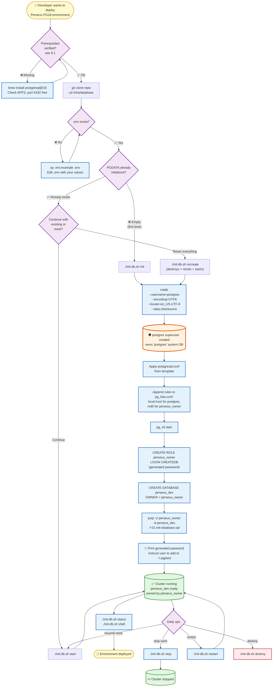

# 🚀 Deployment Document — Perseus PostgreSQL 18 Infrastructure

---

> **Project:** Perseus — SQL Server → PostgreSQL Migration
> **Organization:** DinamoTech
> **Document Type:** Infrastructure Deployment Guide
> **Version:** 1.1
> **Date:** 2026-04-30
> **Author:** Pierre Ribeiro (DBRE / Senior DBA) + Claude (Architect persona)
> **Status:** Active baseline
> **Supersedes:** deployment-perseus-infrastructure-v1.0.md
> **Companion:** ARCHITECTURE-PERSEUS-v2.1.md, WORKFLOW-PERSEUS-v2.1.md
> **Audience:** Developers + DBREs provisioning the local PG18 environment

---

## TL;DR (1-minute read)

This document describes how to provision the **local PostgreSQL 18 development environment** for Project Perseus using **native macOS Homebrew** (no Docker) and management scripts. The cluster lives at `/Users/pierre.ribeiro/workspace/sharing/sqlserver-to-postgresql-migration/postgres/v18/pgdata` (outside the Git repo). All configuration comes from a `.env` file (no hardcoded values). A single CLI orchestrator `init-db.sh` exposes commands `init | start | stop | restart | status | shell | destroy | recreate`.

**Role hierarchy (clarified in v1.1):**
- 🛡️ **`postgres`** — superuser (DBA admin) of the entire cluster; owner of the `postgres` system database
- 👤 **`perseus_owner`** — owns the `perseus_dev` database and the `perseus*` schemas; non-superuser; daily-use role

The cluster is created with extension `pgtap` enabled by default, plus the heritage extensions from the original Docker-based `01-init-database.sql` (uuid-ossp, pg_stat_statements, btree_gist, pg_trgm, citext).

**Key shifts from the Docker baseline:**
- 🔴 Docker eliminated → `brew install postgresql@18` is now a hard prerequisite
- 🔴 `compose.yaml` and `.secrets/` removed
- 🟢 `01-init-database.sql` reused (90%+) with `pgtap` extension added
- 🟢 New `pg_ctl`-based startup/shutdown wrapper preserves the same CLI surface
- 🟢 Password management migrated from `.secrets/postgres_password.txt` to `~/.pgpass` (per ARC v2.1 §2.5)

---

## Migration from v1.0

This patch release applies three corrections that improve naming clarity, role separation, and path organization. **No architectural changes.**

| Change | v1.0 | v1.1 | Rationale |
|---|---|---|---|
| **Superuser role** | Implicit | **Explicitly documented**: `postgres` is the cluster superuser (DBA admin) | Audit clarity; aligns with security boundary discipline |
| **Object owner role** | `perseus_admin` | **`perseus_owner`** | Semantic precision — "owner" describes the role's actual function (owns DB + schemas), avoiding the `admin` connotation now reserved for the cluster superuser |
| **PGDATA path** | `/Users/pierre.ribeiro/workspace/sharing/sqlserver-to-postgresql-migration/postgres/v18` | `/Users/pierre.ribeiro/workspace/sharing/sqlserver-to-postgresql-migration/postgres/v18/pgdata` | Reserves `v18/` parent for non-data artifacts (auxiliary backups, alt configs); follows industry convention (matches Docker baseline `pgdata/`) |

**Impact on companion documents:**

⚠️ The `perseus_admin` → `perseus_owner` rename **also affects** the following artifacts (NOT updated in this patch — track separately):
- `WORKFLOW-PERSEUS-v2.1.md` — § 2.5 `.pgpass` example, § 6.x cookbook commands
- `ARCHITECTURE-PERSEUS-v2.1.md` — § 4.2 data tier role references
- Hook scripts (`provision-branch-db.sh`, `deprovision-branch-db.sh`, `run-pgtap.sh`) — env var references

Plan to update these in a follow-up session (likely as WKF v2.2 / ARC v2.2 minor bump).

**Why preserve v1.0:** consistent with the v2.0/v2.1 versioning discipline — historical baseline preserved for decision-log auditing.

---

## Table of Contents

1. [Prerequisites Verification](#1-prerequisites-verification)
2. [Role Model & Security Boundaries](#2-role-model--security-boundaries)
3. [File Layout & Conventions](#3-file-layout--conventions)
4. [Deployment Process Flowchart](#4-deployment-process-flowchart)
5. [Step-by-Step Deployment](#5-step-by-step-deployment)
6. [Complete Script Listings](#6-complete-script-listings)
7. [Operational Cookbook](#7-operational-cookbook)
8. [Troubleshooting Playbook](#8-troubleshooting-playbook)
9. [Acceptance Checklist](#9-acceptance-checklist)
10. [References](#10-references)

---

## 1. Prerequisites Verification

Before deploying, verify that all prerequisites are in place. Run each command and confirm the expected output.

### 1.1 macOS environment

```bash
# Verify macOS version (Tahoe 26.x expected)
sw_vers
# Expected: ProductName: macOS / ProductVersion: 26.x

# Verify APFS filesystem on data disk (mandatory for PG18 clone semantics)
diskutil info / | grep "File System Personality"
# Expected: File System Personality: APFS
```

### 1.2 PostgreSQL 18 installed via Homebrew

```bash
# Check PG18 binaries
which psql
which initdb
which pg_ctl
# Expected: paths like /opt/homebrew/opt/postgresql@18/bin/psql

# Check version
psql --version
# Expected: psql (PostgreSQL) 18.x

# Check PG18 formula installed
brew list --versions postgresql@18
# Expected: postgresql@18 18.x
```

If PG18 is NOT installed:
```bash
brew install postgresql@18
```

### 1.3 Required tools

```bash
# Required: psql, initdb, pg_ctl (from PG18)
# Optional but recommended:
brew list --versions gh tmux fzf
# Install missing ones:
brew install gh tmux fzf
```

### 1.4 Existing PG18 service must NOT be running on port 5432

The Perseus environment will start its own `postgres` process pointing to a project-specific `PGDATA` directory. If you have a previously-running PG18 service, stop it first:

```bash
# Check if any PostgreSQL is running on 5432
lsof -nP -iTCP:5432 | grep LISTEN
# Expected output: empty (no process listening)

# If output shows a process, stop the old service:
brew services stop postgresql@18

# Or kill manually if needed:
# (be careful — make sure you're not killing a different DB you depend on)
```

### 1.5 Sudo privileges (NOT required)

This deployment **does NOT require sudo**. All operations run under your user account. The `PGDATA` directory is created in your workspace, owned by you.

---

## 2. Role Model & Security Boundaries

The Perseus cluster operates with **two clearly-separated roles** following the principle of least privilege.

### 2.1 The two roles

| Role | Privileges | Scope of ownership | Use case |
|---|---|---|---|
| **`postgres`** | `SUPERUSER`, `CREATEROLE`, `CREATEDB`, `REPLICATION`, `BYPASSRLS` | Owns the `postgres` system database; superuser of the cluster | Cluster administration, role creation, system maintenance, emergency access |
| **`perseus_owner`** | `LOGIN`, `CREATEDB` (no SUPERUSER) | Owns the `perseus_dev` database and all schemas (`perseus`, `perseus_test`, `fixtures`); owner of all migration objects | Daily development; all per-branch DB clones inherit ownership from this role |

### 2.2 Why this separation matters

| Concern | How separation helps |
|---|---|
| **Blast radius** | A bug in a Perseus migration script (run as `perseus_owner`) cannot affect the cluster's system catalog or other databases |
| **Audit trail** | `pg_stat_activity` and logs show clearly whether an operation was performed by the DBA (`postgres`) or by application logic (`perseus_owner`) |
| **CI parity** | Production GCP Cloud SQL also enforces non-superuser application roles. Local matches production discipline. |
| **PII compliance** | The L2→L3 sanitization gate (ARC v2.1 §4.4) runs as `postgres`; downstream Perseus operations cannot bypass it |
| **Mental model** | "If it touches the cluster, use `postgres`. If it touches Perseus business objects, use `perseus_owner`." |

### 2.3 When to use which role

```bash
# As postgres (DBA admin) — rare, infrastructure-level only
psql -h localhost -U postgres -d postgres
# - Creating new roles
# - Cluster-wide ALTER SYSTEM
# - Refreshing dev_template (pg_restore as postgres)
# - Emergency recovery

# As perseus_owner (daily development) — primary
psql -h localhost -U perseus_owner -d perseus_dev
# - Running migrations
# - Creating tables, procedures, functions
# - Running pgTAP tests
# - All branch DB connections inherit this user
```

### 2.4 Authentication

Both roles authenticate via different mechanisms in `pg_hba.conf`:

```
# (configured automatically by init-db.sh init)
local   all   postgres        trust          # local socket — convenience for DBA on dev machine
local   all   perseus_owner   md5            # password required even on local socket
host    all   perseus_owner   127.0.0.1/32   md5
host    all   perseus_owner   ::1/128        md5
```

The `trust` for `postgres` is acceptable for **local single-developer dev environments only** — it allows the DBA to connect without managing a local cluster password. For shared or CI machines, change to `md5` or `scram-sha-256`.

`perseus_owner` always requires a password. Stored once in `~/.pgpass` per ARC v2.1 §2.5.

---

## 3. File Layout & Conventions

### 3.1 Repository structure (relevant files only)

```
sqlserver-to-postgresql-migration/                        # Git repo root
└── infra/
    └── database/
        ├── .env.example                                  # ✅ committed (placeholders)
        ├── .env                                          # ❌ gitignored (real values)
        ├── .gitignore                                    # ignores .env + logs
        ├── README.md                                     # quick reference
        ├── postgresql.conf.template                      # ✅ committed (tuning template)
        ├── init-db.sh                                    # ✅ orchestrator CLI
        ├── lib/
        │   └── common.sh                                 # ✅ shared helpers (logging, env loading)
        └── init-scripts/
            └── 01-init-database.sql                      # ✅ heritage SQL + pgtap added
```

### 3.2 PostgreSQL data directory (outside the repo)

Per criterion #3, `PGDATA` lives **outside** the Git repo, with a dedicated `pgdata/` subdirectory under `v18/`:

```
/Users/pierre.ribeiro/workspace/sharing/sqlserver-to-postgresql-migration/
└── postgres/
    └── v18/
        ├── pgdata/                       # ← PGDATA (the actual cluster)
        │   ├── base/                     # database files
        │   ├── global/
        │   ├── pg_log/                   # logs (pg_log subdirectory inside PGDATA)
        │   ├── postgresql.conf           # generated from template at init time
        │   ├── pg_hba.conf
        │   ├── postmaster.pid            # exists when running
        │   └── ... (standard PG layout)
        └── (reserved for future:         # auxiliary artifacts at v18/ level
             auxiliary backups, alt
             configs, dump archives)
```

> **Why a separate `pgdata/` subdirectory?**
> Reserves the `v18/` parent for non-data artifacts (manual `pg_dump` outputs, alternative `postgresql.conf` test profiles, scripts) without polluting the data directory. Aligns with the universal convention (matches the heritage Docker `infra/database/pgdata/`).

### 3.3 Authentication (`~/.pgpass`)

Per ARC v2.1 §2.5, a single global `.pgpass` line covers all branch DBs for `perseus_owner`:

```
# ~/.pgpass — chmod 600
localhost:5432:*:perseus_owner:<your-password>
```

The orchestrator generates a password on `init` and prints it once for you to add to `~/.pgpass`. **The password is NOT stored in any committed file.**

The `postgres` superuser does NOT need a `~/.pgpass` entry on dev machines because `pg_hba.conf` uses `trust` for local socket connections (see § 2.4).

### 3.4 Naming conventions

| Object | Value |
|---|---|
| Cluster superuser | `postgres` |
| Database owner role | `perseus_owner` |
| Application database | `perseus_dev` |
| App schemas | `perseus`, `perseus_test`, `fixtures` |
| Encoding | `UTF8` |
| Locale | `en_US.UTF-8` |
| Timezone | `America/Sao_Paulo` |
| Port | `5432` |

These match the original `infra/database/` Docker-based setup (with the `perseus_admin` → `perseus_owner` rename in v1.1) so all downstream scripts (procedure deployment, pgTAP runs, refactoring tools) keep working with minimal updates (just the role name).

---

## 4. Deployment Process Flowchart



---

## 5. Step-by-Step Deployment

### Step 1 — Verify prerequisites

Run all checks from § 1. Stop and fix anything that fails before continuing.

### Step 2 — Clone repo and navigate to infra

```bash
cd /Users/pierre.ribeiro/workspace/projects/amyris  # or wherever your repos live
git clone git@github.com:pierreribeiro/sqlserver-to-postgresql-migration.git
cd sqlserver-to-postgresql-migration/infra/database
```

### Step 3 — Configure `.env`

```bash
cp .env.example .env
$EDITOR .env
```

Adjust the values to match your environment. **Default values** in `.env.example` are sensible for a single-developer macOS Tahoe setup; you may only need to confirm `PERSEUS_PGDATA_DIR`.

> **Never commit `.env`.** It is in `.gitignore`.

### Step 4 — Initialize the cluster (first time only)

```bash
./init-db.sh init
```

This single command performs:

1. Validates `.env` is present and complete
2. Validates PG18 binaries are in PATH
3. Creates the `PGDATA` directory (`v18/pgdata/`) if missing
4. Runs `initdb` with `--username=postgres` (creates the cluster superuser), UTF8 + en_US.UTF-8 + data checksums
5. Generates `postgresql.conf` from `postgresql.conf.template`, substituting env vars
6. Configures `pg_hba.conf` for local trust (`postgres`) and md5 (`perseus_owner`)
7. Starts the cluster via `pg_ctl start`
8. Generates a random password for `perseus_owner`
9. Creates the `perseus_owner` role (LOGIN, CREATEDB, no SUPERUSER) with that password
10. Creates the `perseus_dev` database **owned by `perseus_owner`**
11. Runs `init-scripts/01-init-database.sql` connected as `perseus_owner` (extensions, schemas, audit table, helpers)
12. Prints the generated password and instructions for `~/.pgpass`

### Step 5 — Add the generated password to `~/.pgpass`

`init-db.sh init` prints the password and instructions at the end. Copy and run:

```bash
# Append the password to ~/.pgpass (or add a new line if file already exists)
echo "localhost:5432:*:perseus_owner:<generated-password>" >> ~/.pgpass
chmod 600 ~/.pgpass
```

> The password is shown **only once** at init time. Save it. If you lose it, you can rotate via `psql` (as `postgres`) or just `recreate`.

### Step 6 — Verify the deployment

```bash
./init-db.sh status
```

Expected output:
```
[init-db] ✅ Cluster running (PID xxxx)
[init-db]    Host: localhost
[init-db]    Port: 5432
[init-db]    Database: perseus_dev
[init-db]    Owner: perseus_owner
[init-db]    Superuser: postgres
[init-db]    PGDATA: /Users/.../postgres/v18/pgdata
```

```bash
./init-db.sh shell
```

This connects you to `perseus_dev` as `perseus_owner` via `psql`. Run smoke tests:

```sql
\conninfo                    -- confirms: user=perseus_owner, db=perseus_dev
SELECT current_user;         -- perseus_owner
SELECT session_user;         -- perseus_owner
\dn                          -- should list: perseus, perseus_test, fixtures, public (all owned by perseus_owner)
\dx                          -- should list: pgtap + uuid-ossp + pg_stat_statements + btree_gist + pg_trgm + citext + plpgsql
SELECT version();            -- PostgreSQL 18.x
SHOW server_encoding;        -- UTF8
SHOW timezone;               -- America/Sao_Paulo
SELECT * FROM perseus.migration_log;  -- empty table, structure ok
\q
```

To verify the cluster admin separately:
```bash
# Connect as the superuser (uses local trust, no password)
psql -h localhost -U postgres -d postgres
\du                          -- list all roles; should show: postgres (Superuser), perseus_owner (Create DB)
\l                           -- list databases; should show: postgres (owned by postgres), perseus_dev (owned by perseus_owner)
\q
```

### Step 7 — Daily operations

```bash
# Resume work after a reboot
./init-db.sh start

# End of day
./init-db.sh stop

# Restart after config change
./init-db.sh restart

# Quick health check
./init-db.sh status
```

### Step 8 — Reset the environment (when needed)

When you want to start fresh — for example after a template rebuild, after a major config change, or to reproduce CI behavior:

```bash
./init-db.sh recreate
```

This is a shortcut for `destroy` + `init`. **All data in `perseus_dev` is permanently lost.**

For a destructive-only operation (no re-init):

```bash
./init-db.sh destroy
# Cluster stopped. PGDATA wiped. Run `init` to start over.
```

---

## 6. Complete Script Listings

### 6.1 `.env.example` (committed — placeholders, no secrets)

```bash
# =============================================================================
#  .env.example — Perseus PG18 infrastructure configuration
# =============================================================================
#  Copy to .env and adjust values. NEVER commit .env (gitignored).
#  IRON RULE: no hardcoded values in scripts — everything comes from here.
# =============================================================================

# --- PostgreSQL paths ---
# Homebrew default install path on Apple Silicon: /opt/homebrew/opt/postgresql@18
# On Intel Macs: /usr/local/opt/postgresql@18
PERSEUS_PG_PREFIX=/opt/homebrew/opt/postgresql@18

# Data directory — MUST be outside the Git repo (per ARC v2.1)
# Note: actual cluster files live under .../v18/pgdata/ subdirectory
PERSEUS_PGDATA_DIR=/Users/pierre.ribeiro/workspace/sharing/sqlserver-to-postgresql-migration/postgres/v18/pgdata

# Log directory — defaults to $PGDATA/pg_log
PERSEUS_PG_LOG_DIR=/Users/pierre.ribeiro/workspace/sharing/sqlserver-to-postgresql-migration/postgres/v18/pgdata/pg_log

# --- Connection ---
PERSEUS_PG_HOST=localhost
PERSEUS_PG_PORT=5432

# --- Database/role hierarchy ---
# Superuser: 'postgres' (created automatically by initdb; system DB owner)
PERSEUS_PG_SUPERUSER=postgres

# Application owner role: owns perseus_dev DB and all perseus* schemas
# Non-superuser; daily-use role
PERSEUS_DB_NAME=perseus_dev
PERSEUS_DB_OWNER=perseus_owner

# --- Locale & encoding ---
PERSEUS_PG_ENCODING=UTF8
PERSEUS_PG_LOCALE=en_US.UTF-8
PERSEUS_PG_TIMEZONE=America/Sao_Paulo

# --- Performance tuning (development workload, local SSD) ---
PERSEUS_PG_SHARED_BUFFERS=256MB
PERSEUS_PG_WORK_MEM=16MB
PERSEUS_PG_MAINTENANCE_WORK_MEM=64MB
PERSEUS_PG_EFFECTIVE_CACHE_SIZE=1GB
PERSEUS_PG_MAX_CONNECTIONS=100
PERSEUS_PG_RANDOM_PAGE_COST=1.1
PERSEUS_PG_EFFECTIVE_IO_CONCURRENCY=200
PERSEUS_PG_CHECKPOINT_COMPLETION_TARGET=0.9

# --- PG18-specific feature: file_copy_method (instant clone via APFS) ---
PERSEUS_PG_FILE_COPY_METHOD=clone
```

### 6.2 `.gitignore` (committed)

```gitignore
# infra/database/.gitignore
.env
*.log
pg_log/
.DS_Store
```

### 6.3 `postgresql.conf.template` (committed)

```ini
# =============================================================================
#  postgresql.conf.template — Perseus PG18 development tuning
# =============================================================================
#  Placeholders {{VAR}} are substituted at init time by init-db.sh.
#  All values originate from .env. NEVER hardcode here.
# =============================================================================

# --- Connection ---
listen_addresses = 'localhost'
port = {{PERSEUS_PG_PORT}}
max_connections = {{PERSEUS_PG_MAX_CONNECTIONS}}

# --- Memory ---
shared_buffers = {{PERSEUS_PG_SHARED_BUFFERS}}
work_mem = {{PERSEUS_PG_WORK_MEM}}
maintenance_work_mem = {{PERSEUS_PG_MAINTENANCE_WORK_MEM}}
effective_cache_size = {{PERSEUS_PG_EFFECTIVE_CACHE_SIZE}}

# --- Storage / SSD optimization ---
random_page_cost = {{PERSEUS_PG_RANDOM_PAGE_COST}}
effective_io_concurrency = {{PERSEUS_PG_EFFECTIVE_IO_CONCURRENCY}}
checkpoint_completion_target = {{PERSEUS_PG_CHECKPOINT_COMPLETION_TARGET}}

# --- PG18 instant clone ---
file_copy_method = {{PERSEUS_PG_FILE_COPY_METHOD}}

# --- Locale ---
timezone = '{{PERSEUS_PG_TIMEZONE}}'
log_timezone = '{{PERSEUS_PG_TIMEZONE}}'

# --- Logging ---
log_destination = 'stderr'
logging_collector = on
log_directory = 'pg_log'
log_filename = 'postgresql-%Y-%m-%d_%H%M%S.log'
log_rotation_age = 1d
log_rotation_size = 100MB
log_line_prefix = '%t [%p] %u@%d/%a from %h: '
log_statement = 'ddl'
log_min_duration_statement = 1000
log_checkpoints = on
log_connections = on
log_disconnections = on

# --- Required extensions to preload ---
shared_preload_libraries = 'pg_stat_statements'

# --- Parallel query (dev workload) ---
max_parallel_workers_per_gather = 4
```

### 6.4 `lib/common.sh` (committed — shared helpers)

```bash
#!/usr/bin/env bash
# =============================================================================
#  lib/common.sh — Shared helpers for Perseus infra scripts
# =============================================================================
#  Sourced by init-db.sh. Provides:
#    - Logging functions (log_info, log_ok, log_warn, log_error)
#    - Environment loading (load_env)
#    - Prerequisite validation (validate_prereqs)
#  Compatibility: bash 3.2+
# =============================================================================

# --- Colors (only when stdout is a TTY) ---
if [ -t 1 ]; then
    _C_RESET="\033[0m"
    _C_BLUE="\033[0;34m"
    _C_GREEN="\033[0;32m"
    _C_YELLOW="\033[0;33m"
    _C_RED="\033[0;31m"
else
    _C_RESET=""; _C_BLUE=""; _C_GREEN=""; _C_YELLOW=""; _C_RED=""
fi

log_info()  { printf "${_C_BLUE}[init-db]${_C_RESET} ℹ️  %s\n" "$*"; }
log_ok()    { printf "${_C_GREEN}[init-db]${_C_RESET} ✅ %s\n" "$*"; }
log_warn()  { printf "${_C_YELLOW}[init-db]${_C_RESET} ⚠️  %s\n" "$*" >&2; }
log_error() { printf "${_C_RED}[init-db]${_C_RESET} ❌ %s\n" "$*" >&2; }
log_die()   { log_error "$1"; exit "${2:-1}"; }

# --- Load .env file ---
# Usage: load_env <path-to-env>
load_env() {
    local env_file="${1:-.env}"
    if [ ! -f "$env_file" ]; then
        log_die "Environment file not found: $env_file
   Hint: cp .env.example .env  &&  edit .env" 2
    fi
    set -a
    # shellcheck disable=SC1090
    . "$env_file"
    set +a

    # Verify mandatory vars
    local required=(
        PERSEUS_PG_PREFIX
        PERSEUS_PGDATA_DIR
        PERSEUS_PG_HOST
        PERSEUS_PG_PORT
        PERSEUS_PG_SUPERUSER
        PERSEUS_DB_NAME
        PERSEUS_DB_OWNER
        PERSEUS_PG_ENCODING
        PERSEUS_PG_LOCALE
        PERSEUS_PG_TIMEZONE
    )
    for var in "${required[@]}"; do
        if [ -z "${!var:-}" ]; then
            log_die "Required env var '$var' is empty in $env_file" 3
        fi
    done
}

# --- Validate prerequisites ---
validate_prereqs() {
    # PG18 binaries
    for bin in psql initdb pg_ctl pg_isready; do
        if ! command -v "$bin" >/dev/null 2>&1; then
            # Try the Homebrew prefix path
            if [ -x "$PERSEUS_PG_PREFIX/bin/$bin" ]; then
                export PATH="$PERSEUS_PG_PREFIX/bin:$PATH"
            else
                log_die "Required binary '$bin' not found in PATH or $PERSEUS_PG_PREFIX/bin
   Hint: brew install postgresql@18  &&  brew link postgresql@18" 4
            fi
        fi
    done

    # Verify version is 18.x
    local version
    version=$(psql --version | awk '{print $3}' | cut -d. -f1)
    if [ "$version" != "18" ]; then
        log_die "psql is version $version, but PostgreSQL 18 is required" 5
    fi

    # APFS check (warn if not on APFS)
    if ! diskutil info / 2>/dev/null | grep -q "APFS"; then
        log_warn "Root volume does not appear to be APFS — instant clone may not work"
    fi
}

# --- Generate password (25 chars, alphanumeric) ---
generate_password() {
    openssl rand -base64 32 | tr -d "=+/" | cut -c1-25
}

# --- Substitute {{VARS}} in a template file ---
# Usage: render_template <input> <output>
render_template() {
    local in="$1" out="$2"
    if [ ! -f "$in" ]; then
        log_die "Template not found: $in" 6
    fi
    local content
    content=$(<"$in")
    while read -r var; do
        local val="${!var:-}"
        content="${content//\{\{$var\}\}/$val}"
    done < <(grep -oE '\{\{[A-Z_]+\}\}' "$in" | tr -d '{}' | sort -u)
    printf "%s" "$content" > "$out"
}
```

### 6.5 `init-db.sh` (committed — main orchestrator)

```bash
#!/usr/bin/env bash
# =============================================================================
#  init-db.sh — Perseus PG18 infrastructure orchestrator (native, no Docker)
# =============================================================================
#  Commands:
#    init       Initialize cluster from scratch (initdb + role + DB + extensions)
#    start      Start the cluster
#    stop       Stop the cluster
#    restart    Stop + start
#    status     Show cluster status and connection info
#    shell      Connect to perseus_dev as perseus_owner via psql
#    destroy    Stop + wipe PGDATA (DESTRUCTIVE)
#    recreate   destroy + init + start
#    help       Show this help
#
#  Role hierarchy:
#    - postgres       (SUPERUSER, owns 'postgres' system DB)
#    - perseus_owner  (LOGIN+CREATEDB, owns 'perseus_dev' + perseus* schemas)
#
#  All configuration comes from .env (see .env.example).
#  IRON RULE: no hardcoded values.
#  Compatibility: bash 3.2+
# =============================================================================

set -euo pipefail

SCRIPT_DIR="$(cd "$(dirname "${BASH_SOURCE[0]}")" && pwd)"
ENV_FILE="$SCRIPT_DIR/.env"
TEMPLATE_FILE="$SCRIPT_DIR/postgresql.conf.template"
INIT_SQL="$SCRIPT_DIR/init-scripts/01-init-database.sql"

# Source shared helpers
# shellcheck disable=SC1091
. "$SCRIPT_DIR/lib/common.sh"

# ----------------------------------------------------------------------------
#  Commands
# ----------------------------------------------------------------------------

cmd_init() {
    load_env "$ENV_FILE"
    validate_prereqs

    log_info "Initializing Perseus PG18 cluster"
    log_info "  PGDATA:    $PERSEUS_PGDATA_DIR"
    log_info "  Superuser: $PERSEUS_PG_SUPERUSER"
    log_info "  DB owner:  $PERSEUS_DB_OWNER"
    log_info "  Database:  $PERSEUS_DB_NAME"

    # Idempotency guard
    if [ -f "$PERSEUS_PGDATA_DIR/PG_VERSION" ]; then
        log_die "PGDATA already initialized at $PERSEUS_PGDATA_DIR
   Hint: use './init-db.sh recreate' to wipe and reinitialize" 10
    fi

    # 1. Create PGDATA parent (handles the v18/pgdata/ subdirectory creation)
    mkdir -p "$PERSEUS_PGDATA_DIR"
    chmod 700 "$PERSEUS_PGDATA_DIR"

    # 2. Run initdb — creates the cluster with 'postgres' as SUPERUSER
    log_info "Running initdb (encoding=$PERSEUS_PG_ENCODING, locale=$PERSEUS_PG_LOCALE)…"
    initdb \
        --pgdata="$PERSEUS_PGDATA_DIR" \
        --encoding="$PERSEUS_PG_ENCODING" \
        --locale="$PERSEUS_PG_LOCALE" \
        --auth-local=trust \
        --auth-host=md5 \
        --data-checksums \
        --username="$PERSEUS_PG_SUPERUSER" \
        --no-instructions \
        > /dev/null
    log_ok "Cluster initialized (superuser: $PERSEUS_PG_SUPERUSER)"

    # 3. Render postgresql.conf
    log_info "Rendering postgresql.conf from template…"
    render_template "$TEMPLATE_FILE" "$PERSEUS_PGDATA_DIR/postgresql.conf"
    log_ok "postgresql.conf written"

    # 4. Append authentication rules to pg_hba.conf
    cat >> "$PERSEUS_PGDATA_DIR/pg_hba.conf" <<-EOF

# Perseus local development access
local   all   $PERSEUS_PG_SUPERUSER  trust
local   all   $PERSEUS_DB_OWNER      md5
host    all   $PERSEUS_DB_OWNER      127.0.0.1/32  md5
host    all   $PERSEUS_DB_OWNER      ::1/128       md5
EOF

    # 5. Start cluster
    cmd_start

    # 6. Generate password and create the application owner role + database
    local pwd
    pwd=$(generate_password)

    log_info "Creating role '$PERSEUS_DB_OWNER' and database '$PERSEUS_DB_NAME'…"
    PGPASSWORD="" psql -X -v ON_ERROR_STOP=1 \
        -h "$PERSEUS_PG_HOST" -p "$PERSEUS_PG_PORT" \
        -U "$PERSEUS_PG_SUPERUSER" -d postgres <<-SQL
        -- Application owner role: NOT a superuser; can log in and create DBs
        CREATE ROLE $PERSEUS_DB_OWNER
            WITH LOGIN
                 CREATEDB
                 NOSUPERUSER
                 NOCREATEROLE
                 PASSWORD '$pwd';

        -- Application database, owned by the application owner role
        CREATE DATABASE $PERSEUS_DB_NAME
            WITH OWNER      = $PERSEUS_DB_OWNER
                 ENCODING   = '$PERSEUS_PG_ENCODING'
                 LC_COLLATE = '$PERSEUS_PG_LOCALE'
                 LC_CTYPE   = '$PERSEUS_PG_LOCALE'
                 TEMPLATE   = template0;
SQL
    log_ok "Role '$PERSEUS_DB_OWNER' and database '$PERSEUS_DB_NAME' created"

    # 7. Run init SQL connected as perseus_owner (extensions, schemas, audit, etc.)
    log_info "Running 01-init-database.sql as $PERSEUS_DB_OWNER…"
    PGPASSWORD="$pwd" psql -X -v ON_ERROR_STOP=1 \
        -h "$PERSEUS_PG_HOST" -p "$PERSEUS_PG_PORT" \
        -U "$PERSEUS_DB_OWNER" -d "$PERSEUS_DB_NAME" \
        -f "$INIT_SQL" > /dev/null
    log_ok "Initialization SQL applied"

    # 8. Print password and ~/.pgpass instructions
    cat <<-EOF

  ┌─────────────────────────────────────────────────────────────────┐
  │  ✅  Perseus PG18 cluster initialized and running                │
  ├─────────────────────────────────────────────────────────────────┤
  │  Host       : $PERSEUS_PG_HOST
  │  Port       : $PERSEUS_PG_PORT
  │  Superuser  : $PERSEUS_PG_SUPERUSER (no password — local trust)
  │  Database   : $PERSEUS_DB_NAME
  │  DB Owner   : $PERSEUS_DB_OWNER
  │  Password   : $pwd
  │  PGDATA     : $PERSEUS_PGDATA_DIR
  │
  │  🔐 ACTION REQUIRED: add this line to ~/.pgpass:
  │
  │    $PERSEUS_PG_HOST:$PERSEUS_PG_PORT:*:$PERSEUS_DB_OWNER:$pwd
  │
  │  Then:  chmod 600 ~/.pgpass
  │
  │  Quick start:
  │    ./init-db.sh shell      # connect as $PERSEUS_DB_OWNER via psql
  │    ./init-db.sh status     # health check
  │
  │  Admin access (no password needed locally):
  │    psql -U $PERSEUS_PG_SUPERUSER -d postgres
  └─────────────────────────────────────────────────────────────────┘

EOF
}

cmd_start() {
    load_env "$ENV_FILE"
    validate_prereqs

    if [ ! -f "$PERSEUS_PGDATA_DIR/PG_VERSION" ]; then
        log_die "Cluster not initialized at $PERSEUS_PGDATA_DIR
   Hint: run './init-db.sh init' first" 11
    fi

    if pg_isready -h "$PERSEUS_PG_HOST" -p "$PERSEUS_PG_PORT" -q 2>/dev/null; then
        log_ok "Cluster is already running"
        return 0
    fi

    log_info "Starting cluster…"
    pg_ctl start \
        -D "$PERSEUS_PGDATA_DIR" \
        -l "$PERSEUS_PGDATA_DIR/pg_log/startup.log" \
        -w \
        -t 30 \
        > /dev/null
    log_ok "Cluster started"
}

cmd_stop() {
    load_env "$ENV_FILE"
    validate_prereqs

    if ! pg_isready -h "$PERSEUS_PG_HOST" -p "$PERSEUS_PG_PORT" -q 2>/dev/null; then
        log_ok "Cluster already stopped"
        return 0
    fi

    log_info "Stopping cluster…"
    pg_ctl stop -D "$PERSEUS_PGDATA_DIR" -m fast -w -t 30 > /dev/null
    log_ok "Cluster stopped"
}

cmd_restart() {
    cmd_stop
    cmd_start
}

cmd_status() {
    load_env "$ENV_FILE"
    validate_prereqs

    if [ ! -f "$PERSEUS_PGDATA_DIR/PG_VERSION" ]; then
        log_warn "Cluster not initialized at $PERSEUS_PGDATA_DIR"
        return 1
    fi

    if pg_isready -h "$PERSEUS_PG_HOST" -p "$PERSEUS_PG_PORT" -q 2>/dev/null; then
        local pid
        pid=$(cat "$PERSEUS_PGDATA_DIR/postmaster.pid" | head -1 || echo "?")
        log_ok "Cluster running (PID $pid)"
        log_info "  Host:      $PERSEUS_PG_HOST"
        log_info "  Port:      $PERSEUS_PG_PORT"
        log_info "  Database:  $PERSEUS_DB_NAME"
        log_info "  Owner:     $PERSEUS_DB_OWNER"
        log_info "  Superuser: $PERSEUS_PG_SUPERUSER"
        log_info "  PGDATA:    $PERSEUS_PGDATA_DIR"
    else
        log_warn "Cluster initialized but NOT running"
        log_info "  Hint: ./init-db.sh start"
    fi
}

cmd_shell() {
    load_env "$ENV_FILE"
    validate_prereqs

    if ! pg_isready -h "$PERSEUS_PG_HOST" -p "$PERSEUS_PG_PORT" -q 2>/dev/null; then
        log_die "Cluster not running. Run './init-db.sh start' first." 12
    fi

    # Connect as the application owner — uses ~/.pgpass for authentication
    exec psql \
        -h "$PERSEUS_PG_HOST" \
        -p "$PERSEUS_PG_PORT" \
        -U "$PERSEUS_DB_OWNER" \
        -d "$PERSEUS_DB_NAME"
}

cmd_destroy() {
    load_env "$ENV_FILE"
    validate_prereqs

    log_warn "This will PERMANENTLY DELETE all data at $PERSEUS_PGDATA_DIR"
    printf "Type 'yes' to confirm: "
    read -r confirm
    if [ "$confirm" != "yes" ]; then
        log_info "Cancelled"
        return 0
    fi

    # Stop if running
    if pg_isready -h "$PERSEUS_PG_HOST" -p "$PERSEUS_PG_PORT" -q 2>/dev/null; then
        cmd_stop
    fi

    if [ -d "$PERSEUS_PGDATA_DIR" ]; then
        rm -rf "$PERSEUS_PGDATA_DIR"
        log_ok "PGDATA wiped: $PERSEUS_PGDATA_DIR"
    fi
}

cmd_recreate() {
    cmd_destroy
    cmd_init
}

cmd_help() {
    cat <<-EOF
Perseus PG18 Infrastructure — init-db.sh

Usage: $0 <command>

Commands:
  init       Initialize cluster from scratch
  start      Start the cluster
  stop       Stop the cluster
  restart    Stop + start
  status     Show cluster status
  shell      Connect via psql as DB owner
  destroy    Stop + wipe PGDATA (DESTRUCTIVE)
  recreate   destroy + init + start
  help       Show this help

Configuration: edit .env (see .env.example).

Role hierarchy:
  postgres       — cluster superuser (DBA admin)
  perseus_owner  — application owner (DB + schemas)
EOF
}

# ----------------------------------------------------------------------------
#  Main
# ----------------------------------------------------------------------------
case "${1:-help}" in
    init)     cmd_init ;;
    start)    cmd_start ;;
    stop)     cmd_stop ;;
    restart)  cmd_restart ;;
    status)   cmd_status ;;
    shell)    cmd_shell ;;
    destroy)  cmd_destroy ;;
    recreate) cmd_recreate ;;
    help|-h|--help) cmd_help ;;
    *)        log_error "Unknown command: $1"; cmd_help; exit 1 ;;
esac
```

### 6.6 `init-scripts/01-init-database.sql` (committed — heritage + pgtap)

```sql
-- =============================================================================
--  01-init-database.sql — Perseus PG18 initial database setup
-- =============================================================================
--  Reused from the original Docker-based setup. Changes from the heritage:
--    - ✨ pgtap extension added (Critério #2e)
--    - perseus_admin → perseus_owner (v1.1 naming alignment)
--  Runs against perseus_dev as perseus_owner.
--  Idempotent (CREATE IF NOT EXISTS, CREATE OR REPLACE).
-- =============================================================================

\set ON_ERROR_STOP on

-- =============================================================================
-- 1. Enable Required Extensions
-- =============================================================================
-- Note: extensions are owned by perseus_owner (the role running this script);
-- pg_stat_statements is preloaded via shared_preload_libraries in postgresql.conf.

CREATE EXTENSION IF NOT EXISTS "uuid-ossp"          SCHEMA public;
CREATE EXTENSION IF NOT EXISTS "pg_stat_statements" SCHEMA public;
CREATE EXTENSION IF NOT EXISTS "btree_gist"         SCHEMA public;
CREATE EXTENSION IF NOT EXISTS "pg_trgm"            SCHEMA public;
CREATE EXTENSION IF NOT EXISTS  citext              SCHEMA public;

-- ✨ pgTAP for unit testing (TDD per Perseus standards)
CREATE EXTENSION IF NOT EXISTS  pgtap               SCHEMA public;

-- =============================================================================
-- 2. Create Schemas (owned by perseus_owner, the script's session user)
-- =============================================================================

CREATE SCHEMA IF NOT EXISTS perseus      AUTHORIZATION perseus_owner;
CREATE SCHEMA IF NOT EXISTS perseus_test AUTHORIZATION perseus_owner;
CREATE SCHEMA IF NOT EXISTS fixtures     AUTHORIZATION perseus_owner;

-- =============================================================================
-- 3. Set Search Path
-- =============================================================================

ALTER ROLE perseus_owner SET search_path TO perseus, public;

-- =============================================================================
-- 4. Grant Permissions
-- =============================================================================

GRANT USAGE ON SCHEMA perseus      TO PUBLIC;
GRANT USAGE ON SCHEMA perseus_test TO PUBLIC;
GRANT USAGE ON SCHEMA fixtures     TO PUBLIC;

GRANT EXECUTE ON ALL FUNCTIONS IN SCHEMA public TO perseus_owner;

-- =============================================================================
-- 5. Configure Database Settings
-- =============================================================================

-- (Timezone is set globally via postgresql.conf — applied per-DB anyway for safety)
ALTER DATABASE perseus_dev SET timezone TO 'America/Sao_Paulo';
ALTER DATABASE perseus_dev SET log_statement TO 'ddl';
ALTER DATABASE perseus_dev SET max_parallel_workers_per_gather TO 4;

-- =============================================================================
-- 6. Create Audit Tables
-- =============================================================================

CREATE TABLE IF NOT EXISTS perseus.migration_log (
    id                   SERIAL PRIMARY KEY,
    migration_phase      VARCHAR(100) NOT NULL,
    object_type          VARCHAR(50)  NOT NULL,
    object_name          VARCHAR(255) NOT NULL,
    status               VARCHAR(20)  NOT NULL CHECK (status IN ('started','completed','failed','rolled_back')),
    quality_score        NUMERIC(4,2),
    performance_delta    NUMERIC(6,2),
    error_message        TEXT,
    executed_by          VARCHAR(100) DEFAULT CURRENT_USER,
    executed_at          TIMESTAMP WITH TIME ZONE DEFAULT CURRENT_TIMESTAMP,
    execution_duration_ms INTEGER
);

CREATE INDEX IF NOT EXISTS idx_migration_log_object      ON perseus.migration_log(object_type, object_name);
CREATE INDEX IF NOT EXISTS idx_migration_log_status      ON perseus.migration_log(status);
CREATE INDEX IF NOT EXISTS idx_migration_log_executed_at ON perseus.migration_log(executed_at DESC);

-- =============================================================================
-- 7. Create Helper Functions
-- =============================================================================

CREATE OR REPLACE FUNCTION perseus.object_exists(
    p_schema_name TEXT,
    p_object_name TEXT,
    p_object_type TEXT DEFAULT 'table'
) RETURNS BOOLEAN
LANGUAGE plpgsql AS $$
DECLARE
    v_exists BOOLEAN;
BEGIN
    CASE LOWER(p_object_type)
        WHEN 'table' THEN
            SELECT EXISTS (
                SELECT 1 FROM information_schema.tables
                WHERE table_schema = p_schema_name AND table_name = p_object_name
            ) INTO v_exists;
        WHEN 'view' THEN
            SELECT EXISTS (
                SELECT 1 FROM information_schema.views
                WHERE table_schema = p_schema_name AND table_name = p_object_name
            ) INTO v_exists;
        WHEN 'function' THEN
            SELECT EXISTS (
                SELECT 1 FROM information_schema.routines
                WHERE routine_schema = p_schema_name AND routine_name = p_object_name AND routine_type = 'FUNCTION'
            ) INTO v_exists;
        WHEN 'procedure' THEN
            SELECT EXISTS (
                SELECT 1 FROM information_schema.routines
                WHERE routine_schema = p_schema_name AND routine_name = p_object_name AND routine_type = 'PROCEDURE'
            ) INTO v_exists;
        ELSE
            RAISE EXCEPTION 'Unsupported object type: %', p_object_type;
    END CASE;
    RETURN v_exists;
END;
$$;

-- =============================================================================
-- 8. Verify Setup
-- =============================================================================

DO $$
DECLARE
    v_version  TEXT;
    v_encoding TEXT;
    v_user     TEXT;
    v_ext      TEXT;
BEGIN
    SELECT version() INTO v_version;
    SELECT current_user INTO v_user;
    RAISE NOTICE '=================================================================';
    RAISE NOTICE 'PostgreSQL Version: %', v_version;
    RAISE NOTICE 'Running as user:    %', v_user;

    SELECT pg_encoding_to_char(encoding) INTO v_encoding
    FROM pg_database WHERE datname = current_database();
    RAISE NOTICE 'Database Encoding:  %', v_encoding;

    IF v_encoding != 'UTF8' THEN
        RAISE WARNING 'Database encoding is not UTF-8 (got %)', v_encoding;
    ELSE
        RAISE NOTICE 'UTF-8 encoding verified ✓';
    END IF;

    RAISE NOTICE 'Installed extensions:';
    FOR v_ext IN
        SELECT extname || ' ' || extversion FROM pg_extension ORDER BY extname
    LOOP
        RAISE NOTICE '  - %', v_ext;
    END LOOP;

    RAISE NOTICE 'Perseus PG18 development environment ready ✓';
    RAISE NOTICE '=================================================================';
END;
$$;
```

### 6.7 `README.md` (committed — quick reference)

```markdown
# Perseus PG18 Infrastructure

Native macOS PG18 (no Docker) provisioning for Project Perseus.

## Quick Start

```bash
# 1. Prerequisites
brew install postgresql@18

# 2. Configure
cp .env.example .env  # adjust if needed

# 3. Initialize
./init-db.sh init     # prints generated password — add to ~/.pgpass

# 4. Verify
./init-db.sh status
./init-db.sh shell
```

## Role hierarchy

- **`postgres`** — cluster superuser (DBA admin). Connects via local trust (no password on dev machines).
- **`perseus_owner`** — application owner. Owns `perseus_dev` and `perseus*` schemas. Password in `~/.pgpass`.

## Commands

| Command | Purpose |
|---|---|
| `./init-db.sh init` | First-time provisioning |
| `./init-db.sh start` | Start cluster |
| `./init-db.sh stop` | Stop cluster |
| `./init-db.sh restart` | Restart |
| `./init-db.sh status` | Health check |
| `./init-db.sh shell` | psql session as `perseus_owner` |
| `./init-db.sh destroy` | Wipe PGDATA (destructive) |
| `./init-db.sh recreate` | destroy + init + start |

## Configuration

All settings come from `.env`. Never commit `.env` (gitignored).
See `.env.example` for the full list with defaults.

## Layout

- Repository: `infra/database/` (this directory)
- Data directory: `$PERSEUS_PGDATA_DIR` (defaults to `~/workspace/sharing/.../postgres/v18/pgdata`)
- Logs: `$PERSEUS_PGDATA_DIR/pg_log/`
- Password: `~/.pgpass` (generated at init, only for `perseus_owner`)

## Documentation

- Architecture: `docs/architecture/ARCHITECTURE-PERSEUS-v2.1.md`
- Workflow: `docs/architecture/WORKFLOW-PERSEUS-v2.1.md`
- Deployment: `docs/architecture/deployment-perseus-infrastructure.md`
```

---

## 7. Operational Cookbook

### 7.1 First time on a new machine

```bash
brew install postgresql@18
cd /path/to/sqlserver-to-postgresql-migration/infra/database
cp .env.example .env
$EDITOR .env                    # confirm PERSEUS_PGDATA_DIR matches your username
./init-db.sh init               # → prints password
echo "localhost:5432:*:perseus_owner:<password>" >> ~/.pgpass
chmod 600 ~/.pgpass
./init-db.sh shell              # smoke test
```

### 7.2 Daily operations

```bash
# Start of day
./init-db.sh start

# End of day
./init-db.sh stop
```

### 7.3 After an OS update / reboot

```bash
./init-db.sh status             # likely shows "initialized but not running"
./init-db.sh start
```

### 7.4 After modifying `postgresql.conf.template`

```bash
# Re-render the conf and restart
./init-db.sh stop
# Manually re-run render (or use recreate if you don't mind losing data):
psql --version  # confirm still PG18
./init-db.sh start
# For a clean apply with full reload:
./init-db.sh recreate
```

> **Note:** `init-db.sh` does not currently expose a `reload-conf` command. If you change template values, the simplest path is `recreate`. If you need a non-destructive update, edit `$PERSEUS_PGDATA_DIR/postgresql.conf` directly and run `pg_ctl reload`.

### 7.5 Reset to clean slate

```bash
./init-db.sh recreate
# Confirm 'yes' when prompted — wipes PGDATA, runs init again
# Note: a NEW password is generated. Update ~/.pgpass.
```

### 7.6 Rotate the `perseus_owner` password (without recreate)

```bash
# Connect as superuser (no password locally)
psql -h localhost -U postgres -d postgres
```
```sql
-- Inside psql as postgres
ALTER ROLE perseus_owner WITH PASSWORD 'new-strong-password';
```
Then update `~/.pgpass` with the new value.

### 7.7 Troubleshooting a corrupted cluster

```bash
# If start fails with errors, check the startup log
tail -50 "$PERSEUS_PGDATA_DIR/pg_log/startup.log"

# Look at PG's general logs
ls -la "$PERSEUS_PGDATA_DIR/pg_log/"
tail -f "$PERSEUS_PGDATA_DIR/pg_log/postgresql-*.log"

# If unrecoverable, just recreate
./init-db.sh recreate
```

### 7.8 Manual SQL execution (without scripts)

```bash
# As perseus_owner (uses ~/.pgpass automatically)
psql -h localhost -U perseus_owner -d perseus_dev

# As postgres (no password, local trust)
psql -h localhost -U postgres -d postgres

# Run a SQL file as perseus_owner
psql -h localhost -U perseus_owner -d perseus_dev -f /path/to/file.sql

# One-off command as perseus_owner
psql -h localhost -U perseus_owner -d perseus_dev -c "SELECT current_database();"
```

---

## 8. Troubleshooting Playbook

| Symptom | Likely cause | Resolution |
|---|---|---|
| `./init-db.sh init` fails: `psql not found` | PG18 not in PATH | Verify `brew list --versions postgresql@18`; ensure `PERSEUS_PG_PREFIX` in `.env` matches actual install path. On Apple Silicon: `/opt/homebrew/opt/postgresql@18`. On Intel: `/usr/local/opt/postgresql@18`. |
| `./init-db.sh init` fails: `psql is version X, but PostgreSQL 18 is required` | Multiple PG versions installed; PATH picks wrong one | Adjust `.env` `PERSEUS_PG_PREFIX` and / or add `export PATH="/opt/homebrew/opt/postgresql@18/bin:$PATH"` to `~/.zshrc` |
| `./init-db.sh init` fails: `PGDATA already initialized` | Cluster already exists | Use `./init-db.sh recreate` to reset, or just `./init-db.sh start` to use the existing cluster |
| `./init-db.sh start` fails: port 5432 already in use | Another PG instance is running | `lsof -nP -iTCP:5432 \| grep LISTEN` to find it; `brew services stop postgresql@18` if it's the brew service |
| `./init-db.sh shell` fails: `password authentication failed` | `~/.pgpass` missing or wrong (or has the old `perseus_admin` username) | Verify `~/.pgpass` line: `localhost:5432:*:perseus_owner:<password>`; verify `chmod 600 ~/.pgpass` |
| Password lost after init | The password is shown only once at init time | Either `./init-db.sh recreate` (generates new password), or rotate manually as `postgres` (see § 7.6) |
| `pgtap` extension not found | PG18 install missing pgtap | Verify with `psql -d perseus_dev -c "\\dx"`. If missing, install: `brew install pg_pgtap` (or use `pgxn install pgtap`). Then re-run `01-init-database.sql`. |
| `initdb` warns about locale | Locale `en_US.UTF-8` not generated on the system | macOS ships with this locale by default; if missing, check `locale -a \| grep en_US`. Consider switching to `--locale=C.UTF-8` in `.env` if needed. |
| `pg_ctl start` hangs | Slow disk or locked PGDATA | Wait up to 30 s. If still hung: `ps aux \| grep postgres`; manually kill stuck postmaster; `./init-db.sh stop` then `start` |
| `./init-db.sh status` shows "running" but `psql` can't connect | Listening on different port or socket-only | Check `cat $PERSEUS_PGDATA_DIR/postmaster.pid`; verify `port` in `postgresql.conf` matches `.env` |
| `01-init-database.sql` fails: "permission denied for database perseus_dev" | Script being run as the wrong user | The orchestrator runs it as `perseus_owner` (the DB owner). If running manually: `psql -U perseus_owner -d perseus_dev -f 01-init-database.sql`. NEVER run as `postgres` against `perseus_dev` — schemas would end up owned by the superuser. |
| `01-init-database.sql` fails with "extension not available" | PG18 contrib package missing | `brew reinstall postgresql@18`; verify with `ls /opt/homebrew/opt/postgresql@18/share/postgresql@18/extension/` |
| Schemas owned by `postgres` instead of `perseus_owner` | SQL was run as wrong user | `recreate` is the safest fix. Or manually: `ALTER SCHEMA perseus OWNER TO perseus_owner;` (repeat for each schema, run as `postgres`) |
| Can't drop `pgdata` directory: permission denied | Old files owned by root from a previous Docker mount | `sudo rm -rf $PERSEUS_PGDATA_DIR` (only time sudo is needed) |
| `./init-db.sh destroy` complains: cluster running | Trying to destroy a running cluster | The script auto-stops first; if it fails, run `./init-db.sh stop` manually then retry |
| Connecting to `perseus_dev` succeeds but `\dn` shows fewer schemas than expected | `01-init-database.sql` failed silently | Check init logs; `recreate` if uncertain |
| `pgtap` test scripts fail with "permission denied to create extension" | Trying to install extension as `perseus_owner` (a non-superuser) | Run `CREATE EXTENSION pgtap;` as `postgres`. The orchestrator does this automatically during init; only an issue if dropping and recreating extensions later. Alternative: grant the extension privilege explicitly. |

---

## 9. Acceptance Checklist

Use this checklist to validate the deployment is complete and correct.

### 9.1 Pre-deployment

- [ ] macOS Tahoe 26.x confirmed (`sw_vers`)
- [ ] Root volume is APFS (`diskutil info /`)
- [ ] PG18 installed via Homebrew (`brew list --versions postgresql@18`)
- [ ] `psql --version` returns 18.x
- [ ] Port 5432 free (`lsof -nP -iTCP:5432 | grep LISTEN` is empty)
- [ ] No old `brew services` instance running

### 9.2 Repo setup

- [ ] Repo cloned to local machine
- [ ] In `infra/database/`, `.env.example` exists
- [ ] `.env` created from `.env.example` and reviewed
- [ ] `.gitignore` includes `.env`

### 9.3 Initialization

- [ ] `./init-db.sh init` completes without errors
- [ ] PGDATA created at `/Users/pierre.ribeiro/workspace/sharing/sqlserver-to-postgresql-migration/postgres/v18/pgdata`
- [ ] `postgresql.conf` rendered correctly (no `{{...}}` placeholders left)
- [ ] Password printed exactly once
- [ ] `~/.pgpass` updated with the password (line uses `perseus_owner`)
- [ ] `~/.pgpass` permissions are `600`

### 9.4 Cluster runtime

- [ ] `./init-db.sh status` shows running cluster with correct PID
- [ ] `pg_isready -h localhost -p 5432` returns success
- [ ] `lsof -nP -iTCP:5432 | grep LISTEN` shows postgres process

### 9.5 Role hierarchy

- [ ] As `postgres` (no password): `psql -h localhost -U postgres -d postgres` connects
- [ ] `\du` shows two roles: `postgres` (Superuser) and `perseus_owner` (Create DB only)
- [ ] `\l` shows `postgres` (owner: postgres) and `perseus_dev` (owner: perseus_owner)
- [ ] As `perseus_owner` (with password): `./init-db.sh shell` connects without prompt
- [ ] `SELECT current_user;` inside the shell returns `perseus_owner`
- [ ] Attempting `CREATE ROLE foo;` as `perseus_owner` fails (no CREATEROLE)

### 9.6 Database content

- [ ] `\dn` lists schemas: `perseus`, `perseus_test`, `fixtures`, `public`
- [ ] All `perseus*` schemas owned by `perseus_owner` (verify with `\dn+`)
- [ ] `\dx` lists extensions: `uuid-ossp`, `pg_stat_statements`, `btree_gist`, `pg_trgm`, `citext`, **`pgtap`**, `plpgsql`
- [ ] `SELECT version();` shows PostgreSQL 18.x
- [ ] `SHOW server_encoding;` returns `UTF8`
- [ ] `SHOW timezone;` returns `America/Sao_Paulo`
- [ ] `SHOW file_copy_method;` returns `clone`
- [ ] `SELECT * FROM perseus.migration_log;` succeeds (empty result OK)

### 9.7 Lifecycle commands

- [ ] `./init-db.sh stop` stops the cluster
- [ ] `./init-db.sh start` starts it again
- [ ] `./init-db.sh restart` works
- [ ] `./init-db.sh status` correctly reflects each state

### 9.8 Destroy & recreate

- [ ] `./init-db.sh destroy` (confirm 'yes') wipes PGDATA
- [ ] `./init-db.sh init` works on a fresh PGDATA
- [ ] `./init-db.sh recreate` works as a single command
- [ ] After `recreate`, the new password is different and properly added to `~/.pgpass`

### 9.9 Idempotency

- [ ] Running `./init-db.sh init` twice (without recreate) refuses with a clear error message
- [ ] Running `./init-db.sh start` when already running is a no-op
- [ ] Running `./init-db.sh stop` when already stopped is a no-op

### 9.10 Documentation

- [ ] `README.md` reflects the actual commands (with `perseus_owner`)
- [ ] `.env.example` has comments explaining each variable
- [ ] No hardcoded values in any committed script (`grep -rn "perseus_owner\|perseus_dev\|/Users/" scripts/` should only find references via env vars)

---

## 10. References

- **Architecture:** `docs/architecture/ARCHITECTURE-PERSEUS-v2.1.md`
- **Workflow:** `docs/architecture/WORKFLOW-PERSEUS-v2.1.md`
- **RAG Library:** `docs/architecture/RAG-LIBRARY-WORKTREES-PG18-pgTAP-v2.0.md`
- **Heritage scripts (Docker baseline):** `infra/database/legacy/old-init-db.sh` (kept for reference)
- **PostgreSQL 18 docs:** https://www.postgresql.org/docs/18/
- **Homebrew formula:** https://formulae.brew.sh/formula/postgresql@18
- **pgTAP:** https://pgtap.org/

---

## Appendix A — Why we abolished Docker

Per ARC v2.1 §7.4, Docker Desktop on macOS does **not** preserve APFS Copy-on-Write semantics. The PG18 instant-clone feature (`STRATEGY=FILE_COPY` + `file_copy_method=clone`) — which is the foundation of the per-branch database architecture — silently degrades to a multi-minute byte copy when the data directory lives inside a Docker volume. Native installation via Homebrew is the only path that preserves the architecture's core performance guarantee.

Additional reasons:
- Docker Desktop VirtioFS has known permission-handling and corruption issues for `pgdata` (see ARC v2.1 §7.4)
- Native install eliminates a layer of complexity (no `docker compose`, no container networking)
- Aligns with the "single instance, multi-database" model in ARC v2.1 §2

Docker remains useful for **application services** in this project (the migrated apps, pgAdmin, message queues) — never for the database engine itself.

## Appendix B — What changed from the heritage Docker scripts

| Heritage (Docker) | New (native) | Reason |
|---|---|---|
| `compose.yaml` | (removed) | No Docker |
| `docker compose up -d` | `pg_ctl start` | Native lifecycle |
| `.secrets/postgres_password.txt` | Generated at `init`, stored only in `~/.pgpass` | ARC v2.1 §2.5 |
| `pgdata/` inside `infra/database/` | `$PERSEUS_PGDATA_DIR` outside repo | Criterion #3 |
| Docker Secrets reference | OS-level password in `.pgpass` | No Docker |
| `docker exec ... psql` | Direct `psql` | No container |
| Hardcoded values in `init-db.sh` | All from `.env` | Criterion #4 IRON RULE |
| Extensions: 4 (without pgtap) | 5 + **pgtap** | Criterion #2e |
| `init-scripts/` mount via docker-entrypoint-initdb.d | Manually run via `psql -f` after cluster start | No Docker |
| Container healthcheck | `pg_isready` | Native equivalent |
| Single role `perseus_admin` | Two-role hierarchy: `postgres` + `perseus_owner` | Security boundary clarity (v1.1) |

## Appendix C — Migration from v1.0 to v1.1

This patch documents three corrections applied to the v1.0 deployment baseline.

### C.1 Change inventory

| # | Change | v1.0 | v1.1 |
|---|---|---|---|
| 1 | Superuser explicitly documented | Implicit in `initdb --username=postgres` | New § 2 "Role Model & Security Boundaries" with explicit hierarchy |
| 2 | Application owner role rename | `perseus_admin` | `perseus_owner` |
| 3 | PGDATA path | `.../postgres/v18` | `.../postgres/v18/pgdata` |

### C.2 Files affected

| File | Change | Lines impacted |
|---|---|---|
| `.env.example` | New `PERSEUS_PG_SUPERUSER` var; rename `PERSEUS_DB_OWNER` value; PGDATA path | ~6 |
| `init-db.sh` | Reference `PERSEUS_PG_SUPERUSER`; create `perseus_owner` (not `perseus_admin`) with `NOSUPERUSER NOCREATEROLE` explicit | ~15 |
| `lib/common.sh` | Add `PERSEUS_PG_SUPERUSER` to required vars | ~1 |
| `init-scripts/01-init-database.sql` | `AUTHORIZATION perseus_owner`, `ALTER ROLE perseus_owner` | 4 occurrences |
| `README.md` | Update commands and role hierarchy section | ~10 lines |

### C.3 Impact on existing deployments

If you deployed v1.0 already, **run `./init-db.sh recreate` after pulling v1.1 changes**. The role rename and PGDATA path change are not transparently migrated. The recreate path:
1. Wipes the v1.0 PGDATA at `.../v18/`
2. Reinitializes at `.../v18/pgdata/`
3. Creates the `perseus_owner` role (vs the old `perseus_admin`)
4. Generates a new password — **update `~/.pgpass` accordingly**, removing the old `perseus_admin` line

### C.4 Impact on companion documents (NOT updated in this patch)

The following references to `perseus_admin` in companion documents need follow-up updates:

| Document | Section | Change needed |
|---|---|---|
| `WORKFLOW-PERSEUS-v2.1.md` | § 2.5 (`.pgpass`), § 6.x cookbook | `perseus_admin` → `perseus_owner` |
| `ARCHITECTURE-PERSEUS-v2.1.md` | § 4.2 (data tier) | `perseus_admin` → `perseus_owner` |
| `provision-branch-db.sh` | env var `PERSEUS_PG_USER` default | `perseus` → `perseus_owner` (or align via `git config --local perseus.pg.user`) |
| `deprovision-branch-db.sh` | same as above | same as above |
| `run-pgtap.sh` | same as above | same as above |

Plan these as a single **WKF v2.2 / ARC v2.2 minor bump** in a follow-up session.

## Appendix D — Version history

| Version | Date | Highlights | Author |
|---|---|---|---|
| 1.0 | 2026-04-30 | Initial deployment doc; native Homebrew PG18; Docker abolished; pgTAP added by default | Pierre + Claude |
| **1.1** | **2026-04-30** | **Explicit two-role hierarchy (postgres + perseus_owner); PGDATA moved to v18/pgdata/ subdirectory** | **Pierre + Claude** |

---

*End of Deployment Document v1.1 — Project Perseus*
*Active baseline as of 2026-04-30*
*Companions: ARCHITECTURE-PERSEUS-v2.1.md, WORKFLOW-PERSEUS-v2.1.md*
*Supersedes: deployment-perseus-infrastructure-v1.0.md*
