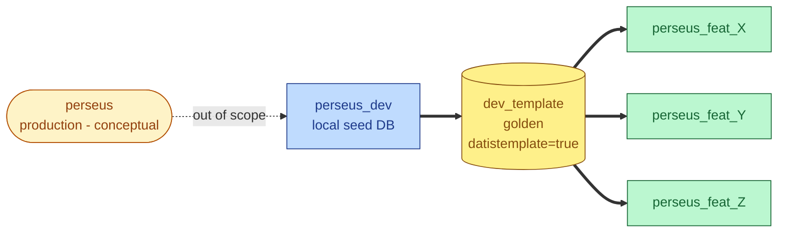

# 🚀 Deployment Document — Perseus Template Promotion

---

> **Project:** Perseus — SQL Server → PostgreSQL Migration
> **Organization:** DinamoTech
> **Document Type:** Data Promotion Deployment Guide
> **Version:** 1.0
> **Date:** 2026-05-11
> **Author:** Pierre Ribeiro (DBRE / Senior DBA) + Claude (Architect persona)
> **Status:** Active baseline
> **Companion:** deployment-perseus-infrastructure-v1.1.md (infra setup — required prerequisite)
> **Audience:** Developers + DBREs running the data promotion workflow

---

## TL;DR (1-minute read)

This document covers the promotion of `perseus_dev` (the developer's local seed database, populated from production data) into `dev_template` (the golden, read-only template used to clone per-branch worktree databases). A single script — `scripts/promote-dev-to-template.sh` — performs the clone via PG18 `STRATEGY=FILE_COPY` with `file_copy_method=clone` (APFS clonefile, ~200 ms), marks the target as `datistemplate=true`, and runs a smoke test. PII sanitization is wired as a placeholder hook (mandatory to implement before any production data flows through). Promotion is **manual, on-demand, single-developer-local**.

---

## Table of Contents

1. [Concept: 3 Actors](#1-concept-3-actors)
2. [Prerequisites](#2-prerequisites)
3. [Flowchart](#3-flowchart)
4. [Step-by-Step](#4-step-by-step)
5. [Script Reference](#5-script-reference)
6. [Operational Cookbook](#6-operational-cookbook)
7. [Troubleshooting](#7-troubleshooting)
8. [Acceptance Checklist](#8-acceptance-checklist)
9. [Version History](#9-version-history)

---

## 1. Concept: 3 Actors

This deployment operates on **three actors only**. Everything else is out of scope.

| Actor | Role | Lifecycle |
|---|---|---|
| **`perseus_dev`** | **Seed DB** populated from production data. The developer owns how it gets populated (`pg_restore`, fixtures, schema-only — out of scope). Lives in the local PG18 cluster, created by `init-db.sh init`. | Created once. Refreshed by the developer on demand. |
| **`dev_template`** | **Golden template**: a clone of `perseus_dev`, marked `datistemplate=true`, read-only. Per-branch worktree DBs clone from this. | Created by `promote-dev-to-template.sh`. Refreshed whenever the developer wants to propagate new seed state to future worktrees. |
| **`perseus_<branch>`** | **Per-branch worktree DB**, cloned from `dev_template` by `provision-branch-db.sh` (via the `gtr` `postCreate` hook). Where Claude Code agents work in isolation. | Created when a worktree is added; destroyed when the worktree is removed. |

### What this document does NOT cover

| Concern | Where it lives |
|---|---|
| How `perseus_dev` is populated with production data | Developer's choice — out of scope |
| Production database (`perseus`) topology | Conceptual only — out of scope |
| Cluster install, role creation, `perseus_dev` initial schema | `deployment-perseus-infrastructure-v1.1.md` |
| Per-branch worktree DB creation | `provision-branch-db.sh` (already in repo) |
| PII sanitization implementation | Placeholder hook present; implementation deferred (see § 5.2) |

---

## 2. Prerequisites

Before running the promotion, verify:

```bash
# 1. Cluster is running (deployment v1.1 already done)
./infra/database/init-db.sh status
# Expected: "Cluster running"

# 2. perseus_dev exists and is populated
psql -h localhost -U perseus_owner -d perseus_dev -c "
  SELECT count(*) FROM pg_class
   WHERE relnamespace NOT IN (
     SELECT oid FROM pg_namespace
      WHERE nspname IN ('pg_catalog','information_schema','pg_toast')
   );
"
# Expected: a number > 0

# 3. file_copy_method = clone (PG18 instant clone via APFS)
psql -h localhost -U postgres -d postgres -c "SHOW file_copy_method;"
# Expected: clone

# 4. APFS volume hosting PGDATA
diskutil info / | grep "File System Personality"
# Expected: APFS
```

If any check fails, fix before proceeding.

---

## 3. Flowchart



**Reading the diagram:**
- **Dashed line** (`Prod -. out of scope .-> Dev`): how `perseus_dev` is populated is out of this document's scope.
- **Thick arrow** `Dev ==> Template`: the operation this document automates. Single command: `./scripts/promote-dev-to-template.sh`.
- **Thick arrows** `Template ==> Branch*`: handled by `provision-branch-db.sh` on `gtr new <branch>`. Each branch clone takes ~200 ms.

---

## 4. Step-by-Step

### Step 1 — Verify prerequisites (§ 2)

Run all checks. Stop and fix any that fail.

### Step 2 — Confirm `.env` configuration

Open `infra/database/.env` and confirm these variables are set (additions to v1.1):

```bash
# Source seed DB (already in v1.1)
PERSEUS_DEV_DB_NAME=perseus_dev

# Target golden template — NEW
PERSEUS_TEMPLATE_DB_NAME=dev_template

# PII sanitization hook (placeholder) — NEW
PERSEUS_PII_SANITIZE_HOOK=scripts/hooks/pii-sanitize.sh
```

If missing, append them — defaults shown above are appropriate.

### Step 3 — Run the promotion

```bash
cd <repo-root>
./scripts/promote-dev-to-template.sh
```

What happens internally (no action needed from you):
1. Loads `.env` and validates prereqs
2. Confirms `perseus_dev` exists and has user objects
3. Checks `file_copy_method=clone` (warns if not)
4. **Edge case #2:** detects active branch DBs cloned from a previous template version. If found and `--force` not given → aborts with the list.
5. Invokes PII sanitization hook (currently no-op placeholder, prints warning)
6. Drops existing `dev_template` (unflags + terminates + drops)
7. `CREATE DATABASE dev_template TEMPLATE perseus_dev STRATEGY=FILE_COPY OWNER perseus_owner` (~200 ms via APFS clone)
8. `UPDATE pg_database SET datistemplate=true WHERE datname='dev_template'`
9. Smoke test: clones template into throwaway DB, drops it
10. Prints summary

### Step 4 — Verify

```bash
# Confirm dev_template exists and is flagged
psql -h localhost -U postgres -d postgres -c "
  SELECT datname, datistemplate, datallowconn
    FROM pg_database
   WHERE datname IN ('perseus_dev','dev_template');
"
```

Expected:
```
   datname    | datistemplate | datallowconn
--------------+---------------+--------------
 perseus_dev  | f             | t
 dev_template | t             | t
```

### Step 5 — Use it

Future `git gtr new <branch>` commands will automatically clone from `dev_template`. No further action.

---

## 5. Script Reference

### 5.1 `scripts/promote-dev-to-template.sh` (main script)

Located at `scripts/promote-dev-to-template.sh`. ~180 lines. Sources `infra/database/lib/common.sh` for logging and env loading (no code duplication, honors reuse criterion).

**Options:**

| Flag | Effect |
|---|---|
| (none) | Safe mode: aborts if active branch DBs detected |
| `--force` | Proceeds even with active branch DBs (they will become stale) |
| `--help` | Show usage |

**Exit codes:**

| Code | Meaning |
|---|---|
| 0 | Success |
| 1 | Generic error (bad args, missing lib) |
| 10 | Cluster not running |
| 11 | `perseus_dev` does not exist |
| 12 | `perseus_dev` is empty |
| 13 | Active branch DBs detected without `--force` |
| 14 | PII hook failed |

### 5.2 `scripts/hooks/pii-sanitize.sh` (placeholder)

**Status: NOT IMPLEMENTED.** Currently a no-op that prints warnings on every run. Intentionally wired into the promotion script so:
- The pipeline exercises the hook path end-to-end (validates wiring)
- Every promotion logs a TODO reminder
- A future commit only needs to fill in the SQL, not also rewire the integration

**Implementation checklist** (TODO before any production data):
- Identify all PII columns (emails, phones, CPF, addresses, names)
- Write idempotent UPDATE statements (deterministic hashes preserve FK consistency)
- Add `VACUUM ANALYZE` at the end
- Update DPA documentation referencing this script as the sanitization point

---

## 6. Operational Cookbook

### 6.1 First-time template creation

After deployment v1.1 has provisioned the cluster and you've populated `perseus_dev`:

```bash
./scripts/promote-dev-to-template.sh
```

Done. `dev_template` is ready.

### 6.2 Refresh template after `perseus_dev` changes

The developer modified `perseus_dev` (added fixtures, ran a fresh restore, applied migrations) and wants future worktrees to start from this new state:

```bash
# Make sure no active worktrees that you'd lose data on
git gtr list

# If there are worktrees you want to preserve, finish them first (commit + PR + cleanup)

# Promote
./scripts/promote-dev-to-template.sh
```

If active worktrees exist that you don't want to clean up first:

```bash
./scripts/promote-dev-to-template.sh --force
```

⚠️ This makes those worktree DBs **stale** — they were cloned from the old template state, not the new one. They keep working but no longer reflect the seed.

### 6.3 Reset everything (nuclear)

```bash
# Drop all branch DBs (manually or via gtr rm on each worktree)
psql -U postgres -At -c "
  SELECT 'DROP DATABASE \"' || datname || '\";'
    FROM pg_database
   WHERE datname LIKE 'perseus_%'
     AND datname NOT IN ('perseus_dev')
     AND datname NOT LIKE '%_eph_%';
" | psql -U postgres

# Re-promote
./scripts/promote-dev-to-template.sh
```

### 6.4 Verify a specific worktree DB is fresh (cloned from current template)

```bash
# Show creation time of a branch DB vs template
psql -U postgres -c "
  SELECT datname,
         (pg_stat_file('base/' || oid)).modification AS created
    FROM pg_database
   WHERE datname IN ('dev_template', 'perseus_feat_X');
"
```

If the branch DB was created **before** the template's modification time, it's stale.

---

## 7. Troubleshooting

| Symptom | Likely cause | Resolution |
|---|---|---|
| Script aborts: `Source database 'perseus_dev' does not exist` | `init-db.sh init` not run yet | Run deployment v1.1 first |
| Script aborts: `Source database 'perseus_dev' appears empty` | `perseus_dev` exists but has no user objects | Populate it with production data (developer's responsibility) before promoting |
| Script aborts: `Refusing to promote with active branches present` | Existing branch DBs would become stale | (a) Cleanup branches via `git gtr rm <wt>`, OR (b) re-run with `--force` accepting staleness |
| Script very slow (>10 s for clone) | `file_copy_method='copy'` instead of `clone` | `psql -U postgres -c "ALTER SYSTEM SET file_copy_method='clone'; SELECT pg_reload_conf();"` |
| Promotion succeeds but `provision-branch-db.sh` later fails: "template not found" | Variable mismatch — `provision-branch-db.sh` looks for `dev_template` but `.env` says different | Confirm `PERSEUS_PG_TEMPLATE` (used by provision) matches `PERSEUS_TEMPLATE_DB_NAME` (used by promote) — both should default to `dev_template` |
| `pgtap` extension missing in branch DB | `perseus_dev` did not include `CREATE EXTENSION pgtap` at populate time | Add `CREATE EXTENSION IF NOT EXISTS pgtap;` to `perseus_dev`, re-promote, re-clone branches |
| `ERROR: source database "perseus_dev" is being accessed by other users` | Open psql session against `perseus_dev` | Close other sessions; the script auto-terminates but a session opened in the same second may race. Retry. |
| `ERROR: database "dev_template" is being accessed by other users` | Active branch worktrees were created and the user just connected | Close those psql sessions; or use `--force` (which terminates them) |
| Smoke test fails | The clone succeeded but `datistemplate=true` did not stick, or template has corruption | Re-run; if persistent, inspect `pg_log/` for FILE_COPY errors |

---

## 8. Acceptance Checklist

Use to validate a clean promotion.

### 8.1 Prereqs

- [ ] `init-db.sh status` shows cluster running
- [ ] `perseus_dev` exists with user objects (count > 0)
- [ ] `SHOW file_copy_method` returns `clone`
- [ ] `.env` has `PERSEUS_TEMPLATE_DB_NAME` and `PERSEUS_PII_SANITIZE_HOOK` set

### 8.2 Promotion

- [ ] `./scripts/promote-dev-to-template.sh` exits 0
- [ ] PII hook warning printed (expected — placeholder)
- [ ] Clone elapsed time < 5 s (with `file_copy_method=clone`)
- [ ] Smoke test logged "PASS"
- [ ] Summary box printed

### 8.3 Post-conditions

- [ ] `dev_template` exists in `\l`
- [ ] `dev_template.datistemplate = true`
- [ ] `dev_template.datallowconn = true`
- [ ] `dev_template` owned by `perseus_owner`
- [ ] Smoke clone succeeded (proves template is operationally usable)

### 8.4 Edge case behavior

- [ ] With active branch DBs present and no `--force`: script aborts with branch list (exit 13)
- [ ] With `--force`: script proceeds, logs warning about stale branches
- [ ] Running twice in a row: second run drops + recreates without error

### 8.5 Reuse / integration

- [ ] Subsequent `git gtr new <branch>` creates branch DB from new template
- [ ] Branch DB has same extensions as `dev_template` (including `pgtap`)

---

## 9. Version History

| Version | Date | Highlights | Author |
|---|---|---|---|
| **1.0** | **2026-05-11** | **Initial: `perseus_dev` → `dev_template` promotion via PG18 FILE_COPY+clone. Placeholder PII hook. Edge case #2 (active branches) handled with `--force` opt-in.** | **Pierre + Claude** |

---

*End of Template Promotion Deployment Document v1.0 — Project Perseus*
*Companion: deployment-perseus-infrastructure-v1.1.md (infrastructure setup)*
*Companion script: scripts/promote-dev-to-template.sh*
